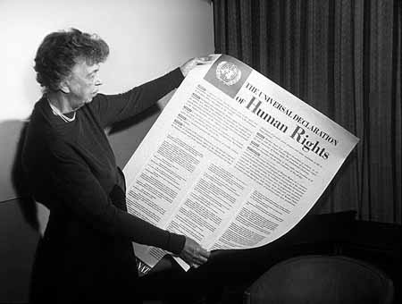

# The Universal Declaration of Human Rights

As a result of the tragedy and loss experienced during the Second World War, the United Nations General Assembly adopted the Universal Declaration of Human Rights on December 10, 1948, in Paris, France. The document is known to be the first of its kind to establish fundamental human rights, for it declares rights that everyone in the world should have.

It is also regarded as the foundation of international human rights law as numerous international treaties, constitutions, and other laws have elaborated on the rights contained in the document, especially accessibility laws.

The Universal Declaration of Human Rights was commissioned in 1946 by the Commission on Human Rights, led by committee chair, Eleanor Roosevelt.

The 18 members of the Commission who drafted the document represented different cultural backgrounds, political backgrounds, and nationalities from all over the world.

The document consists of a preamble that spells out the reasons for the document and 30 articles that state fundamental human rights ranging from right to life, liberty, equality, spiritual and political freedoms, to social, cultural, and economic rights. As of today, there are 192 member states of the United Nations, all of which have agreed to abide by the Declaration. The document has also been translated 467 times, setting a world record back in 2009 for the most translated document in the world.

## Summary of each article published in the Universal Declaration of Human Rights.

1. Everyone is born free and equal.
2. Everyone is entitled to the rights listed in the document.
3. Everyone has a right to life, freedom, and safety.
4. No one has the right to enslave anyone.
5. No one has the right to torture or abuse anyone.
6. Everyone has rights no matter where he or she is.
7. The law is the same for everyone and everyone is equal before the law.
8. Everyone's rights are protected by the law.
9. No one has the right to place anyone in prison with no good reason or exile anyone from his or her country.
10. Everyone is entitled to a fair and public trial by an independent party.
11. Everyone is innocent until proven guilty. Everyone has a right to prove his or her innocence.
12. Everyone has a right to privacy and protection of his or her name.
13. Everyone has the right to move within his or her country and travel as he or she wishes.
14. Everyone has the right to go to another country if he or she fears for safety in his or her own country.
15. Everyone has the right to a nationality and no one should be deprived of his or her nationality or denied change of nationality.
16. Everyone has the right to marry and build a family. Marriage should only be entered into with free and full consent of each spouse. Every family has the right to be protected by society and by the State.
17. Everyone has the right to own property and share property. No one has to right to take or deprive another of his or her property.
18. Everyone has the right to believe what he or she wants to believe in, the right to religion, and the right to change his or her religion.
19. Everyone has the right to freedom of opinion and expression.
20. Everyone has the right to assemble together in peace. No one has the right to force another into a group or association.
21. Everyone has the right to democracy, to participate in his or her government, and the right to choose his or her leaders.
22. Everyone has the right to social security: housing, education, childcare, medical assistance, and welfare.
23. Everyone has the right to employment, the right to choose his or her employer, the right to equal compensation, and the right to join a trade union.
24. Everyone has the right to vacation and holidays with pay from work.
25. Everyone has the right to food and shelter to maintain a healthy way of living.
26. Everyone has the right to an education.
27. Everyone has the right to protect his or her artistic and intellectual creations. No one can copy one's creations without his or her permission.
28. Everyone is entitled to proper social order where these rights are fully realized and recognized.
29. Everyone has a duty to protect the rights and freedoms of others.
30. No one can take away anyone's human rights.

## Additional Resources

- United Nations: [The Universal Declaration of Human Rights](https://www.un.org/en/about-us/universal-declaration-of-human-rights)
- Online Article: [Universal Declaration of Human Rights](https://en.wikipedia.org/wiki/Universal_Declaration_of_Human_Rights) from Wikipedia
- Online Article: [Universal Declaration of Human Rights](https://www.humanrights.com/what-are-human-rights/universal-declaration-of-human-rights/) from United for Human Rights
- Online Article: [The Universal Declaration of Human Rights](https://www.ohchr.org/en/universal-declaration-of-human-rights) from the Office of the High Commissioner
