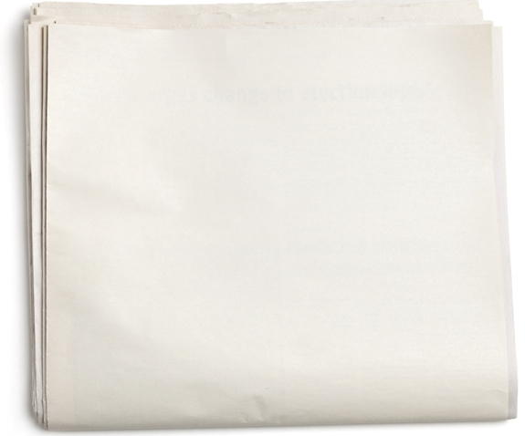

# Accessibility Matters

What if I handed you a blank newspaper? Would you be able to read it?

No, of course you wouldn't be able to read it. A blank newspaper isn't going to do you a lot of good, at least if you wanted to read the news. Maybe you could use it to line the bottom of a birdcage, but you aren't going to get the day's headlines from a blank newspaper.

## Print Disabilities

Giving a blind person a newspaper is just as useless as giving a sighted person a blank newspaper. Blind people can't read printed materials. Sometimes this is referred to as a "print disability." Without some sort of help or assistive technology, blind people can't read:

- Signs on buildings
- Product packaging (like medicine labels)
- Business cards
- Postal mail sent to their home
- Any printed text

Printed materials are everywhere, so print disabilities can be a big problem.

## How do Blind People Read Newspapers?

Blind people can't read printed materials directly, so they need to do it some other way. Here are some ways it has been done in the past:

- A friend or family member could read the newspaper to the blind person
- People could record themselves reading the newspaper out loud, and make these recordings available to blind people
- An embosser could create a braille copy of the newspaper
- Radio or television news stations can provide similar reports on the same topics

All of these methods work, but there are problems with all of them:

- What if a friend or family member is busy or not available?
- What if no one makes a recording of the particular stories that a particular blind person is interested in?
- What if there is a long lag time before a recording is made?
- What if the blind person can't afford the braille version? (Braille requires much more paper, and of a much heavier weight than newspaper.)
- What if the blind person can't read braille? (Less than 10% of blind Americans can read braille.)
- What if the radio or television stations don't report on a story? Or what if their report is less in-depth than the newspaper version?

Importantly, all of the above methods depend on other people. A blind person cannot quickly or easily access the information in newspapers independently. Fortunately, there is a better way.

## Digital Text and "Screen Readers" Solve the Problem

With the invention of computers, text became digital, and eventually speech synthesizers were invented, allowing blind people to listen to text read out loud by the computer itself, and allowing them to navigate web interfaces in ways that make sense to someone who is blind. Screen readers, as these software programs are called, allow blind people to access information independently, without having to have direct assistance from anyone else.

The web, in particular, has opened up a world of possibilities for people who are blind. Information is available quickly, on almost every topic imaginable. Blind people do not have to inconvenience friends or family. They have a new level of independence not even remotely possible before.

## ...But Only if the Content is Accessible

None of this matters much at all, though, if these things aren't accessible to us.

Unfortunately, that's the situation that many people with disabilities face in this digital age. The potential for access is clearly before us, but many digital resources were not created with accessibility in mind. They exclude people who are blind, and people who have other types of disabilities.

This is something that needs to change.