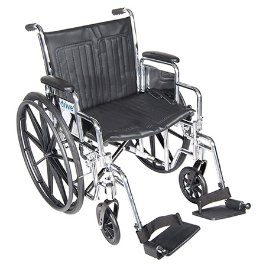
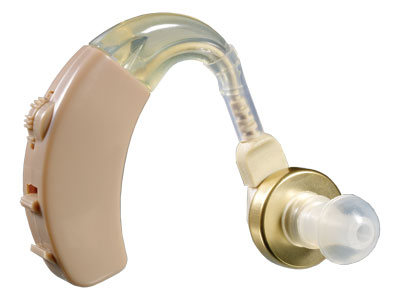
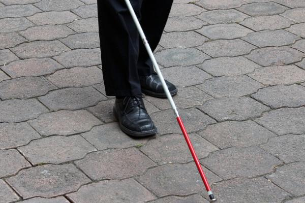
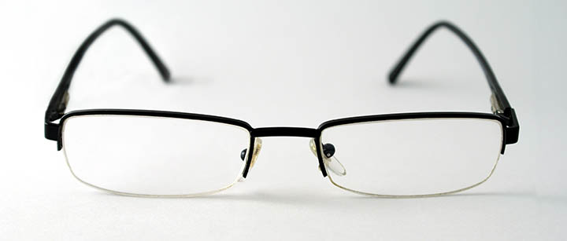
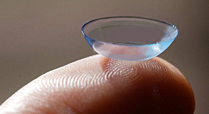

# Assistive Technologies
People with disabilities sometimes need technologies to help compensate for their lack of ability in certain areas. Technologies designed specifically for people with disabilities are often referred to as assistive technologies. One of the most common types of assistive technology is a wheelchair.

Another common assistive technology is the hearing aid.

Blind people frequently use canes as assistive technologies.

## Assistive Technologies All Around Us

But what about you? Do you use an assistive technology? If you have a disability of any type, you probably do. But what if you don't consider yourself to have a disability? Do you live your life completely without assistive technologies? Perhaps you do. 

But there may be some assistive technologies that you never thought of as a tool for people with disabilities. If you don't have perfect vision (few people do), you probably use some sort of corrective lens, like glasses or contacts, to help you see better. Glasses and contacts are assistive technologies.

Glasses and contacts are so common that you probably took for granted that they were normal, and that people who wear them don't have disabilities. There are certainly varying degrees of imperfect vision, but imperfect vision can definitely be a disability when it is not corrected.

## Assistive Technologies and the Web

People have invented technologies to help those with disabilities better access computers and the internet. Without getting into too much detail just yet, a few of them are featured in the table below.

## Disabilities and Assistive Technologies

### Blindness

- Screen readers
- Refreshable braille devices

### Low Vision	

- Screen enlargers
- Screen readers

### Color Blindness	

- Color enhancement overlays or glasses

### Deafness	

- Captions
- Transcripts

### Motor/Mobility Disabilities	

- Head wand
- Mouth stick
- Alternative keyboards
- Eye gaze tracking
- Voice activation

### Cognitive Disabilities	

- Screen readers
- Screen overlays
- Augmentative communication aids

## Assistive Technologies Don't Solve Everything

It is important to note that even though assistive technologies exist, they do not completely compensate for the disability. In this sense, assistive technologies in the virtual world are much like wheelchairs in the physical world: wheelchairs and web-based assistive technologies enable access that would be impossible otherwise, but there are constraints in the built environment (for wheelchairs) and virtual environment (for digital assistive technologies) that limit their effectiveness.

Assistive technologies are extremely valuable, <strong>but the people who create the environments must create them with accessibility in mind</strong> in order for the assistive technologies to be most effective.