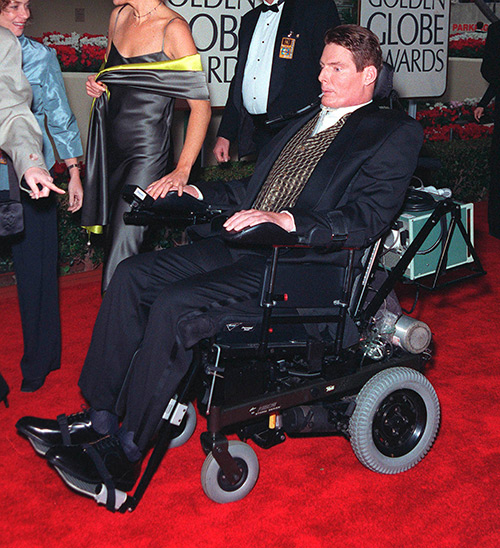
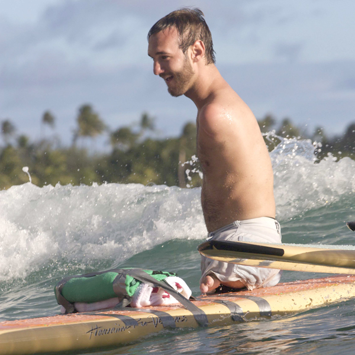
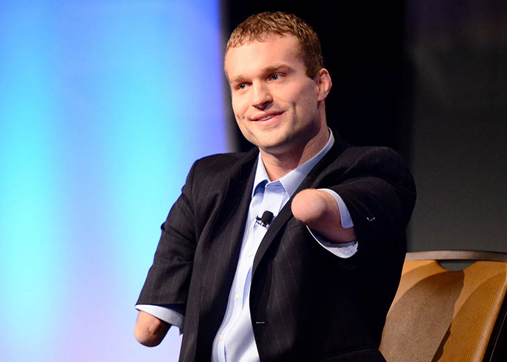
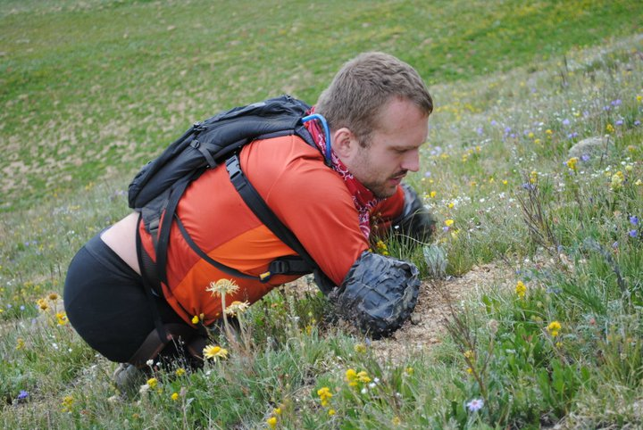
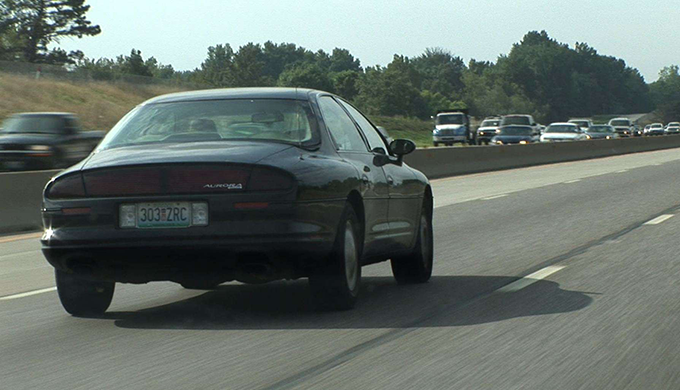
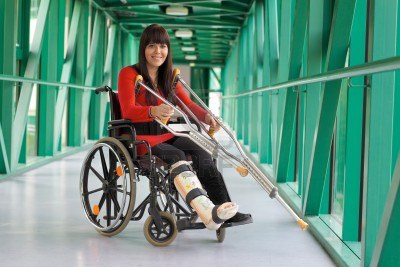

# Our Diverse Abilities

You might have a disability.

In fact, roughly 1 in every 5 people (about 20%) has a disability of some kind. Disabilities are quite common. They always have been. Having a disability is completely normal. If you have a disability, you are in good company.

## Recognizable Disabilities

Some disabilities are immediately obvious, and some people are famous both for their disability and for their other features. Stevie Wonder, for example, is a well-known R&B musician who happens to be blind, and that's not something he can hide from the rest of the world. People know that he is blind.

Christopher Reeve was famous as an actor before he experienced a horse-riding injury that severed his spine and took away his ability to move most of his body. Even if he weren't famous, everyone around him would know about his disability, because it could be seen as a prominent physical characteristic.

A person with no arms and no legs will find it hard to hide the disability. Although not as famous as Stevie Wonder or Christopher Reeve, [Nick Vujicic](http://www.lifewithoutlimbs.org/), was born without arms or legs and has gone on to become a motivational speaker and author. He also played a leading role in a short film called The Butterfly Circus ([official Butterfly Circus website](http://thebutterflycircus.com/)).

And, in case you're curious, not only can he swim, he can also surf.

Or you may recognize [Kyle Maynard](http://kyle-maynard.com/), an author, speaker, and accomplished athlete who was born without hands or feet. He won 36 varsity wrestling matches during his senior year in high school and was inducted into the National Wrestling Hall of Fame in 2005.

Kyle climbed Kilimanjaro without hands or feet. Here he is training in Colorado for his Kilimanjaro climb.

## Hidden Disabilities

Other disabilities are not always immediately obvious. For example, how would you know if the stranger reading a book across from you at the airport is deaf?

How would you know if the person driving ahead of you on the freeway has a reading disorder?

How would you know if the person next to you in the check-out line at the grocery store experiences seizures from time to time?

You can't know. Many disabilities are hidden until circumstances arise that would reveal them.

## Temporary Disabilities

Sometimes disabilities are temporary, like when an injury or surgery reduces a person's mobility.

## Age-Related Disabilities

Many of us, if we are lucky enough to live to an old age, will experience one or more types of disabilities related to the aging process. As we get older, we tend to lose our sight, our hearing, our mobility, and our cognition.

Our abilities diminish, and that too is normal. It's part of what it means to be human.

## Disabilities on the Web

Not all disabilities affect a person's ability to use the web. A person with paralysis in the legs—or even a person with no legs at all—can still use a computer without any problem, for example. The disabilities that matter most in terms of their effect on web use are disabilities in the eyes, ears, hands, and brain.