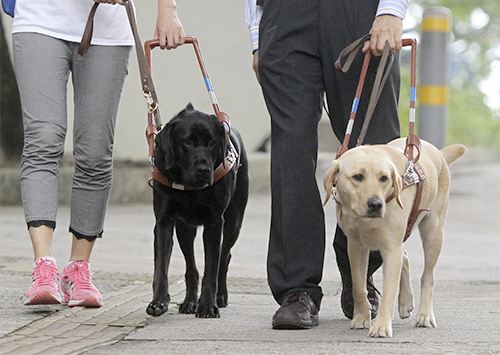
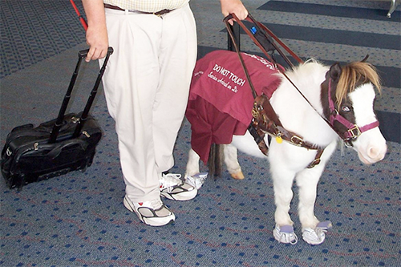

# Service Animals

Service animals (such as guide dogs) are doing a job. When they're in work mode, do not pet them, play with them, feed them, or draw their attention in any way. These animals are in service of their owner.

Distracting service animals from their job makes it harder for the owner to control the animal's actions, which reduces the usefulness of the service animal, and can even lead to some dangerous situations for the owner, if the service animal is not paying attention to risky situations

When a service animal is not in work mode, the owner may allow you to pet it or interact with it, but be sure to ask the owner first. Do not interact with the animal without the owner's knowledge and permission.

Interesting trivia: Most service animals are dogs, but other animals can be service animals too, such as miniature horses and pot-bellied pigs, both of which can be trained to do the same kinds of tasks that guide dogs can do.

