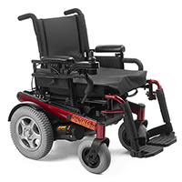

# Poverty and Disability

## Disabilities are Expensive

Disabilities can be expensive, not only for the person with a disability, but also for family members and care-givers. An electric wheelchair, for example, can cost anywhere from under US $2,000 to US $30,000 or more, depending on the features required. The wheelchair must also be maintained and repaired.

Beyond the equipment cost, a person who needs an electric wheelchair likely also needs the daily assistance of other people, both at home and in the workplace. The cost of simply living and doing daily tasks can be significantly higher for a person with a disability when compared to the costs for someone without a disability.

The yearly cost of the support systems (assistive technologies plus human helpers) varies dramatically depending on the type of disability and can range from almost no cost on the low end to staggeringly high costs on the other extreme. These are the non-negotiable costs of life.

Sadly, many people with disabilities who need these support systems cannot afford them, so their disability is compounded by financial constraints that prevent them from receiving technologies and services that could dramatically improve their quality of life.

## Disabilities Can Be Both the Cause and the Result of Poverty

The result is that a large proportion of people with disabilities, and their families, live in or near poverty. This is especially true in poorer countries, where people with disabilities are often among the poorest of the poor, and the most vulnerable of populations.

In the United States, people with disabilities are twice as likely to live in poverty as the general population. About 30% of people with disabilities live below the poverty line, according to a [US Senate report in 2014](http://www.help.senate.gov/imo/media/doc/HELP%20Committee%20Disability%20and%20Poverty%20Report.pdf)

In poorer countries, the situation is much worse. The number of people with disabilities is greater, due to deficiencies in health care, sanitation, and safety. People with disabilities are among the poorest of the poor, and the effect on individuals and families can last generations.

## Additional Resources

Working paper: [Poverty and disability—a critical review of the literature in Low and Middle-Income Countries](https://www.researchgate.net/publication/320757151_Poverty_and_Disability_a_critical_review_of_the_literature_in_low_and_middle-income_countries), by Nora Groce, Gayatri Kembhavi, Shelia Wirz, Raymond Lang, Jean-Francois Trani, Maria Kett, Leonard Cheshire Disability and Inclusive Development Centre, Working Paper Number 16

## Data Details About Poverty and Disability by Country/Region

http://health.costhelper.com/wheelchair.html

The following data shows the % of Disabled Population Living in Poverty, Year, and Data Sources.

### Australia

- Source 1 (2012):
  - 27.4%
  - http://www.probonoaustralia.com.au/news/2013/03/disabled-people-more-likely-live-poverty-acoss
  - Notes: living below the poverty line of 50% of median household income

### Latin America and the Caribbean

- Source 1 (No Year):
  - 82%
  - http://siteresources.worldbank.org/DISABILITY/Resources/Regions/LAC/LACfactsheetSpn.pdf (original link no longer available)
- Source 2 (No Year):
  - About 80%
- Website: Planneta Educação; Domain: http://www.plannetaeducacao.com.br/ (original link no longer available)

### United Kingdom

- Source 1 (2013):
  - 30%
  - Domain: http://www.mph-uk.com/ (original site is no longer available)
- Source 2 (No Year):
  - 23.1%
  - http://www.disabled-world.com/disability/statistics/
  - Notes: When extra expenses associated with being disabled were considered, the poverty rate for people with disabilities shot up to 47.4 percent.
- Source 3 (2013):
  - 30%
  - https://www.gov.uk/government/publications/disability-facts-and-figures/disability-facts-and-figures
  - Notes: Papworth Trust – Disability in the United Kingdom, Facts and Figures, December 2013

### United States

- Source 1 (2012):
  - 28.4%
  - http://www.disabilitystatistics.org/reports/acs.cfm?statistic=7 (need to submit selected search criteria to view statistics)
- Source 2 (2009):
  - 27%
  - http://www.cjwalsh.ie/2009/02/us-disability-statistics-practical-application-in-europe/ (original link no longer available)
  - Notes: 25 to 64 years of age with a severe disability
- Source 3 (2012):
  - 21.4% (Women: 23.8%, Men: 18.6%)
  - http://www.demos.org/blog/ (original link no longer available)
  - Notes: age 15 and above. (disability poverty rate by sex and race in source)
- Source 4 (No Year):
  - 25.3%
  - http://www.americanbar.org/content/dam/aba/uncategorized/2011/20110314_aba_disability_statistics_report.authcheckdam.pdf

