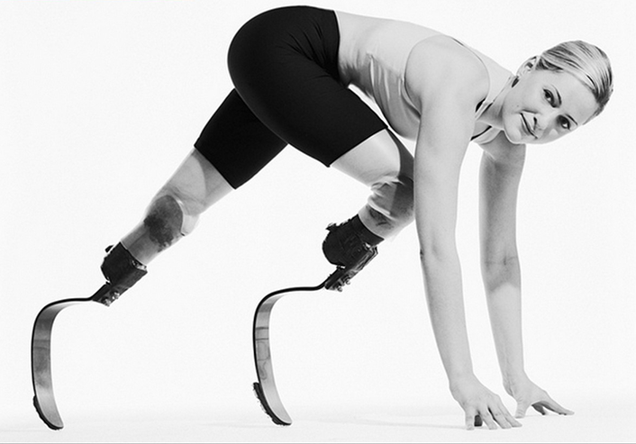

# Myth: Accessibility is ugly

## Truth: Accessible web sites can be stunningly beautiful... or not

Let's first debunk the fear of ugliness. It's a myth, or at least it should be a myth. Certainly, there are some ugly designs out there for people with disabilities.

But that's more of a failure of the imagination than a necessary condition. If you want to create ugly designs, you're free to do so, but don't use accessibility as an excuse. Designs for people with disabilities can be just as beautiful (or as ugly) as designs for anyone else. That part is up to you.

## A comparison: Creativity and beauty in prosthetic legs

Aimee Mullins is a double leg amputee who decided that she didn't want to settle for plain prosthetic legs. She turned her disability into an outlet for creative expression. In addition to having regular functional prosthetic legs, she has athletic "blade" style prosthetic legs for running, a separate set of prosthetic legs that are several inches taller than her normal biological height would be, and she even had an artist carve ornate wooden prosthetic legs for her, with intricate designs and embellishments. All of these prosthetic legs are functional. They can also be beautiful.

Don't let anyone impose limits on your imagination when it comes to designing for accessibility. Accessibility can be beautiful if you design it to be beautiful. It's up to you.

## Most Accessibility Features Are Invisible

The whole point of universal design is to make one design that fits the needs of a wide range of people. One of the nice things about the web is that this is usually pretty easy to do because most of the accessibility fixes are invisible. You can create a single design that looks beautiful, and which also happens to be accessible.

Let's run through a quick (and incomplete) list of accessibility features to demonstrate how many of them don't alter the design at all:

### Alt text for images:

Invisible. Available only to screen readers and other assistive technologies.

### Labels for form elements:
Invisible (at least the <label> tag itself is invisible).

### Headings:
The heading tags (<h1>, <h2>, etc.) are invisible. The text itself is visible, as you would want it to be.

### Table Headers:
The code to designate a header cell in a table (<th>) is invisible. Marking a cell as a header causes the text to be bold and centered, so in that sense it alters the visual appearance, but if you don't like it, you can use CSS to change it back to non-bold and left-aligned (or any other style that you like).

### Lists:

Lists alter the formatting by grouping the items by bullets or numbers, but if you don't want those visual effects, you can change them with CSS. It is common to create a main navigation menu for a web site using an unordered (bulleted) list, and then style it to make it look like tabs or buttons instead of like a bulleted list.

### Language:

Invisible. The default language of the document is set in the underlying markup (`<html lang="en">`). Changes in the language are also in the markup (`Hola. Me llamo Pablo`).

### Keyboard Accessibility:

Ensuring that all actionable items on a web page are accessible to a keyboard doesn't require a change in the look of the web page. It just requires a change in the way the markup and scripted interactions are structured.

### Reading Order:

Invisible. The underlying reading order depends mostly on the order that things appear in the source code, not the order that they appear in the visual rendition of the content. You can rearrange the visual aspects of the design as much as you want with CSS positioning without altering the reading order in the markup.

### Captions:

If you use closed captions, the captions won't appear in the video for people who don't turn them on.

### Audio Descriptions:

If you use closed audio descriptions, people won't hear them unless they turn them on.

### ARIA:
ARIA (Accessible Rich Internet Application) markup makes interactive JavaScript widgets more accessible to assistive technologies without changing the visual appearance. All of the markup happens in the code.
A few accessibility fixes do alter the visual appearance. Here is a list of some of the main ones:

### Color Contrast

Some web designs use colors that are too similar to each other, or that don't provide enough contrast between the text and the background, so in some cases designers need to increase the contrast by changing the colors.

### Links to Skip Navigation

It is good practice to put a link at the very top of the web page that allows users to skip past the navigation and go directly to the main content of the web page. 

One of the main audiences for a link like this is blind screen reader users. If they were the only audience, then the link could be invisible, but they are not the only audience. Sighted keyboard users must also be able to access the link. Designers tend not to like putting an extra link in their design if they know its purpose is to serve people with disabilities, and not the majority of their site visitors.

One way that designers have gotten around this design inconvenience is by making the link invisible until users tab to it, and then making it disappear once users tab away from it. That approach allows sighted users to use it, without cluttering the visual design with an extra link.

### Cognitive Disabilities

This is one area where the design might need to look radically different. If you're designing with the needs of people with cognitive disabilities in mind, you probably need to simplify the content down to the barest minimum. Depending on the type of cognitive disability you're targeting, you may need to simplify the text substantially, or you may need to eliminate the text altogether and replace it with images, videos, audio, and interactive components.

This course, for example, is not designed to be ideally accessible to people with cognitive disabilities. The assumption is that you are a competent web designer, developer, project manager, or some other professional who is interested in learning about web accessibility.

Not all of the content here is appropriate for people with cognitive disabilities, and it would be difficult to make it accessible to people who may never understand enough about web design to make the effort worthwhile. That's an honest assessment of the accessibility of this course to people with serious cognitive disabilities.

That being said, it is possible to implement some suggestions without "ruining" the design, such as illustrating concepts with images, not using slang or idiomatic expressions, and expanding acronyms and abbreviations the first time they appear in the text.
