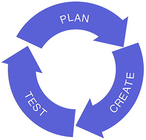

# Web Development Process

## Note:
Even though this page talks specifically about the web development process, the same ideas can be adapted to the development process for consumer or industrial products, architecture, transportation systems, etc.

## Plan, Create, Test

One way to summarize the overall web development process could be as follows: Plan, Create, Test.

Usually this is cyclical. In an agile workflow, the cycle may happen every two weeks, at least for the smaller tasks. The larger tasks would have longer cycles.

The purpose of this page is to highlight where accessibility can fit into the overall process of web development, and to show that accessibility needs to be considered throughout the process. The following tables present simplified lists of things to keep in mind at various stages.

## Step 1: Planning and Design Phase
Whether the ambitions are large (a complete site redesign) or small (a new feature), accessibility needs to be part of the plan.

### Task and Roles (possibly) Involved

#### Research (market, users, opportunities, etc.)

- Executive team
- Product owners
- Business analysts

#### Set Requirements (marketing/sales goals, branding, purpose, accessibility standards and best practices, security, legal, etc.)

- Executive team
- Product owners
- Business analysts
- Accessibility lead/team
- Security lead
- Legal team
- QA lead

#### Design the Information Architecture and User Experience

- Desktop interaction experience
  - Sighted keyboard users (ensure visual focus indicator, full keyboard functionality, keyboard focus management on dynamic widgets, etc.)
  - Blind users (correct semantic markup, alt text for images, landmarks, headings, ARIA markup on custom widgets, etc.)
- Mobile interaction experience
  - Blind users (compatible with mobile screen readers)
  - Low vision users (ability to zoom)
- Visual experience
  - Low vision (ability to zoom, ability to customize colors of text/background, high contrast, etc.)
  - Colorblindness (don't use color alone to convey information)
- Auditory experience
  - Deaf users (video captions)
  - Deafblind (transcripts)

##### Roles involved

- Information architects
- UX team
- UI team
- Accessibility lead/team
- QA lead
- Visual designers

## Step 2: Creating the Content and Components

This is where the main work of building and writing gets done. The people creating the content and components need to have clear instructions from the previous planning stage in order to ensure what they create is accessible.

### Task and Roles (possibly) Involved

#### Front End Markup and Programming

Preliminary testing, unit tests:

- Test with automated tools (like aXe)
- Manual testing
- Screen reader testing (especially of dynamic/interactive components)

##### Roles involved
- Programmers
- Visual designers
- CSS coders
- Accessibility lead/team
- QA team

#### Create Text Content

Add basic accessibility features, such as:

- Add alt text to embedded images
- Ensure proper table markup
- Ensure logical reading order
- Ensure proper heading hierarchy for sections of content
- Ensure understandability

##### Roles involved
- Technical writers
- Marketing team
- Content specialists
- Data entry team
- PDF accessibility specialist
- MS Office accessibility specialist

#### Test the Multimedia

- Deaf (captions)
- Blind (audio descriptions)
- Deafblind (transcripts)

##### Roles involved

- Producer
- Marketing team
- Videographer
- Sound technician
- Video editor
- Transcriber
- Captioning specialist
- Audio description specialist

## Step 3: Testing the Content and Components

This is where the QA team, together with the accessibility team, determine whether the accessibility requirements were met.

### Task and Roles (possibly) Involved

#### Test the Front End Markup and Programming

Pre-launch testing, against the full list of accessibility requirements.

- Test with automated tools (like aXe)
- Manual testing
- Screen reader testing
- Full accessibility test
- Log/track defects with detailed accessibility user stories, instructions to reproduce bug, acceptance criteria, etc.

##### Roles involved
- QA team (trained in basic accessibility testing techniques)
- Accessibility team (with full accessibility expertise)
- Users with disabilities (reality check with real users)

#### Test the Text Content

Test for text accessibility features, such as:

- Add alt text to embedded images
- Ensure proper table markup
- Ensure logical reading order
- Ensure proper heading hierarchy for sections of content
- Ensure understandability

##### Roles involved
- QA team (trained in basic accessibility testing techniques)
- Accessibility team (with full accessibility expertise)
- Users with disabilities (reality check with real users)

#### Test the Multimedia

Test multimedia against full list of multimedia accessibility requirements.

- Deaf (captions)
- Blind (audio descriptions)
- Deafblind (transcripts)
- QA team (trained in basic accessibility testing techniques)

##### Roles involved
- Accessibility team (with full accessibility expertise)
- Users with disabilities (reality check with real users)

## Take Accessibility Seriously

If accessibility is taken seriously at all three of these main stages—planning, creating, and testing—the web site has a much greater chance of meeting the needs of people with disabilities. If accessibility is not taken seriously, it's almost guaranteed that the web site will present accessibility barriers to people with disabilities.
