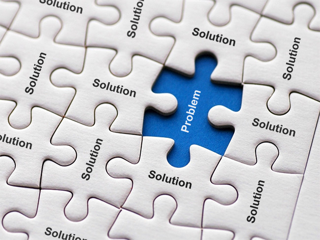

# Functional Solutions Model

The functional solutions model of disability is related to the social model of disability. The functional solutions model takes a practical approach to disability by identifying the functional impairments, or limitations, that are a result of disability. The model then seeks out solutions for eradicating these limitations through advancements in technology or methodology.

There is less of a focus on the social and political aspects of disability, but more focus on applying innovation to overcoming the limitations of disability.

Businesses that create and sell accessibility solutions often take a functional solutions approach. They see a need and try to meet the need with their products and/or services. Most products and services in this approach address issues at the level of the individual.

A person who cannot use her hands may need a device to help her turn pages in a book, or to cut food on a plate, or to open a door, or to pour some milk. The business model depends on identifying accessibility challenges in the environment and creating accessibility solutions to overcome those challenges.

Accessibility professionals are interested in functional solutions, because that's their job. Some accessibility professionals are interested in the broader socio-political implications of their actions, and others are not. Either way, accessibility professionals, by definition, take a functional solutions approach to specific accessibility problems.

## Strengths of the Functional Solutions Model

This model focuses on results that benefit people with disabilities. It takes a real-world approach to finding solutions that work, without getting hung up on theoretical or political questions. It instead puts energy into ideas, technologies, and innovations that improve the lives of people with disabilities. The emphasis in this model is on building accessible environments, and on getting things done.

## Weaknesses of the Functional Solutions Model

Even if a technology or solution is innovative, sometimes it is not the most useful solution to broader problems, which may be a result of the social and environmental barriers people with disabilities face.

If accessibility professionals are too focused on creating practical technological solutions, they may miss opportunities to address the larger social context. Sometimes addressing the larger social context works so well that it can make a specific technological solution obsolete.

## External Links for Further Study
- [Online article: "Models of Disability and their Relation to Accessibility"](https://martyncooper.wordpress.com/2012/10/10/models-of-disability-and-accessibility/) by Martyn Cooper