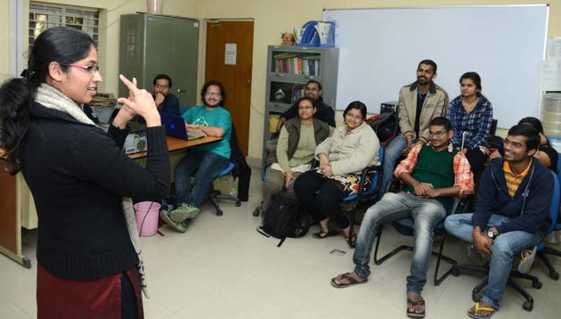
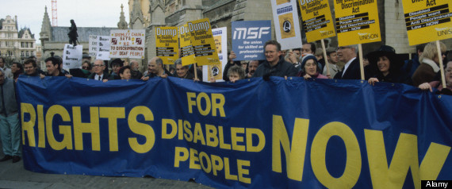

# Social Identity or Cultural Affiliation Model

People with disabilities may develop a sense of personal identity through consorting with others who share similar life experiences based on their disability. Together, the group develops a sense of culture based on these shared experiences.

## Deaf Culture and Identity

Social identity can be particularly strong among people who are deaf who share linguistic experiences as sign language users. Sign language truly is a language. In fact, there are many different sign languages, each with its own vocabulary and grammar, akin to the variance in spoken and written languages. Sign languages include American Sign Language, British Sign Language, German Sign Language, Turkish Sign Language, Nepali Sign Language... and a [long list of other sign languages](https://en.wikipedia.org/wiki/List_of_sign_languages).

There are even [deaf theater productions](http://www.ntd.org/ntd_history.html), deaf television shows, and other avenues of deaf artistic expression that help to strengthen deaf cultural bonds.

## Strengths of the Social Identity or Cultural Affiliation Model

### Self-Acceptance and Empowerment

Fully accepting one's disability can be an important part of one's emotional and psychological well-being, and having a support network of friends with disabilities—even if they don't have the same type of disability—can be a valuable asset on a personal level.

### Political Strength

Beyond the personal level, people with disabilities can gain political strength by forming alliances and advocacy networks. It is easier to petition for political change as a group with a collective voice, rather than merely as individuals.

## Weaknesses of the Social Identity or Cultural Affiliation Model

The social identity model doesn't always serve as a useful basis for technical definitions of disability, because groups of people with different types of disabilities—or even without any disabilities—may consider themselves part of the same social group.

Strongly identifying with other people with disabilities may partly be a result of feeling excluded from the rest of society.

## External Links for Further Study

- Wikipedia article: [Deaf Culture](https://en.wikipedia.org/wiki/Deaf_culture)
- Wikipedia article: [Disability studies: Questioning the social model](https://en.wikipedia.org/wiki/Disability_studies#Questioning_the_social_model)
- Academic journal article: [Disability and Identity, by Margaret Wangui Murugami](http://dsq-sds.org/article/view/979/1173), Disability Studies Quarterly, Volume 29, Issue 4 (2009)
- Academic journal article: [Disability and Identity: Personal Constructions and Formalized Supports](https://dsq-sds.org/article/view/880/1055), by Christopher J. Johnstone, Disability Studies Quarterly, Volume 24, Issue 4 (2004)