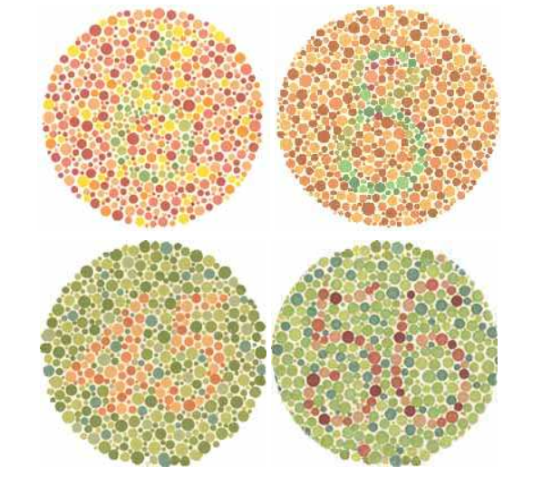
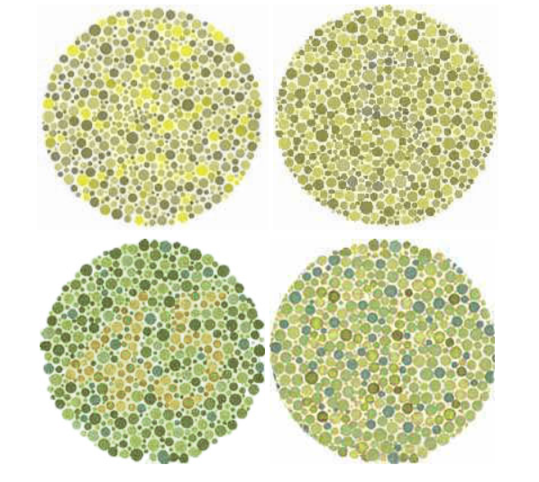
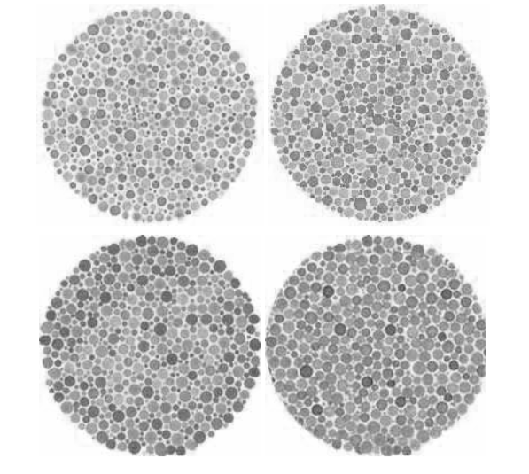

# Color Blindness

Color-blindness does not literally mean that a person can't see any color at all (except in very rare cases). Color-blindness refers to the inability to distinguish between certain kinds of colors, especially colors that are of equal brightness or luminosity, even if the colors themselves appear quite different to people without color-blindness.

## Types of Color-Blindness

There are several kinds of color-blindness, and varying degrees within those types, so it is difficult to provide a precise explanation of which color combinations are the worst for people who experience color-blindness. The most prevalent form of color-blindness, though, is red-green color-blindness.

Deuteranopia and Protanopia are two common sub-types of red-green color-blindness. Some people may also have what is known as Tritanopia, or blue-yellow color-blindness. Though very rare, there are those who inherit an insensitivity to all colors. People who have Achromatopsia see colors in grayscale.

Though is it difficult to truly capture how people experience color-blindness, the tabs below simulate how a person with red-green color-blindness and grayscale vision may see colors according to the characteristics of these conditions.

In case you have trouble seeing the numbers in any of these images, here is an explanation of the original images: The number six appears in the first circle (green numeral on a red background). The number eight appears in the second (green numeral on an orange background). The number forty-five appears in the third circle (orange text on a green background). The number fifty-six appears in the fourth image (red text on a green background).

### Red/Green Colors

The most common form of color-blindness is red-green color-blindness, which makes it hard to distinguish between reds, oranges, and greens. Above are a few examples of the types of colors that can be easily confused. Can you see the numbers in each of the circles?

### Red/Green Color Blindness

Those who have red-green color-blindness may see the images in the manner they have been adjusted here. The numbers are very difficult to distinguish this way.

### Achromatopsia (Grayscale)

In very rare cases, a person's vision can be insensitive to all colors, rendering the world in a type of grayscale. Here are the same images from the previous examples, modified to appear in grayscale.

### Red and Black Colorblindness

In addition to red-green and blue-yellow color-blindness, the colors red and black may be difficult to distinguish for some people. The tabs below illustrate how similar the colors may be to those who are colorblind.

#### Red and Black Colors

Red and black can be difficult to distinguish for some people. Here is how red and black may appear to those who may not be colorblind.

#### Red and Black Colorblindness simulation

Now, here is how that same image may appear to those who have trouble seeing red and black. The red text and the red image nearly blend together with the black background.

## Do Not Use Color Alone to Communicate Information

Since colors may look similar to those who are colorblind, it is critical that color is not used as the only way to communicate or distinguish information.

The example below demonstrates how a person who is colorblind may miss information that is only conveyed through color.

<figure>
<figcaption>
The table here only uses color to convey the level of difficulty of the classes. Some people with red-green color-blindness may have difficulty distinguishing the colors.
</figcaption>

|Course Title               | Level*                            |
|---------------------------|-----------------------------------|
|Angular.js                 | 🟥                                 |
|jQuery                     | 🟨                                 |
|Introduction to JavaScript | 🟩                                 |

*Red = advanced, Yellow = intermediate, Green = beginner
</figure>

<figure>
<figcaption>
Here is the same table as it may appear to someone with red-green color-blindness. It is hard to distinguish the level of difficulty by color alone since both the advanced and beginner courses look to be the same color.
</figcaption>

|Course Title               | Level*                            |
|---------------------------|-----------------------------------|
|Angular.js                 | 🟫                                 |
|jQuery                     | 🟨                                 |
|Introduction to JavaScript | 🟫                                 |

*Red = advanced, Yellow = intermediate, Green = beginner
</figure>

## Assistive Technologies for People with Color-Blindness

There aren't many assistive technologies for people with color-blindness. For the most part, it is a condition that people just have to live with. A company called EnChroma claims to have developed glasses that can help compensate for some kinds of color-blindness. 

See [https://enchroma.com/](https://enchroma.com).
Their products may be worth checking out if you experience color-blindness.

## Summary

Majority of people who are colorblind are able to see colors, but there are certain colors and color combinations that may be difficult for them to differentiate. It is critical not to rely on color alone to communicate information. To learn more about color-blindness, explore the resources below.

## Related Links: Color-Blindness

- Article: [Color Blindness or Color Vision Deficiency](https://www.archimedes-lab.org/colorblindnesstest.html) by Gianni A. Sarcone (Archimedes Laboratory Project)
- Wikipedia Article: [Color blindness](https://en.wikipedia.org/wiki/Color_blindness)
- Simulator: [Color Oracle: Design for Color Impaired](http://www.colororacle.org/) (free download for Windows, Mac, and Linux)