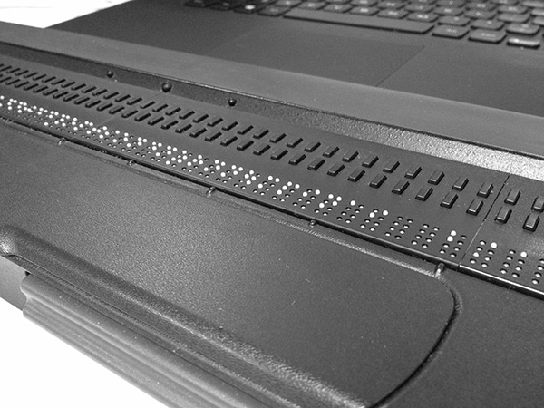
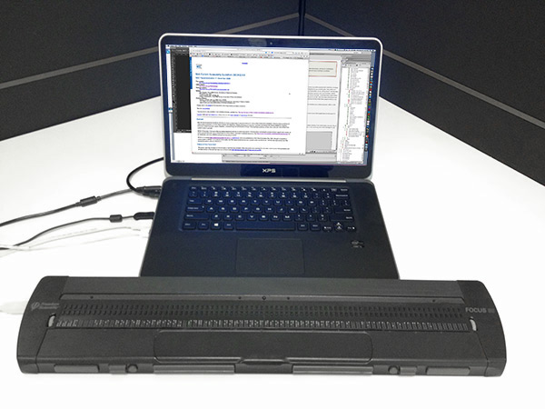

# Deafblindness

## Braille Displays

If a person is both deaf and blind, the only option is to use a refreshable braille display in combination with a screen reader. Rather than have the screen reader read out loud in an audio format, people who are both deaf and blind have the screen reader output the text to the braille display, which they can then feel with their hands.

Refreshable braille displays have a line of holes in the physical interface that allow small pins to come up and down to form braille characters. The screen reader sends a line of text to the refreshable braille display. Users read the text on that line, then press a button to go to the next line. The pins drop down, then come up in a new configuration to reflect the new line of text.

Braille displays can be attached to regular computers, and act as a supplement to the main computer keyboard. Users often switch between the main keyboard for typing and the braille display for reading.

The braille display pictured below is one of the larger models. Smaller models are also available.

A refreshable braille display is also popular among people who are blind but able hear. This is especially the case when they deal a lot with text that is not ideal to be read out loud (eg. programming languages which contain a lot of symbols disturbing the reading flow).