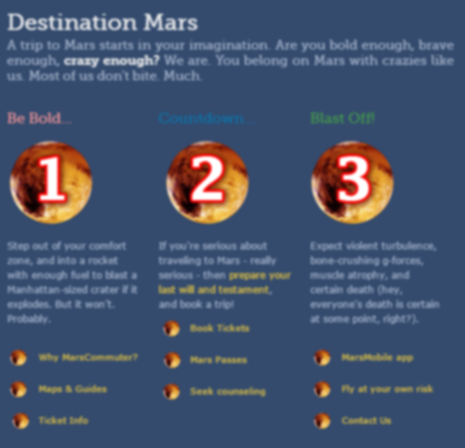
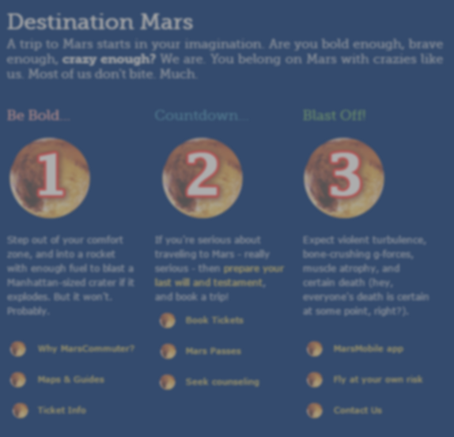
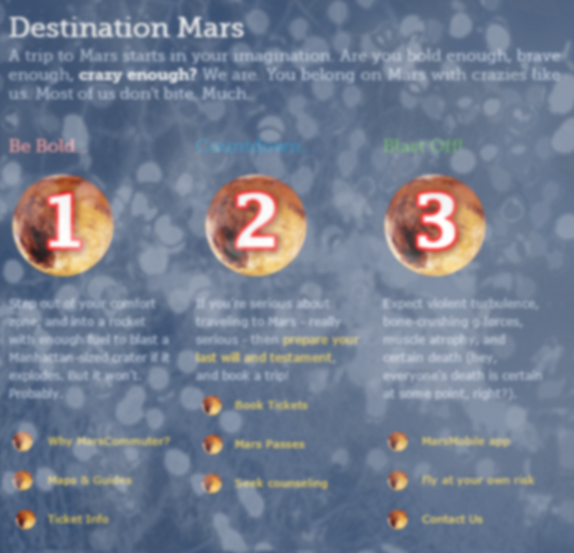
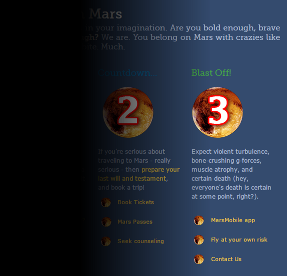
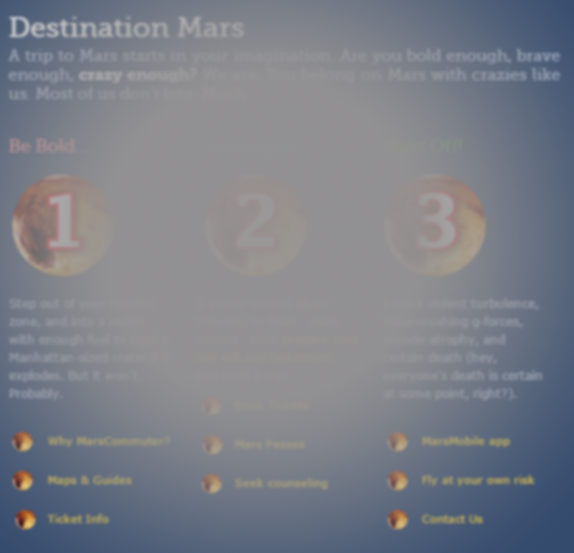
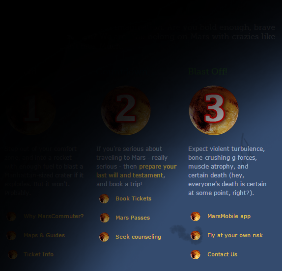
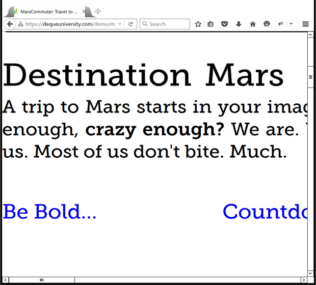
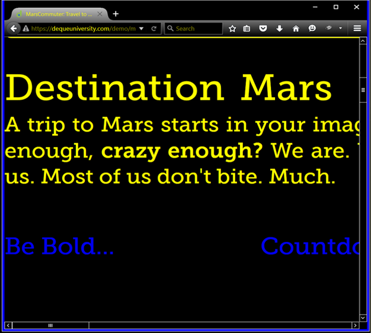
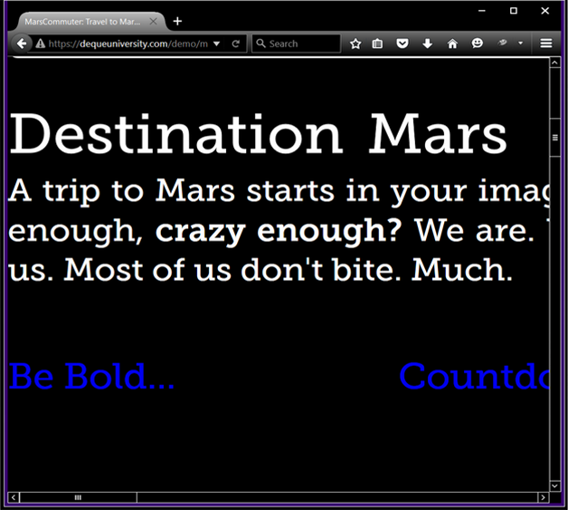
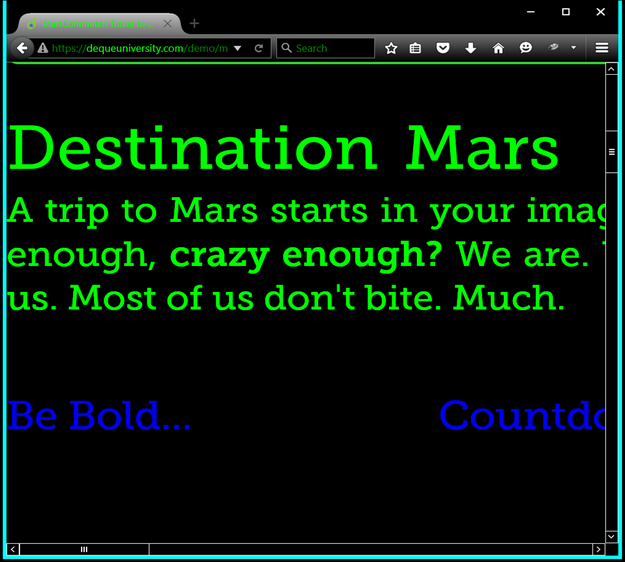

# Low Vision

## Overview

People with low vision can see, but their vision is still quite far from perfect even with powerful corrective lenses. Those who have low vision may be unable to see well enough to drive or read most printed text unless they enlarge it. Low vision isn't a single condition. It is a broad category encompassing many different conditions, with varying degrees of vision impairment. They can't see well enough to read small fonts or to clearly discern details without enlarging them. There is quite a bit of diversity in the kinds of low vision that a person can experience. Here are a few possible types and characteristics:

### Blur

For people who have low vision, faces and objects appear blurry. It is difficult for them to distinguish specific features. In terms of using websites, foreground elements may be difficult to see from background elements. In the image above, a person with blurred vision may be able to see large text like headings, but smaller text may be hard to read.

### Blur with Low Contrast

People who have low vision or blurred vision can also experience seeing things in low contrast, meaning that there aren't very many bright or dark areas. Everything tends to appear about the same brightness, which makes it hard to distinguish outlines, borders, edges, and details. In this image, the text colors and background color may be difficult for people with low contrast vision to see.

### Cataracts

There are some people who experience blind spots in their eyes, which can cause them to miss visual information if it's in one of their blind spots. A person who has cataracts may see innumerable dark gray spots that can cloud his or her vision and make objects on a website extremely difficult to see.

### Diabetic Retinopathy

Diabetic Retinopathy is another eye condition that causes people to see floating dark spots, similar to what the image depicts here.

### Glaucoma

Some people can see only a small area, and have no peripheral vision. The edges are heavily darkened or vignetted. It is like looking through a narrow tube. The image above simulates the tunnel vision experienced by someone who has Glaucoma.

### Hemianopia

Hemianopia, or Hemianopsia, is another eye condition that limits vision to a smaller area. In the case of Hemianopia, vision loss occurs on either the right or left side of both eyes.

### Macular Degeneration

Macular degeneration is an eye disease where there is a loss of vision in the center of the eye, the field of vision. While people with macular degeneration have peripheral vision, the deterioration of the macula can cause either blurred vision or a blind spot to occur in the central vision.

### Retinal Detachment

For those who experience retinal detachment, vision can be affected in multiple ways. Some may experience flashes of light in their vision field, while some see what is called "floaters" in their vision, which can appear as dark debris floating in front of them. The image depicts another major symptom of retinal detachment, where a dark shadow covers a significant portion of the field of vision.

## Low Vision Experiences on the Web

### Screen Magnification

Reading small text is an extremely difficult task for a user with low vision. Users with low vision may need to use screen magnification like ZoomText or MAGic, which shows a small portion of the screen at a time. When the screen is magnified, it zooms in on a section of the screen and displays it at high resolution.

Specialized screen magnification software like ZoomText and MAGic have a large number of features to help optimize the visual experience for people who have low vision. The video below provides an overview of some of the main features of ZoomText.

- [Video: Introduction to ZoomText and Screen Magnifiers](https://www.youtube.com/watch?v=ojtiVj78QPw)

<figure>
<figcaption>Video Transcript</figcaption>
One of the most important technologies for people with low vision is a screen magnifier. Screen magnifiers enlarge parts of the screen, just like a magnifying glass would so that the text and the images on the screen are easier to see.

I'm going to demonstrate some of the features on ZoomText, which is one brand of screen magnifier, so that we can see how they work. When you first start up ZoomText, the default zoom is set to two times normal view, and you can see on the interface it says 2x for the power. ZoomText can go all the way up to 36 times normal size, which is quite large.

I'll step you through some of these enlargements, just so you can see how big it can get. So here we are at the largest setting, and you can see that the text is still easy to read. ZoomText takes over the font smoothing and enhances it quite a bit over the normal operating system font smoothing technology. Now, 36 times is really too big for what I want to do, so I'm going to decrease the zoom and go back down to two times, 2x.

Now, the screen enlargement is only part of what ZoomText can offer. It also offers enhancements of the colors, the pointer for the mouse, and the cursor for the keyboard, as well as the focus when you're navigating around menu systems, around web pages. So, let's take a look at the colors first. We're on the normal color scheme at the moment. I'm going to change that to Invert Brightness, which changes everything to the opposite color, so this is like a photo negative back in the days of film, and what was, you know, black is now white, and the other colors are their opposites as well. Some people find this easier to read.

Another scheme that we can choose is yellow on black. Now this one is mainly for people who experience difficulty, in fact even can experience pain, when they see bright lights, so looking at a white computer screen with black text is really hard for them; it hurts their eyes, so they change it to a lot of black with yellow text. Now, this particular website, it has a dark background to begin with, so that's what gets converted into the yellow. For the parts that were bright before, those are the ones that are now dark.

Another option that we have is to convert just to black and white. And we can set it to be a black text on a white background, basically just removing the color but leaving things as they are, and then we can reverse this so that what was black is now white, what was white is now black, and we get variations in the gradations of grey that were the opposite of what they were before.

Let's turn it back to normal and take a look at some of the options for the pointer. Now, this is referring to the mouse pointer, which is usually in the shape of an arrow, sometimes in the shape of a hand when it's over links. One of the options is to use yellow with a full cross, which converts the pointer to a yellow color with a black outline and then puts a red cross at the point of the pointer, at the very tip of it, and that makes it really easy to see where the mouse pointer is as you're moving across the screen. You could turn off the full cross and just leave the large yellow cursor. Some people find that easier to use.

Another option is to put a red circle around the cursor, and you could leave it, in this case, a color red. You can also customize these options, but the default color for this particular setting is to leave it red. And a variation on this idea is to use a circle only when moving. So, if I leave the mouse alone, it doesn't have a circle, but if I start moving it, it puts a circle around it. And then, as soon as I stop, the circle goes away. And if you have a really hard time seeing the pointer because it's just too small, you could turn it to the giant green option, which just makes it huge, and as you move across the screen it's very visible. I’m going to put it back to normal.

The cursor is what you see when you put the focus inside of a form element or when it's in a word processor and you're typing, or an email, or something like that. And the default option, if you just look at the regular cursor, it's just this really small blinking line, and it's really hard for people with low vision to see. We can make it more visible by choosing some of these options. So, one of them is to put a green circle around the focus. So right now, I'm not in a text area; I'm not in a form input or anything like that, so it looks normal. If I click inside the search field, it puts the green circle where the focus is, which makes it immediately obvious. And if I start typing something, the green circle will follow the keystrokes.

I’m going to go ahead and turn that one off and demonstrate the last category that I'm going to talk about here, which is the focus. The focus can be hard to see on a webpage. If I start tabbing through the web page, it will put an outline or a dotted line around the links, which is great, as long as it shows up. As we tab through things, you notice that it sometimes doesn't show up. Right now, for example, I'm on the login button for Facebook, but there's no outline around it because the designers who put together this site took away the outline for that particular link. If I tab to the next link which is the sign in link, the outline comes back, so we have some inconsistencies here.

And some of these are really difficult to see, so, for example, on the Send me to Mars! and Hotels link, this can be a bit difficult for someone with low vision to see, so let's go down to ZoomText and make it more visible. I'm going to choose the first option, which is to put a red rectangle around the focus. So, going back to the web page, now I have a really easily visible red outline around the link, and if I tab around to the other options, the red outline follows the focus. And you can change these colors as well, but that's the first option there.

ZoomText has other options; you can use it to zoom in just on a portion of the screen, or you could leave it as is right now, which is enlarging the whole thing. And you notice also when you move around, the mouse tracks the zoom along with it so that you don't lose your place. You can use a reader as well, a screen reader, and there are several options available for the screen reader. You can change the rate of speech, you can let it follow your typing, and some other options there. And it acts basically like JAWS, or like NVDA, or VoiceOver, some of the other screen readers that are out there reading the text to you.

So, for someone who has low vision, this is really the best way for them to gain access to their computer and to websites. It allows them to access things that they really couldn't access before, in a way that makes it possible for them to be independent, which is an important aspect of web accessibility overall.
</figure>

#### Screen Magnification Challenges

Though large magnification can help overcome the main challenges of low vision, there are still some issues a user can encounter. For instance, if an image is particularly large, a user may need to scroll around the screen to see the whole thing. If a JavaScript alert pops up to the side of the current visual focus, the alert may actually appear out of the visible area for the user with low vision, so the user may not see the alert at all. It is best to place popups, alerts, error messages, and other similar messages near the visual focus, to make sure users don't miss them.

### Screen Readers

Most people think of blind people when they think of screen readers, but people with low vision can benefit from screen readers too. Hearing the words can help make the visual text easier to understand, especially for those with extreme low vision. 

ZoomText and MAGic have basic screen readers built into them. Screen readers bundled with screen magnifiers generally aren't as full-featured as stand-alone screen readers, but they are adequate for most tasks.

### Color Customization

For people with low contrast vision, or low color vision, colors may not be easily visible, and may be hard to distinguish from each other. Text that is too close in color or luminance (brightness) to the background can be hard to read. Some people may also experience pain when looking at bright lights or bright areas on paper or computer screens. All-white backgrounds can be particularly difficult. To attempt to remedy the effects of low contrast and bright areas, users may modify the colors either in the operating system or in the web browser.

Colors can be used in web design, but it is crucial to not use color alone to convey important information since users customize colors based on what is best for them. Make sure the important information is represented in the text.

There are custom stylesheets you can use as overrides: [http://ssb22.user.srcf.net/css/](http://ssb22.user.srcf.net/css/)

Browse through the simulations below to see how screen magnification and color customization are used by people who have low vision.

#### Enlarged Text

Low vision users may use screen magnification to enable them to read small text and view smaller graphics.
The image here is a simulation of text enlargement where the high contrast settings in the operating system are used to 
override settings in the browser.

#### Enlarged Text Yellow on Black

Making the text larger may not be enough for some people though. Some people need to modify the colors. Someone who experiences pain when viewing bright lights may decide to reverse the color scheme, using black (or some other dark color) as the main background and yellow or white as the main text color. Here, yellow is the main text color.

#### Enlarged Text White on Black

White text is used here with a black background for optimal high contrast and to increase the readability.

#### Enlarged Text Green on Black

Bright green against a black background may also be used to increase the readability of web pages for low vision users.

## Additional Resources

- [ZoomText](https://www.freedomscientific.com/products/software/zoomtext/)
- MAGic (apparently no longer existant)
- [A video showing ZoomText user Leanne Cough explaining how she uses ZoomText (unfortunately the video has no captions)](http://vimeo.com/13757711)
