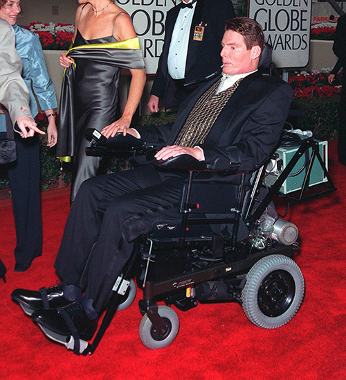

# Mobility, Flexibility, and Body Structure Disabilities

Mobility disabilities affect a person’s ability to move independently and purposely. For example, people who have missing limbs, multiple sclerosis, cerebral palsy, stroke, partial or complete paralysis, or arthritis may experience limitations with moving their body or parts of their body.

Disabilities in this category can be present from birth, occur due to aging, or be the result of a disease. They can also be temporary, permanent, or periodically recur or relapse. Approximately 3.5% of adults in the US have a mobility disability.

Disabilities in this category may affect ambulation, or the ability to walk without using an assistive device. They may also result in difficulty with dexterity or fine motor control. 

For example, if a person experiences tremors in the hands, it can be difficult to move with enough precision to use a mouse or other tools that require good muscle control. Other examples might be difficulty with handwriting, tying shoelaces, or picking up small objects. Between 3 and 7 % of children across the world have ADHD, which can often result in fine motor control difficulty.

Body size or shape disabilities are related to a person’s stature, proportions, or shape. For example, dwarfism, rheumatoid arthritis, acromegaly (increased bone size), and obesity would all fall under this category. 

A person may experience various related conditions such as muscle weakness and muscle fatigue (extreme exhaustion), hearing loss, vision loss, and diabetes. Statistics show that 1% of the world’s population has rheumatoid arthritis, while 39-40% of adults have obesity.

There are many different disabilities affecting mobility, flexibility, and motor control, all with different characteristics and somewhat different accessibility needs, but with at least this one principle in common: all web content must be operable no matter what method a person uses to access the computer.

Whether by mouse or keyboard or a disability-specific assistive technology, the web content needs to work. The content must be compatible with a wide variety of input devices and methods. For example, a person may be completely missing one or more hands, forcing the person to use other body parts — such as the feet — to access a computer. They may use a foot mouse to operate their machine.

## Real People with Motor Disabilities
Do you recognize the man in the photo below?

The man in the photo above is the same man in the photo below.

## Physicist Stephen Hawking

The man is Stephen Hawking, the famous physicist. The difference between the two photographs is striking. In the first photograph, Mr. Hawking is standing, smiling, and appears to have full mobility. In the second photograph he is sitting in a wheelchair, and it is obvious that he had not had full mobility for many years. His muscles had atrophied. He was not able to smile as before. In fact, he was not even able to talk on his own. Mr. Hawking had a degenerative neuromuscular disease called ALS (amyotrophic lateral sclerosis), also known as Lou Gehrig's disease.

This disease had progressively taken away his ability to control his muscles voluntarily. For anyone with ALS, eventually it may take away their ability to control their involuntary muscles as well, making it impossible for their body to breathe or perform other life-sustaining actions on its own. In the meantime, though, he had produced numerous notable scholarly and popular writings about science and the universe. He had been able to do this because of the assistive technologies he used.

Stephen Hawking used a computer to help him speak, write, and interact with the world. He had a sensor hooked up to his glasses that detected movements in his cheek.

As he looked at the computer screen, options were displayed on the screen, and he was able to select from among the options and type his words on the computer. He then had the computer read his words out loud.

This was a laborious, time-intensive process. It could take him several minutes to type a single sentence. In 2008, he gave a TED talk in which he discussed our relationship with the universe and speculated about life outside of planet Earth. At several points during the video, the camera shows him interacting with his computer using the motion-detecting hardware and the word-prediction software as assistive technologies. The video itself doesn't talk about web accessibility, but watching how Mr. Hawking used his computer can be enlightening, because he would have used the same type of technology to access websites.

One of the memorable quotes from his talk (at about 7:45):

<figure>
"All my life I have sought to understand the universe and find answers [...] I have been very lucky that my disability has not been a serious handicap. Indeed, it has probably given me more time than most people to pursue the quest for knowledge."
</figure>

The video of the full talk is available on the TED web site:

- [https://www.ted.com/talks/stephen_hawking_questioning_the_universe](https://www.ted.com/talks/stephen_hawking_questioning_the_universe)

### Something to think about

What if Stephen Hawking were born 40 or 50 years earlier? Would he have been able to type entire talks, entire scholarly articles, and entire books on his own? No. This is literally the first time in the history of the world that someone like Stephen Hawking can do this independently. In fact, we can take it a step further.

Without modern technologies, we probably wouldn't even know that Stephen Hawking could think at all. He might have ended up in a nursing home, or some other lonely circumstance, completely unable to communicate. And yet, because of modern technologies, we know that he could not only think, but he was one of the most brilliant minds of our generation. That's the power of modern technologies for people with disabilities.

## Marie-France Bru

Like Stephen Hawking, Marie-France Bru has ALS (amyotrophic lateral sclerosis). She has almost no movement in her body, but she can move her jaw slightly. She has a sensor attached to her jaw that detects movement. With this movement, she is able to use a computer to do a wide variety of tasks including writing emails, chatting with her husband via instant messaging, taking care of the finances online, and buying groceries.

In other words, she does a lot of the same tasks that many people do. She just happens to do them from home with her computer... by moving just her jaw.

When you watch this video, pay attention to how she uses custom virtual keyboards to interact with the computer.

- [Video](https://www.youtube.com/watch?v=ENkjkIypXq4)

<figure>

Video Transcript

[A pivotal role in the household]

[An AssistiveWare Production]

[Marie-France Bru, teacher]

[A woman sitting in front of her computer. She views an e-commerce website.]

[A synthesized woman's voice speaking:] Nowadays, the computer has become an almost indispensable tool. I am in front of my computer and manage the bank accounts, as well as my mail. What is more, I do all kinds of shopping: groceries, clothes, Christmas presents, just about anything—and all of that from home, without a need to go out.

As I am almost completely paralyzed and my hands do not move at all, it is impossible for me to type on a keyboard or use a mouse. Therefore, I use a scanning program called Switch XS. This allows me, through the aid of a switch, to control the scanning of one or more keyboards designed by myself. The switch is a little device that is taped to my cheek. All I need to do is make small jaw movements to activate the scanning.

[She uses a virtual keyboard on the computer screen. The keyboard cycles through sections in sequence; she moves her cheek, which triggers the sensor and selects the part of the keyboard she wants to use. She is able to type using this method.]

As I do not speak, I use the speech synthesis of Proloquo. [Computer speaks in French.] Proloquo also helps me when I write. It allows me to verify that what I write is in agreement with what I wanted to write. I developed a rapid writing method, which is based on a pretty complicated writing keyboard.

I also use the keystrokes application, which offers the possibility of entering as many abbreviations as I want. In addition, it offers word prediction. [Computer speaks in French.] This allows me to write about four times as fast as when I would have to type each individual letter.

[The camera moves away from her and across the hall, where a man is sitting in front of a computer and typing on a keyboard.]

Switch XS also allows me to communicate with my husband through iChat when he is at his desk and I am at mine. It also allows me to help him with his research work. [The man types a response to his wife in an instant messaging program.]

The computer has also allowed me to create a website about my illness, motor neurone disease. The site provides me many contacts with other ill people or their families.

Without a computer, I would be little more than a vegetable. I can say without exaggeration that the computer has saved my life. Without Switch XS I would not have accessed Mac OS 10 which has changed my life. Thanks to all this technology, I continue to play an important role in the household, because I am the one taking care of the groceries, the one managing the bank accounts, and the one keeping contact with our friends.

[Marie-France Bru, born in 1943]

[living in Paris, France]

[speaking with the voice "Lucy" of the Acapela Group]

[was diagnosed with amyotrophic lateral sclerosis (motor neurone disease) in September 1995]

[Copyright 2005 AssistiveWare]

[www.assistiveware.com]

[www.als-testimony.org]

[www.acapela-group.com]

</figure>

## Actor Christopher Reeve

Christopher Reeve became famous in Hollywood playing Superman, and appearing in other movies, such as Somewhere in Time.

In 1995 he was thrown from his horse during a competitive riding event, resulting in a cervical spinal injury that left him paralyzed from the neck down. He was no longer able to use his legs, hands, or torso. After his initial rehabilitation, he was able to use an electric wheelchair powered by a puff and sip control, which essentially means that he would blow into or suck on a straw hooked up to his wheelchair.

Reeve went on to become a vocal advocate for research to benefit people with spinal cord injuries. With the help of voice recognition software and other assistive technologies, he was able to write full length books, including a memoir titled "Still Me" and a meditative reflection on life entitled "Nothing Is Impossible."

He used the same type of technologies to access computers and the internet.

## Typewriter Artist Paul Smith

Paul Smith (1921-2007) was born with cerebral palsy, a condition that makes his movements spastic, and very difficult to control. He would have had a difficult time using a mouse. He was able to use a keyboard though, as he proved by creating detailed works of art using only a typewriter.

Watch this brief news video segment about his artwork:

- [Video](https://youtu.be/svzPm8lT36o)

<figure>

Video Transcript

[One finger of a hand pushes down one key at a time on a typewriter keyboard.]

[Narrator:] Keystroke by keystroke, he types his latest masterpiece in an Oregon nursing home.

[An outdoor sign in front of the building says Rose Haven.]

But Paul Smith is not an author; he's an artist.

[Paul:] I’m going to work on the tail.

[A picture of a dog is visible on a paper in the typewriter in front of Paul.]

[Narrator:] He was born with severe cerebral palsy, yet Paul Smith has created hundreds of works of art using a typewriter.

[An image is shown of mountains, then an image of George Washington crossing the Delaware River.]

[Woman:] You give me a typewriter, I can't even type twelve words a minute looking at my hands, okay. There is no way that I could come up with a picture like that.

[Three works of art are shown: a cityscape, a squirrel, a gondola and gondolier on the water with a city in the background.]

[Man:] Every time I flip through the work, I am just amazed because it's as good as art as you can find.

[Paul moves the lever on the typewriter and uses the roller to adjust the position of the paper.]

[Narrator:] Paul's movements are severely limited; his determination, endless. His disorder makes using a brush or pen impossible, but as a young man, he discovered the keys to expressing himself at the top of a typewriter keyboard. Using just 10 of the symbol keys, he taught himself to paint. Look closely and you can see how Paul typed pound signs to create the facial detail on his Mona Lisa.

[Closeups of Paul’s Mona Lisa are shown.]

[A closeup of an image of a desk with a typewriter on top is shown, then the full room.]

[Narrator:] Here, the @ symbol doubles for desk drawer knobs in this scene of his childhood bedroom; note the typewriter prominently displayed.

[A portrait of a man’s face, then a colored scene in the countryside at a river are shown.]

[Narrator:] Paul has created incredibly detailed pictures by artistically aligning those 10 keys against a black or colored ribbon.

[Paul:] It’s something to do.

[Man:] His joy in life is finding ways to be creative. I think he sees it—that's part of why he's on earth, why we're on earth.

[Man:] Well, I think the dog now has a tail.

[Paul’s in-progress picture of a dog is shown next to the photograph that inspired it.]

[Narrator:] When someone says, I could never do that, Paul answers,

[Paul:] What can you do?

[An image of a water wheel is shown, then an image of a house.]

[Narrator:] Places Paul's lived or visited are the inspiration for much of his art, some of which lines the hallway of Rose Haven Nursing Center.

[Man:] There's a lot of memories on this wall. Let's see, that's the ship you went to Bermuda on.

[Paul:] My whole family went.

[Paul plays chess with another man. Paul indicates his moves by pointing to the pieces and the squares on the board.]

[Narrator:] His family now is the staff and residents of Rose Haven, where he has lived since 1967.

[Woman:] Hey, Paul. How are you doing today?

[Paul:] All right.

[Woman:] Are you still working on that dog?

[Woman:] Hi, sweetie. How you doing?

[Man:] He's such a terrific person; he's a—such a humble man, a real gentle soul.

[Man, speaking on Paul’s behalf:] She's really nice.

[Woman:] Oh, thanks, Paul. It’s easy to be nice.

[Woman:] All right, Paul. I’ll catch up with you later.

[Narrator:] Paul Smith would much rather brag about his friends at Rose Haven than about himself or his art.

[Paul:] He’s a good guy. He’s a real good guy!

[Narrator:] And those who know him say the same thing about Paul. The artist is even more inspiring than his art.

[Woman:] It's wonderful to watch him work, and it's wonderful to enjoy his art, but not as good as it is enjoying him.

[Narrator:] Deeply religious, Paul says his artistic ability is a gift from God.

[Paul’s picture of the Last Supper is shown.]

[Narrator:] His faith and something else keeps him going.

[Paul:] My finger.

[Man:] Your finger. []laughing]

[Narrator:] And with that finger, for as long as he is able, this extraordinary man will continue creating his extraordinary art, one keystroke at a time.

</figure>

## Artist Zohreh Etezad
Iranian artist Zohreh Etezad was born without arms, so she uses her feet to paint and to weave her artistic creations. She has exhibited her artwork in several countries in the region. The dexterity and skill in her feet rivals the dexterity of most people with their hands. She is able to use a paintbrush, weave yarn in and out of the loom, and perform other tasks related to the creation of her artwork, all without hands.

- [Video](https://www.youtube.com/watch?v=SYL86cnF5-k)

<figure>

Video Transcript

[Narrator]: For 49-year old artist Zohreh Saltaneh,
it's not just her paintings
that are drawing a lot of attention,
but also her toes.

Born with a birth defect
that can stunt the growth of
an unborn baby's arms and hands,
she paints by holding the brush
between her toes.

The Tehran-born painter
uses her feet and toes
for just about everything,
including daily chores
like cleaning the house, cooking,
and helping her elderly mother.

But despite her disability,
her artwork has gained her
a number of different awards,
and her paintings have been shown
in about 60 exhibitions
around the world.

And in case you're wondering,
her creativity isn't limited to painting.
She also weaves Persian carpets.

Gary Hamilton for CBSnews.com

</figure>

## Assistive Technologies Used by People with Motor Disabilities
The assistive technologies used by a person with a motor disability are specific to that person's needs. Here are some of the assistive technologies available:

### Vertical Keyboard with Mouth Stick

### One-Handed Keyboard

### Expanded Keyboard with Raised Sections Between Keys

### Speech Recognition

Some people can take advantage of speech recognition software that translates the user's spoken words into language that the computer can understand. Speech recognition can be used to type text, enter data into forms, and navigate web pages using keyboard-style interactions or using a mouse emulation mode. One of the popular brands of speech recognition software is [Dragon](https://www.nuance.com/dragon.html).