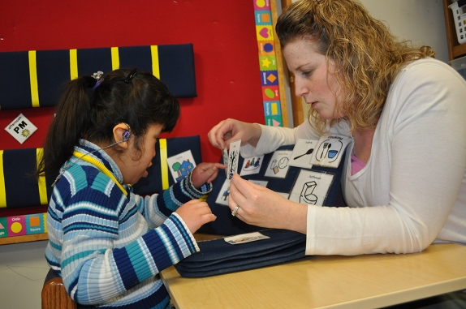

# Multiple/Compound Disabilities

As the term suggests, people with multiple, or compound, disabilities have a combination of two or more disabilities that may involve speech, motor, visual and hearing impairments, as well as a learning disability or an intellectual disability.

The term “multiple disabilities” does not disclose what disabilities are involved, how many disabilities, or the degree of each disability. There are a number of possible combinations of disabilities. 

A person may have a motor disability in conjunction with an intellectual disability. Another individual may have autism along with a speech impairment. Some individuals may have three disabilities. It is not so much about the number of disabilities, but the impact of the combined disabilities and how the disabilities combined should be accommodated.

Depending on the combination of disabilities, those with multiple disabilities could experience some of the following:

- Difficulty processing information
- Difficulty producing speech sounds
- Difficulty with mobility and fine-motor movements, such as the use of hands
- Difficulty with detecting or deciphering sounds
- Difficulty applying knowledge to various situations
- Difficulty seeing visual information

## Accessibility for Multiple Disabilities

Accessibility for people with multiple disabilities is rooted in the individual's specific needs. If needed, communication should be supported through augmentative and alternative communication such as sign language, tangible symbols, or computer-generated speech. Those with multiple disabilities may also benefit from using assistive technologies to help overcome functional limitations and support communication.

Since it is difficult to discern what an individual with multiple disabilities may need, providing support for both augmentative and alternative communication and assistive technologies, and following accessibility standards, are key for making physical and technological environments more accessible.

## Additional Resources
- Online Article: [Multiple disabilities](https://en.wikipedia.org/wiki/Multiple_disabilities) from Wikipedia
- Web Page: [ERIC Institute of Education Sciences - Severe and/or Multiple Disabilities Fact Sheet 10 from the National Dissemination Center for Children with Disabilities (NICHCY)](https://eric.ed.gov/?id=ED572699)
