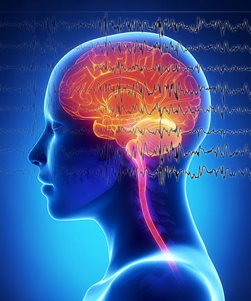
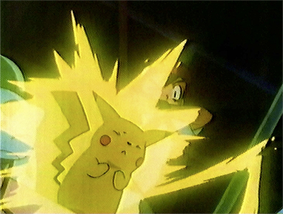
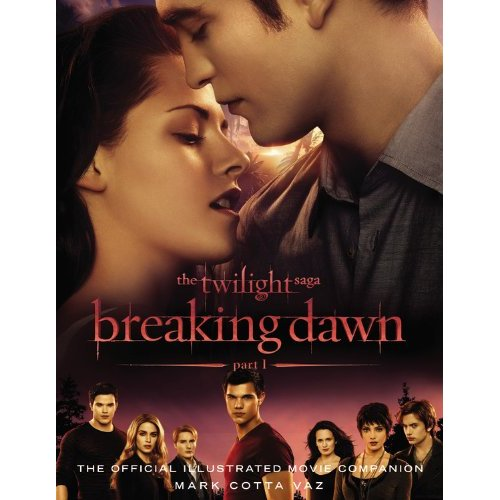

# Seizure Disorders

Seizures are abnormal or erratic electrical impulses in the brain that interfere with a person's ability to process information or, in some cases, control voluntary muscle movement. Some seizures can result in violent convulsions that put a person at risk of injury.

Seizures can be caused by a wide range of circumstances including brain injury, dehydration, sleep deprivation, infections, fevers, drug overdoses, drug withdrawals, and even flashing lights. This last category is the one that is of interest to web developers.

## Photo-Epileptic Seizures

Putting flashing or strobe-type effects in videos, graphics, or animations can put some viewers at risk for seizures. Seizures caused by flashing lights are sometimes known as photo-epileptic seizures. 

One of the most well-documented cases of flashing lights causing seizures was a Pokémon cartoon in 1997 that sent 685 children to the hospital when they experienced seizures as a result of an intense scene with flashing lights.

More recently, the movie Breaking Dawn featured an intense scene with flashing lights that caused people to experience seizures in the movie theater.

Not all people with seizure disorders are sensitive to flashing lights. Seizures can be triggered by other conditions as well, most of which are completely out of the control of web designers. Still, web designers and media creators can choose to avoid flashing lights as a way to prevent possible injury to the viewers who are sensitive to such stimuli.