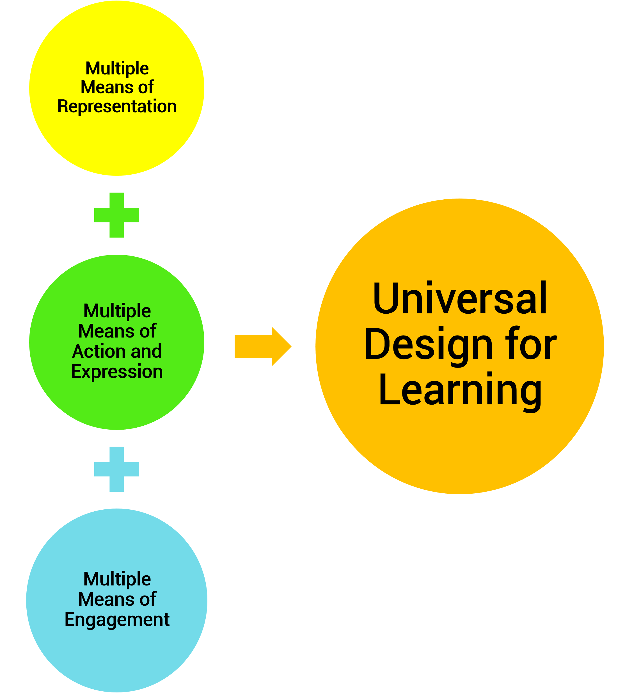

# Universal Design for Learning

## What is Universal Design for Learning?

Universal Design for Learning (UDL) is an approach to designing curricula that eliminates barriers in the learning environment in order to improve educational experiences for all learners. All aspects of learning are designed to be modified based on various learner needs.

These components of learning design include instructional goals and objectives, methods of instructional delivery, materials used for learning, and assessments. In this section, we will closely examine how the principles of UDL, which are multiple means of representation, action and expression, and engagement, are used to develop these instructional components based on students' diverse abilities.

## Learning Goals of This Section

After reviewing this section on universal design for learning, you should be able to:

- Define universal design for learning.
- Identify the principles of universal design for learning.
- Describe the purpose of each principle.
- Explain the importance of utilizing principles in curriculum and instructional design.

## In This Section:

- [Learner Diversity](learner-diversity.md)
- Multiple Means of Representation
- Multiple Means of Action & Expression
- Multiple Means of Engagement

## Additional Resources

- Online Article: [About Universal Design for Learning](https://www.cast.org/impact/universal-design-for-learning-udl#.VseHauLX20U) - CAST.org
- Website: [cast.org website (formerly: National Center on Universal Design for Learning)](https://www.cast.org/)
- Online Article: [About Universal Design for Learning](https://www.uvm.edu/cess/cdci/udluvm-universal-design-learning-project-completed?Page=about-udl/index.php&SM=about-udl/submenu.html) - The University of Vermont