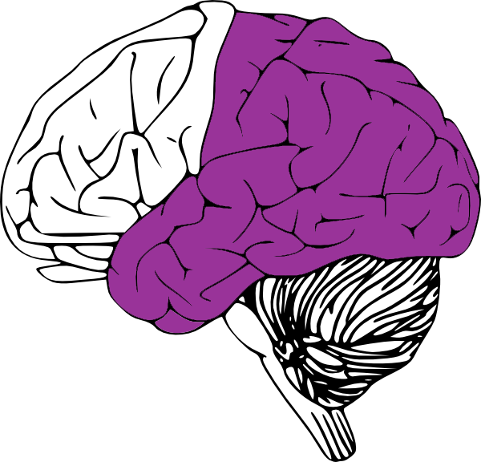
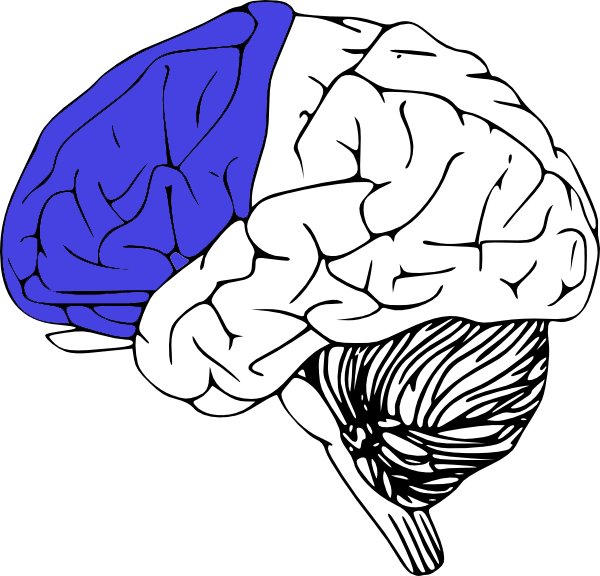

# Learner Diversity

## Cookie-Cutter Learners Don't Exist

UDL acknowledges that diversity among individual learners needs to be considered when designing instruction and addressed during the learning process. The different backgrounds, skill sets, needs, and interests learners have can greatly contribute to the learning process and shape how they acquire new knowledge.

Eradicating the approach to designing "one-size-fits-all" instruction is key to UDL. Designing curricula extends beyond designing for only one type of learner. Multiple options for learning should be incorporated into instructional design to effectively educate diverse learners.

## The Science Behind Learning

### The Three Primary Brain Networks

Learning is not a one-dimensional process. Research in neuroscience has discovered that three primary brain networks play a role in gathering new information and being engaged in education.

#### Recognition Networks

Recognition networks are located in the back of the brain where the medial temporal lobes, parietal lobe and occipital lobe are.
Perceiving and gathering information, understanding ideas, recalling facts, and recognizing voices and language are all examples of how recognition networks work in our brains. Recognition networks enable us to collect knowledge.

#### Strategic Networks

Strategic networks are located in the front of the brain, where the frontal lobe is.

Examples of how strategic networks work include planning and organizing tasks, connecting ideas together, executing actions and demonstrating skills. Strategic networks come into play when learners complete activities and assessments that allow them to practice competencies and demonstrate mastery of competencies and learning objectives. Strategic networks are involved when learners apply the knowledge they have acquired.

#### Affective Networks

Affective networks are located in the center of the brain, where the limbic system is.

Affective networks in the brain enable us to assign significant or personal meaning to newly acquired knowledge and discover what stimulates us during the learning process. Through affective networks, learners are engaged in the learning process. They are attentive to what is being taught and are motivated to learn more.

## No One Thinks Exactly the Same

With knowing how learning takes place through these neural networks, not everyone is going to perceive information exactly the same way. Not everyone is going to connect ideas in the same manner or assign the same meaning or significance to a piece of knowledge. 

Universal Design for Learning aims to embrace these differences in learners. Diversity in learning is highlighted in UDL through the principles and guidelines the approach utilizes for creating varied and flexible instruction.

The video below from Perkins School for the Blind provides a detailed overview of UDL and its supporting principles.

- [Video](https://www.youtube.com/watch?v=pnXl-mzwjmU)

  
Video Transcript

[NARRATOR:] The name "Perkins" carved in stone. Below a gothic tower, a boy navigates with a cane.

A title. Perkins Presents: Universal Design for Learning with Elizabeth Hartmann, Ph.D., Lasell College.

The following webcast is based on the UDL principles and guidelines developed by CAST.

[ELIZABETH HARTMANN]: So once you're on board with the UDL framework, and you really understand that it's not the child that needs to be fixed, but rather the curriculum, the UDL principles help you think about how you can make curriculum that's smart from the start that basically meets the needs of all learners in your classroom from the very beginning.

And this is in contrast to taking an existing curriculum and constantly retrofitting it, which often is what's done now, and can help provide students with disabilities, students with visual impairments, and multiple disabilities, and deafblindness.

Also, there's a lot of research that has been done, even many years ago, that seems to just nicely fit with this way of thinking, nicely fit with the UDL framework. The people who created the framework really were trying to take the best practices, the strong research base in neurobiology, in education, and technology and to come up with a different way of thinking about supporting all learners.

So it's already on a strong foundation. But as UDL is implemented and enacted in schools, there are studies now that are showing that both teachers and students are benefiting from it.

[NARRATOR]: For more information and resources about UDL visit the National UDL Center at CAST. www.udlcenter.org

Fade to black. A graphic of the Perkins logo swoops across the screen, revealing a chapter heading, "Multiple Means of Representation."

[ELIZABETH HARTMANN]: There are three principles that help you really look at curriculum, and make it smart from the start so it meets the needs of all learners, especially those who have visual impairments and multiple disabilities, including deafblindness. These three principles can help you to see how your curriculum is providing options or really optimizing learning for these learners. And, in doing so, can provide them with more meaningful and authentic access and engagement with learning that goes on in the classroom.

I think that if we think about learners with visual impairment and multiple disabilities, including deafblindness, often in a typical classroom, the concepts are represented through print or through the teacher presenting them to the classroom. And these learners often just don't have basic access to that information because of how it's presented. It's usually tailored to this idea of the average student.

[NARRATOR]: In a photograph, we see examples of multiple means of representation being used to present the concept of multiplication. On a large purple index card, the equation two times three is written out. Below are two groups of three brightly colored fabric balls. A large yellow index card displays the equation four times two. Above it are four groups of two of the same fabric balls.

[HARTMANN]: So the first principle, multiple means of representation, it allows us to kind of take a step back and think, "How can I present..." "How can I represent what I am trying to teach my class so that it meets the needs of all learners, including that student who has a visual impairment, including that student who has deafblindness."

And in doing that, you start to come up with different ideas, different ways to represent that actually benefit the entire classroom.

[NARRATOR]: In a photograph, a group of first graders walks on a sidewalk through a manicured garden. A sign identifies it as the Garden for the Blind.

[HARTMANN]: Maybe instead of just using a textbook to talk about something abstract like weather, you have the students go outside and experience weather. It works well for the student with deafblindness, and the student with visual impairment and multiple disabilities. But it also really works well for all the learners in the classroom.

[NARRATOR]: A graphic lists the first principle, provide multiple means of representation, has these three guidelines. Provide options for perception. Provide options for language, mathematical expressions, and symbols. And provide options for comprehension. Fade to black.

Multiple Means of Action and Expression.

[HARTMANN]: With the second principle, multiple means of expression, you're really looking at what is the goal of the lesson? And what do you want the students to really learn? And then how do you find ways for students to show that they have actually learned that? And I think this is in contrast to typically what happens sometimes in schools where you get into a routine, there's just been a certain way of doing things.

You present a certain lesson in a certain manner, and then the students will do a worksheet to show what they know. Or the students will do a paper or take a test.

And the second principle challenges us to really say, "How can we get to understanding?"

[NARRATOR]: In a photograph, we see examples of multiple means of action and expression that students have used to illustrate their experiences on a field trip to the beach. One student wrote a short report on a word processor, and included pictures of fish and a sea turtle. Another student collected shells in a small box labeled "Ryan's Shells." A third student painted a picture of the beach, showing the sand, the ocean with two red fish, and two birds flying in sunny skies.

[HARTMANN]: How can we really figure out what a student knows about a concept or a lesson that we've taught? And providing different ways, so that we're not just focusing on one way to assess a student or one way for them to show that they understand. And for the student with visual impairment and multiple disabilities, or the student with deafblindness, this is essential. And any educator in the field of deafblindness, or in the field of visual impairment, is very used to doing this already.

[NARRATOR]: In a photograph, we see a large piece of brown paper in the shape of a leaf. Various real leaves and branches that a student collected have been glued to the paper, some colorful, others dry and brown.

[HARTMANN]: So the teacher, if they're using multiple means of expression and action to really get at what a learner understands about weather, you could think about how that learner experiences the world and then create a journal or an experience box that collects these different experiences that the learner has with weather.

If the learner has some residual vision or hearing, you could take videos, or pictures. You could collect artifacts like leaves, sticks, flowers, plants. Basically anything that that learner connects to and really uses to understand weather, which is a very abstract concept.

[NARRATOR]: The guidelines for the second principle, provide multiple means of action and expression are... Provide options for physical action. Provide options for expression and communication. Provide options for executive functions. Fade to black.

Multiple Means of Engagement.

[HARTMANN]: The third principle is all about trying to create a learner that's very purposeful, and a learner that's very motivated. And I think what brings you joy or brings you quality of life is very individual, it's very personal.

So there are many different things that a teacher needs to do to have a classroom where their learners are engaged. But one of the most powerful things they can do is get to know their students and really provide the whole class with very various options, different levels of support, different levels of challenge, so that it's not this one-size-fits-all mentality.

I think that's probably the biggest thing that kills motivation and engagement in a classroom is when students are told we are doing this one thing today, it has to be done in this way, and that's that.

I think in the field of deafblindness especially, the teachers know that you really need to get the attention of the learner.

[NARRATOR]: In a photograph, a young girl stands in the center of the classroom with her classmates seated around her in a circle of chairs. At her feet is a black and white service dog. She is demonstrating some of the dog's abilities to her classmates, who watch intently.

[ELIZABETH HARTMANN]: You really need to find a way to get them to connect with what you're trying to teach them. And often what teachers will do is build lessons or units around a particular student's interest, something that they really enjoy.

For example, if we go back to this idea of teaching weather concepts. And you have a learner with deafblindness in your classroom who really likes certain friends. Perhaps their experience journal or experience box can be completed with... in collaboration with that peer that they really love to hang out with.

[NARRATOR]: In a photograph, a young girl sits at a classroom table with two schoolmates. The girl, who wears glasses, and sits in a chair which provides some additional support, is gluing colorful squares of paper onto a large paper butterfly. The paper butterfly is attached to a slant board on the table in front of her.

[HARTMANN]: Or those pictures of the student experiencing different weather conditions can include the peer in the picture or the video with them and their peer together. That might be one way to have more engagement in a lesson.

[NARRATOR]: The graphic lists the third principle of UDL, provide multiple means of engagement, and the three guidelines to keep in mind. Provide options for recruiting interest, provide options for sustaining effort and persistence, and provide options for self-regulation. Fade to black.

The UDL Approach to Curriculum.

[HARTMANN]: In the UDL framework, curriculum is defined in four components. There are goals, materials, methods, and assessments. And so it's a pretty standard definition of what curriculum encompasses.

I think the more important point is that curriculum isn't a static body of knowledge, but really curriculum should be about the mastery of the act of learning itself.

So we're not learning calculus. We're not learning about different plants. But, really, we're learning about the kind of skills that will sustain us through our entire life.

And this is not to say that calculus or learning about plants isn't important. That's actually the content of where our learning takes place. But really what we need to focus on are the kind of skills, the kind of knowledge that will help us to learn anything as we continue this journey of being lifelong learners and not overly focus on the content.

[NARRATOR]: In a photograph, we see a group of young students planting an herb garden in a raised bed. Another similar bed is visible in the background. The shot then dissolves to two young adults who are shown working in the greenhouse of a large nursery. The boys, both of whom are wearing hearing aids, are repotting plants.

[HARTMANN]: You know, and I've been using this example of weather and how to use the three principles to support learning for a learner with deafblindness. But when you take a step back and you really think about what the goal is for an elementary school classroom that's learning about weather, all these ideas that we know in the field of deafblindness work so well for our learners actually are fabulous for all the learners in the classroom.

They work well for learners who are English language learners, they work well for learners who might have more mild disabilities, learning disabilities, specific language impairment.

And they also work really well for students who don't have any disabilities.

So by using these UDL principles and thinking about the learner with visual impairments and multiple disabilities, or the learner with deafblindness, we're really making a curriculum that's smart from the start for all learners. We're really optimizing curriculum for all the learners in the classroom.

So instead of seeing a learner with deafblindness being put into a classroom as a challenge or as a problem, it's now turned around.

It's a resource, it's something that's going to help that teacher, help that classroom, help all those students learn and live a better quality of life after they leave that classroom.

[NARRATOR]: Fade to black.

The Case for UDL in Curriculum Design.

[HARTMANN]: For people to really embrace the UDL framework, they... you know, you have to spend some time to get to know it, and really buy into this conceptual shift that it's the curriculum that needs to be fixed.

And really, you have to think about how the curriculum can be fixed from the start and not constantly retrofitted. Because I think in the field of visual impairment and deafblindness, we're very used to retrofitting curriculum.

We're working to support learners. And if they're in a general education classroom, we're given the curriculum that's often used in the classroom and based around this average student. And then we're constantly after the fact trying to fix it, trying to make it so that our student gets access to what's going on in the classroom.

But the UDL framework challenges us to really think about how we can develop and implement curriculum that's smart from the very start. So really challenging people who create curriculum, challenge people who are implementing curriculum to instead of going through the process of retrofitting—which is timely and it's exhausting—really thinking upfront about how we can provide all these multiple means of representation, multiple means of expression and action, and multiple means of engagement from the very beginning.

[NARRATOR]: For more information and resources about UDL visit the National UDL Center at CAST. www.udlcenter.org

Fade to black.

