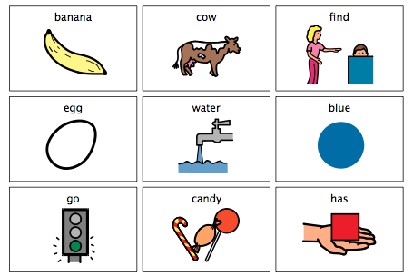

# Multiple Means of Representation

## Principle 1: Provide Multiple Means of Representation

We learned that we collect information through the recognition networks in the brain, but collecting that information depends on how that information is presented to us as learners. Learners are diverse.

There are learners who may have different cultural backgrounds, learners who may be visually or hearing impaired, and learners who may have cognitive disabilities. Not everyone perceives information the same way, so it is critical that instruction is delivered in various, multiple formats.

<strong>Principle 1: Multiple Means of Representation</strong> focuses on ensuring variety in instructional delivery. Different mediums should be considered when teaching learners. Presenting information in formats such as print, electronic text, visual and aural is critical. 

Consider those who may have cognitive, visual, and auditory disabilities, or those who may speak a different native language. For a student who has a cognitive disability, providing instructional visuals may help him or her process information; but a visual will not assist a student who is visually impaired.

Implementing multiple instructional options will enhance the chances of diverse learners achieving learning goals and objectives.

## Guidelines for Multiple Means of Representation

### Guideline 1: Provide Options for Perception

Information is perceived through the senses, particularly through sight, sound, and touch. If instructional information is not presented in a way a learner perceives information, it will be extremely difficult for the learner to grasp the knowledge. 

Preventing imperceptibility involves presenting the same kind of information in different formats, particularly in formats students can customize based on their specific needs. When options for learners are built into instructional materials, it maximizes a teacher's chances of reaching a greater number of students.

#### Checkpoints for Guideline 1

##### Checkpoint 1.1: Allow Information to be Customized

Teachers should consider presenting information in print as well as in digital formats. When digital materials are presented, students should be able to customize the information according to their specific needs. For example, learners should be able to adjust text and image sizes, change fonts, color contrast, the sound and speed levels of audio and video resources.

##### Checkpoint 1.2: Make Auditory Information Accessible

Be aware that information presented audibly may not be accessible to students who are deaf or hard of hearing. Consider providing captions and transcripts for video and audio, incorporate speech-to-text technology in the classroom, and supply visual interpretations of music or sounds.

##### Checkpoint 1.3: Make Visual Information Accessible

Be cognizant that information presented in a visual format may not be accessible to students who may be blind or visually impaired, or to students who may not know how to interpret graphics due to their backgrounds. Provide both print and electronic descriptions of images and graphics, and use physical, tactile models (maps, atomic structures) for students to touch to grasp information.

### Guideline 2: Provide Options for Language, Mathematical Expressions, and Symbols

Different representations of content should be presented to learners to not only increase accessibility, but to enhance comprehension.

There are instances where learners may not know or understand what a graphic or symbol may be communicating to them, or what a mathematical equation may be asking of them. This could be due to a specific disability or it could be due to differing cultural backgrounds. In any case, instructors should provide supplemental materials that increase understandability.

#### Checkpoints for Guideline 2

##### Checkpoint 2.1: Explain Vocabulary and Symbols

It is vital to the learning process that instructors take time to teach vocabulary and symbol meanings that will enable students to be successful. Provide descriptions along with graphics and symbols; and supply additional resources like definitions and translations for unfamiliar terms.

##### Checkpoint 2.2: Highlight Syntax and Structure

The structure of sentences or math equations may be confusing or unfamiliar to some learners. Ensure that relationships between structures are highlighted and emphasized. Additionally, help students connect syntax and structure they have already learned to new knowledge they obtain.

##### Checkpoint 2.3: Help Decipher Mathematical Notation, Text, and Symbols

To help students learn math symbols and notations, and decode them easier, teachers need to use the symbols frequently. Learners can better recall the meaning of symbols, text, and notations if they are used with fluency in the classroom environment.

##### Checkpoint 2.4: Support Other Languages

For learners who are not very familiar with the primary language used in the classroom, additional resources should be provided. Consider supplying definitions and key information in both the primary classroom language as well as a student’s native language. Electronic translation tools may also assist learners in comprehending language. Also, consider complementing text-based materials with visuals to increase understanding of text information.

##### Checkpoint 2.5: Utilize Multiple Media Formats

Text has traditionally been the primary format for instructional materials. However, learning materials presented in text format may be inaccessible to students with cognitive disabilities and print disabilities. Text-based materials should be supplemented with visual illustrations like diagrams, models, charts, and videos. Ensure that connections between the text formats and visual formats are clear to learners.

### Guideline 3: Provide Options for Comprehension

The key to education is to ensure learners are able to use and apply knowledge they consume. Enabling students to link new information to what they have previously learned and incorporating active learning strategies may increase a student’s capacity to process information. Students are diverse in how they process information, so instructors must include variable options for learners to comprehend information.

#### Checkpoints for Guideline 3

##### Checkpoint 3.1: Provide Background Knowledge

Students learn better and retain new information when they can connect the new information to previous knowledge. However, some learners may not have the background information needed to comprehend a new topic. There are also students who may have the necessary background knowledge, but they may not know how to associate it with new knowledge.

Instructors need to make sure that background knowledge is supplied and activated to make learning more meaningful. Teach prerequisites and use aids like concept maps to assist students in joining new information with prior knowledge.

##### Checkpoint 3.2: Focus on Patterns, Critical Features, Big Ideas and Relationships

One critical key to learning is the ability to determine what is important to know from what is secondary, or not so important to know. Being able to focus on critical information makes learning more efficient. However, some students may need assistance in determining what they really need to learn.

Highlighting major concepts and elements in instructional materials and delivery can help students select primary information from secondary information. Instructors can use resources like outlines, examples, and cues to help learners identify essential information.

##### Checkpoint 3.3: Support Information Processing, Visualization, and Manipulation

The ability to use new information is based on that information being successfully processed. Processing information is a skill that needs to be nurtured during the learning process. The skill involves learners being capable of picking, choosing, and modifying information in a manner that allows them to better recall and remember that information. Instructors can foster these skills in students through progressive guidance. Some examples include using scaffolds in learning materials and activities, sequentially guiding students through step-by-step procedures, and delivering instructional content in smaller, digestible parts.

##### Checkpoint 3.4: Support Transfer and Generalization

Once learners process information, they need to be able to apply that information to different situations. This ability also needs to be cultivated during the learning process. Using multiple means of representation is vital in supporting students being able to use information in different contexts.

Instructors should use various teaching methods that trigger students to connect and transfer what they have previously learned to new information. Instructors should encourage students to use studying techniques like mnemonic devices for memory and generalization, and provide different ways for students to gather information like concept maps and outlines for taking notes.