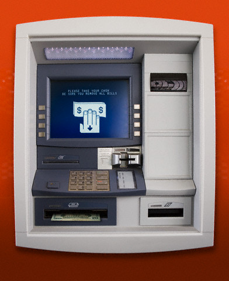
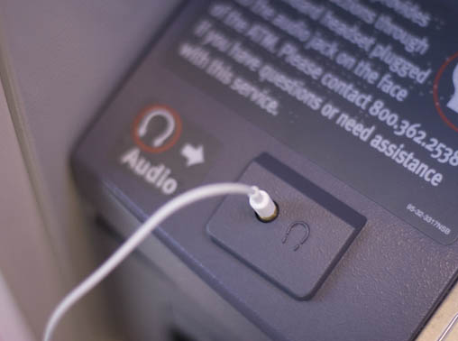
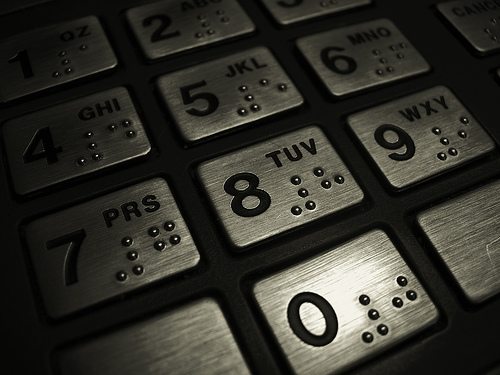
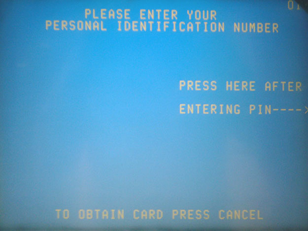
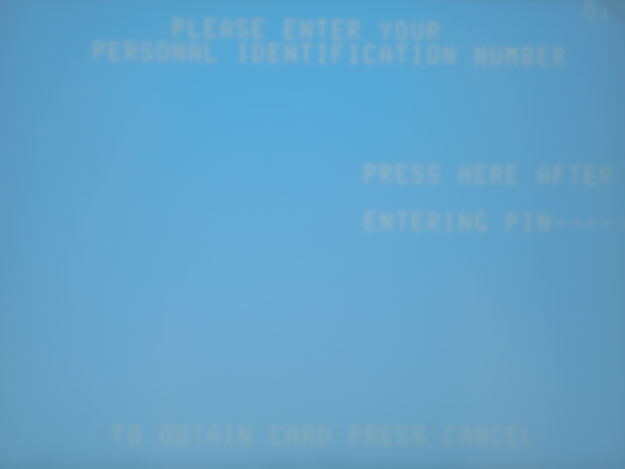

# ATMs

As recently as 2012, an article in the Wall Street Journal, ["ATMs Fall Short on Disability Rule,"](https://www.wsj.com/articles/SB10001424052970204276304577265710282201338) pointed out that about 50% of all ATMs failed to meet basic accessibility guidelines for blind access, even with legal regulations in place. If we consider electric wheelchair access, the problem is even worse.

In fact, nearly all ATMs are inaccessible to electric wheelchair users with limited upper body mobility. Even the most accessible modern ATM designs are a compromise between practical architectural concerns, the business concerns of banks, and full accessibility.

## Physical Accessibility

If you were an electric wheelchair user with limited upper body mobility, would you be able to roll up to an ATM and use its interface? Probably not. The vast majority of ATMs do not offer space underneath them to position a wheelchair, and you probably wouldn't be able to lean over far enough (or at all) to reach the controls on the ATM.

Voice activation might work for some people with limited upper body mobility, but that would also reduce the privacy of the interaction. Anyone standing nearby would be able hear the person's requests, including account and PIN information.

Unfortunately, the reality for most people with limited upper body mobility is that they need to depend on other people to perform these functions. Either the person will never use an ATM, or the person will entrust a friend or family member with the task of using the ATM on their behalf

There aren't really any options that allow for independent access to ATMs for people with limited upper body mobility, except to redesign the physical interface. If the person were able to position the wheelchair under the keyboard, the person could use a mouth stick or a head wand to touch the controls, but very few ATMs are designed this way.

On the positive side, manual wheelchair users with full upper body mobility won't have as much difficulty, as long as the interface is low enough.

## Blind Access

Many modern ATMs have headphone jacks, allowing a blind user to walk up to the ATM and hook up some headphones to listen to audio instructions, and to interact with the ATM using an audio interface. Headphones aren't included with the ATM. Users need to bring their own. Even so, this is an important advance for blind people.

Many ATMs also have braille characters on the keypads, making it possible for blind users to accurately type in their PIN and other information.

## Low Vision Access

Some ATM screens are difficult to read because of the low contrast between the text and the background, as shown in this photograph of a login screen with yellow text and a light blue background.

A person with low vision might see it more like this:

In fact, a person with perfect vision may also find the screen hard to read if the sun is shining directly onto the screen. High contrast screens benefit more than just people with low vision.

## Online and Mobile Banking

Online banking can solve some of the access issues for users with disabilities. It probably wouldn't be a good idea to request cash this way and have it sent in the mail, but users could perform other functions, such as transferring amounts between accounts, finding out account balances, read account statements, and even deposit checks using applications that allow users to photograph the check and deposit it from home. Even a blind person could deposit a check this way, with a little practice.

All of this depends on the accessibility of the bank's web site and mobile application. If either is inaccessible to people with disabilities, that just adds to the frustrations of not being able to use other aspects of financial institutions.

## Universal Design Principles and Examples

Table: UD Principles and Examples that Apply to ATMs

UD Principle            | Examples of Principle
------------------------|--------------------------------------------------------------------------
Principle 2,            | - ATMs that have tactile interfaces, such as dials, or touchscreen
Flexibility in Use      |   interface and larger buttons
                        | - ATMs that are placed at varying heights for diverse users to access, 
                        |   and designed for wheelchair access
------------------------|--------------------------------------------------------------------------
Principle 4,            | - ATMs that provide visual, tactile and audio information to users, 
Perceptible Information	|   and utilizes higher contrast settings to make visual information 
                        |   more distinguishable
                        | - ATMs that allow users to utilize their personal devices to interact
                        |   with and operate ATMs

