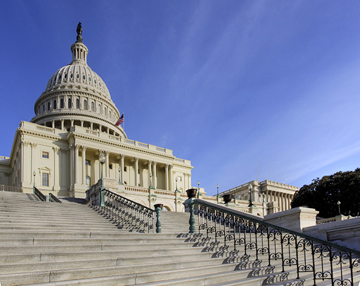
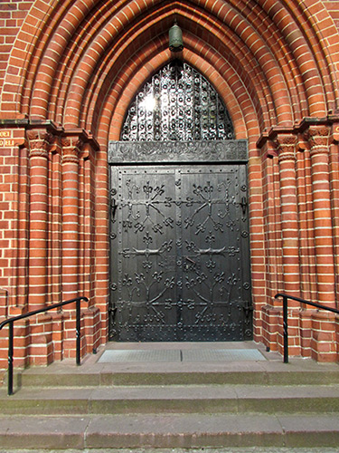
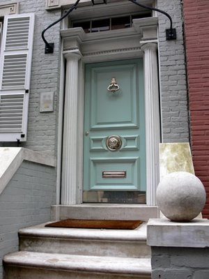
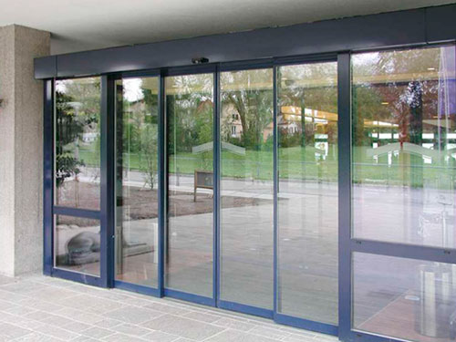
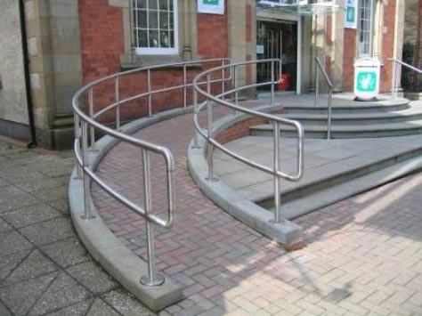
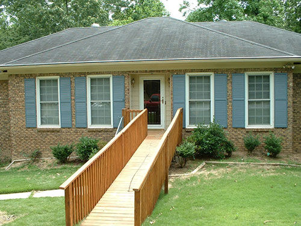
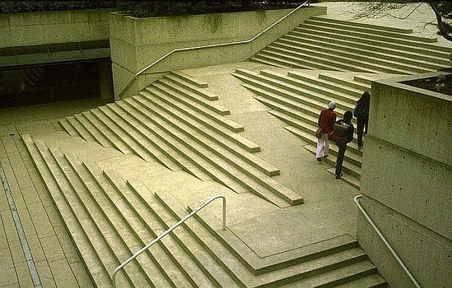

# Building Entrances

If a person can't get into a building (or web site), it doesn't matter how accessible it is on the inside, because there is an insurmountable barrier on the outside.

## Steps

Steps are a pretty formidable barrier to people using wheelchairs. Nearly all older buildings have steps or stairs leading up to the entrance.

## "Unvisitable" Houses

The vast majority of single family homes, townhomes, and row houses in western countries have steps leading up to the front door. This means that if you have a friend who uses a wheelchair, there is no way for your friend to come visit you and enter into your house independently.

You, or someone else, will need to help your friend up the stairs. Or, if your friend is in an electric wheelchair, which can weigh hundreds of pounds, chances are you simply won't invite your friend over, because there is no way to get your friend in and out of your house.

Think about that. If you are the person in the wheelchair, you can visit hardly any of your own friends. You could always meet at a wheelchair-accessible restaurant or somewhere else, but you can't visit your friends in their houses. That's sad. Homes are simply not created with universal design in mind.

## Universal Design for Entrances

One way to get around the problem of steps is to eliminate the steps altogether. Many modern commercial buildings have done just that. This kind of design allows for easy access for everyone. No one is excluded.

Ramps
A ramp is another way to make an entrance accessible to a wheelchair. Ramps plus steps give people an option to choose between the two ways of approaching the front entrance. Ramps take up quite a bit of space, so they are not as elegant in some ways as a simple flat entrance, but ramps are an acceptable option.

Some ramps dramatically alter the appearance of the building, and not always in a good way. In the photo below, a long wooden ramp leads up to the front of a house. The ramp dominates the visual design of the front yard and divides the lawn into two halves. If the home had been designed with universal access in mind to begin with, the ramp wouldn't have been so prominent, and may not have been necessary at all.

Still, there are ways of creating ramps that are both functional and attractive. The ramp below zig-zags among stairs, creating a modern universal design that everyone can use.

## Universal Design Principles and Examples

Table: UD Principles and Examples that Apply to Building Entrances

UD Principle	Examples of Principle
---------------------------|-----------------------------------------------------------------------
Principle 1, Equitable Use | - Same entrance to the building for all people (instead of a main 
                           |   entrance for people who can walk up stairs and a separate entrance
                           |   for people in wheelchairs)
                           | - Ramps built into stairs – not separate from stairs
                           |   (sleek, modern universal design)

