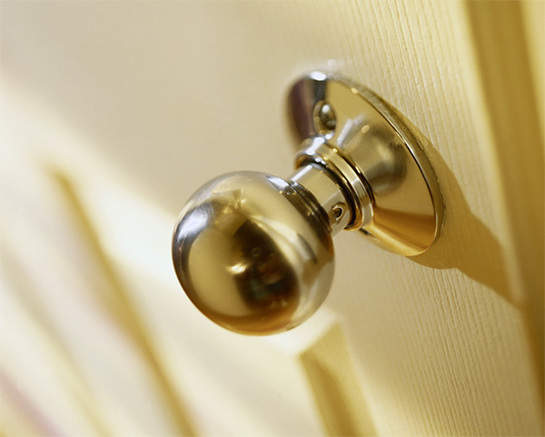
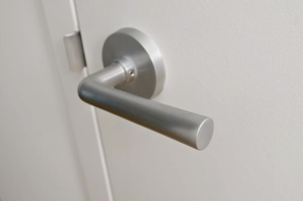
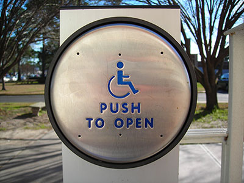
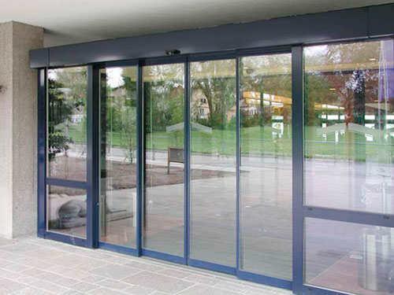
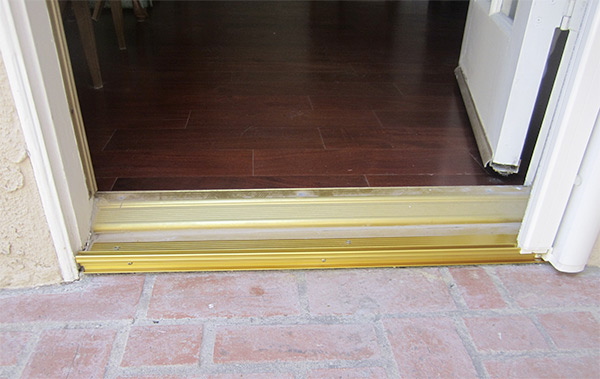
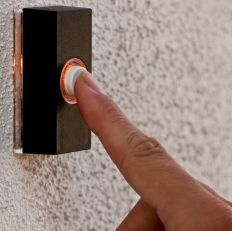
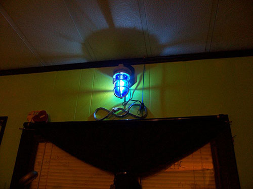
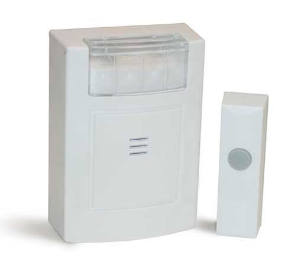

# Doorways

Let's assume that you walked on an accessible sidewalk, up to an accessible entrance of a building. What kind of door are you going to find? Will the door itself be accessible? What if you have quadriplegia? What if you have some use of your hands, but you can't grip very tightly? What if you have no hands at all? Will you be able to open the door by yourself? That depends on the design of the door.

## Doorknob Designs

A classic rounded doorknob will be inaccessible to people with weak grip, people with quadriplegia, or people without hands.

A lever doorknob will be significantly more accessible to a wider range of people. People with no hands may be able to use a shoulder or other body part to push on the lever. People with weak grips may be able to put the weight of their hand on the door and push down.

Levers still are not universally-accessible though. A person with quadriplegia probably will not be able to operate the lever.

## Alternatives to Doorknobs

One solution would be to install a push button that opens the door automatically. If positioned well, a person with quadriplegia could push on the button with the electric wheelchair, allowing the person to pass through the doorway independently.

## The Universal Design Approach

Another option would be to get rid of the doorknob completely and install an automatic door with a sensor to open for anyone who gets close to the door. This solution requires no effort whatsoever from the people who want to enter the building.

## Door Thresholds

Door thresholds can be almost as bad as steps. Tall thresholds are bad for people in wheelchairs, who may not be able to push or power their chair over the threshold. They're also potentially bad for people who are blind, who may trip on them. Lower thresholds don't present as much of a problem, but they could still trip up an unsuspecting blind person.

## Doorbells

Doorbells present some of the same problems as doorknobs. People with quadriplegia can't push them. People without hands may or may not be able to push them, depending on how the doorbell is designed.

People who are blind don't know if a door has a doorbell or not, without feeling around. Doorbells aren't always placed in the same location, so it is a guessing game when walking up to an unfamiliar door.

What about deaf people? If they're inside the house, how will they hear when a doorbell rings? The answer is that they won't. There is a workaround though. Doorbells can be hooked up to lights instead of to chimes. When a visitor presses the doorbell, the lights flash or blink. The light below is kind of an industrial-looking design.

This next example, which shows both the light on the left and the doorbell on the right, is more discreet.

Doorbells can also be programmed to send a signal to a device that a person wears, such as a cell phone, which can vibrate and/or flash a light.

## Universal Design Principles and Examples

Table: UD Principles and Examples that Apply to Doorways

UD Principle            | Examples of Principle
------------------------|--------------------------------------------------------------------------
Principle 4,            | - Doorbells that have lights as well as audio cues
Perceptible Information	| - Doorbells that can be programmed to send vibrating signals to a device
------------------------|--------------------------------------------------------------------------
Principle 6,            | - Doors that have lever handles that require less effort to operate
Low Physical Effort     | - Electronic doors with sensors and flat entryways that everyone can use

