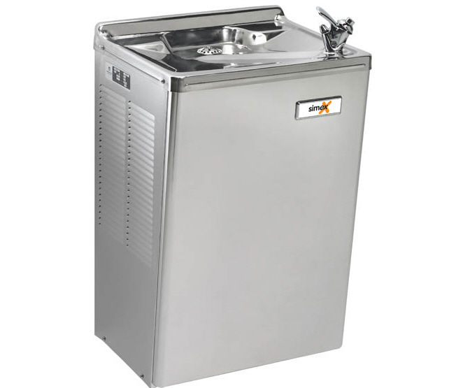

# Drinking Fountains

Drinking fountains fit many of the same accessibility design patterns as things we have already described, like faucets, sinks, and doorknobs. You need to be able to roll a wheelchair under the drinking fountain.

You need to be able to turn on the water with minimal pressure, and perhaps without hands. Additionally, you need the fountain to be reachable by very short people, such as people with dwarfism or children.

Here is an outdated drinking fountain, not created with universal design in mind:

An alternative version features two fountains at different heights, large push buttons in front that a person may be able to activate with a wheelchair, and room underneath the fountains to maneuver a wheelchair.

Something that would make these fountains even more accessible would be an auto-detect feature, so that people wouldn't have to push any button.

## Universal Design Principles and Examples

Table: UD Principles and Examples that Apply to Drinking Fountains

UD Principle	Examples of Principle
--------------------|------------------------------------------------------------------------------
Principle 2,        | Drinking fountains that are placed at varying heights to 
Flexibility in Use  | accommodate different users
--------------------|------------------------------------------------------------------------------
Principle 6,        | Drinking fountains that have auto-detecting features
Low Physical Effort |
