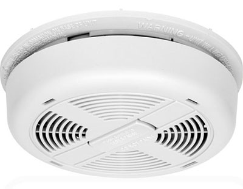
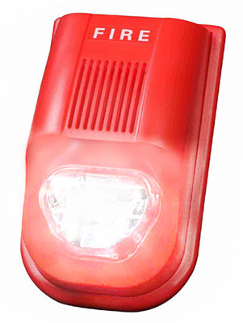
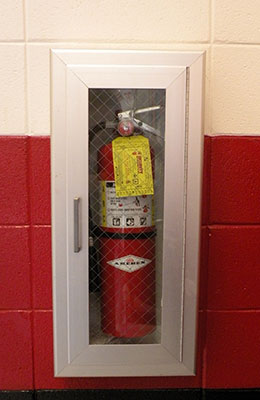

# Emergencies

What happens to people with disabilities in an emergency? How do they find out that there is an emergency at all?

## Fire!

If a smoke detector goes off in a house, it sounds a loud, annoying alarm. People who can hear can't help but pay attention to it. People who are deaf, though, can't hear it at all. They need a visual way of finding out about the emergency.

One solution is to provide smoke detectors with bright flashing lights. These will be able to get the attention of a deaf person, as long as the light is flashing in the same room. It may be necessary to install the lights in multiple rooms.

A blind person will be able to hear the alarm just fine, unless the person is also deaf. In that case, the person will need a mobile device that vibrates when a smoke or fire alarm goes off.

Blind people do face another challenge though. They may not know where to find a fire extinguisher, even if it is right in front of them. This is especially true if the fire extinguisher is built into the wall like the unit shown below.

The chances of a blind person ever becoming aware of a fire extinguisher like this are very low. The fire extinguisher might be able to save a life, but not if it is essentially invisible.

## Universal Design Principles and Examples

Table: UD Principles and Examples that Apply to Emergencies

UD Principle            | Examples of Principle
------------------------|--------------------------------------------------------------------------
Principle 1,            | - Emergency exit routes that are accessible and usable for all people
Equitable Use           |
------------------------|--------------------------------------------------------------------------
Principle 4,            | - Smoke detectors and other alarm systems that have flashing lights
Perceptible Information |   and audio sounds

## More Information:

- News story: [Federal grant to provide smoke alarms for deaf and hard-of-hearing in New Hanover County](https://portcitydaily.com/local-news/2013/07/30/federal-grant-to-provide-smoke-alarms-for-deaf-and-hard-of-hearing/)