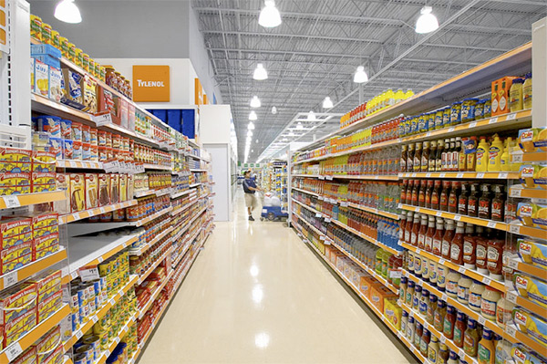
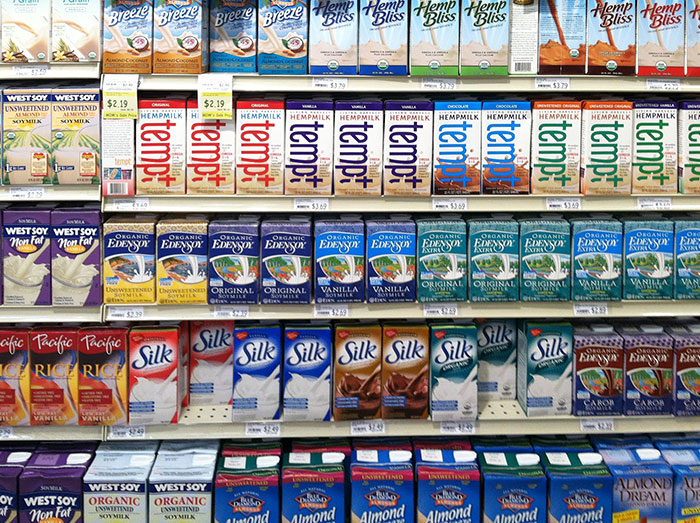

# Grocery Stores

Food. We all need it. One place to get it is at the grocery store. But not if we find the grocery store inaccessible. How can a person with quadriplegia go grocery shopping?

## Physical Access

Even if the person is able to enter the store, the experience itself of shopping is inaccessible. Shopping requires grabbing items and putting them into a cart. It requires putting the items on the conveyer belt or counter at the register to purchase them. A person with quadriplegia cannot do these things.

A person with paraplegia can use their hands, but probably cannot get up out of the wheelchair to access items on higher shelves. In principle, if the shelves were lower, a person with paraplegia could shop independently, but that's not how grocery stores are built.

In fact, the shelves near the bottom are also inaccessible. There is a small range in the middle that is ideally accessible to a person in a wheelchair.

## Access for People with Visual Disabilities

A person who is blind or who has low vision is not going to be able to see well enough to get around the store to know where to find items. Beyond that, a blind person wouldn't be able to distinguish items on the shelves, because none of the containers have braille labels.

Even if they did, it would take an exceptionally long time to browse a grocery store by feeling all of the labels on everything.

Can you imagine trying to tell the difference between all of the identically-shaped boxes in the photo below, without being able to look at them? If you wanted Silk brand, but not EdenSoy or WestSoy or Hemp Bliss, would you be able to find what you wanted if you were blind? Of course not. It's an impossible task.

The experience of going to a grocery store is simply not very accessible to a lot of people with different kinds of disabilities.

## Buying Groceries Online

Now, in some cities, some grocery stores sell groceries online and provide delivery. A person with quadriplegia, paraplegia, blindness, or low vision could use the appropriate assistive technologies and purchase food online, completely independently, without receiving help from anyone. That's quite a leap forward for the independence of people with disabilities, especially for those who cannot easily leave the house.

## Universal Design Principles and Examples

Table: UD Principles and Examples that Apply to Grocery Stores

UD Principle         | Examples of Principle
---------------------|-----------------------------------------------------------------------------
Principle 1,         | - Shelves, product markers, product information, and prices that can be 
Equitable Use        |   exposed to portable devices
                     | - Orientation and guidance provided in the grocery store for everyone 
                     |   to help find items
---------------------|-----------------------------------------------------------------------------
Principle 2,         | - Shelves placed at lower heights to accommodate diverse needs of shoppers
Flexibility in Use   |
