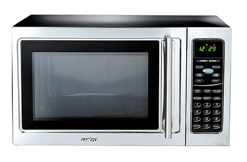
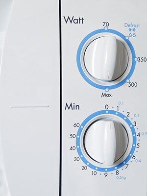

# Microwaves

## Touchscreen Interfaces

Most microwaves these days have a flat touchscreen interface designed for visual users.

There are no perceptible buttons or dials for a blind person to feel or grasp. The flat interface of microwaves makes them exceptionally difficult to use without sight or with low vision.

Some people with visual disabilities will have friends or family members place bumped stickers on top of the buttons to make the interface more blind-friendly. Blind users would still need to memorize what each sticker meant, but at least they wouldn't have to guess where the buttons were.

## Tactile Interfaces

Older microwaves used to be built with dials, which were less of a problem for people who were blind. It turns out that you can still buy microwaves with dials, but they are much harder to find these days.

## Accessible Alternatives
There are other ways to make microwaves accessible to people with visual disabilities. The microwave could include an audio interface, or employ a [blind-friendly touchscreen, similar to the one available in New York City taxis](taxis.md).

## Universal Design Principles and Examples

Table: UD Principles and Examples that Apply to Microwaves

UD Principle             | Examples of Principle
-------------------------|-------------------------------------------------------------------------
Principle 2,             | - Microwaves that have tactile interfaces, such as dials, or 
Flexibility in Use       |   touchscreen interface and larger buttons
-------------------------|-------------------------------------------------------------------------
Principle 4,             | - Microwaves that provide visual and audio feedback and 
Perceptible Information  |   have tactile markers

