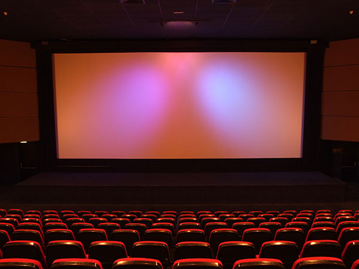
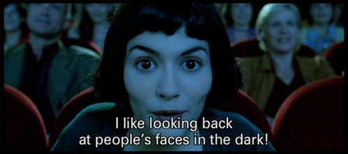

# Movies

AMC movie theater accessibility info: https://www.amctheatres.com/assistive-moviegoing opens in a new window opens in a new window

Closed caption glasses, with audio description tracks by Sony at Regal theaters: http://www.npr.org/blogs/alltechconsidered/2013/05/12/183218751/new-closed-captioning-glasses-help-deaf-go-out-to-the-movies 

## Universal Design Principles and Examples

Table: UD Principles and Examples that Apply to Movies

UD Principle             | Examples of Principle
-------------------------|-------------------------------------------------------------------------
Principle 1,             | - Movie theaters that provide integrated and adaptive seating
Equitable Use	           |
-------------------------|-------------------------------------------------------------------------
Principle 4,             | - Movie theaters that provide assistive devices that allow viewers 
Perceptible Information  |   to amplify audio, listen to audio description, or view captions 
                         |   for movies
-------------------------|-------------------------------------------------------------------------
Principle 7,             | - Movie theaters that have wide aisles and seating for those who use 
Size and Space for       |   assistive technologies
Approach and Use	       |

## See also:

- [Audio description in theaters: Making theaters more accessible](https://afb.org/aw/14/12/15725)
  