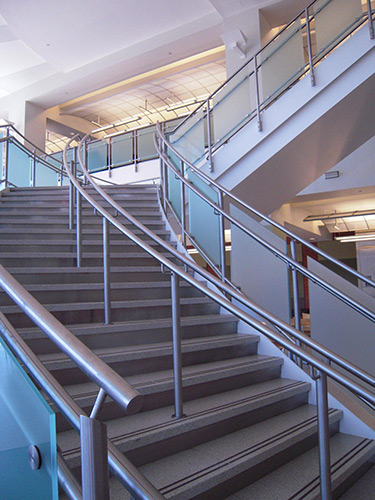
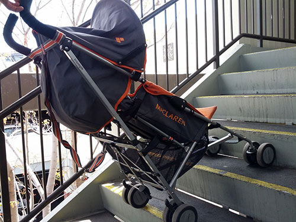
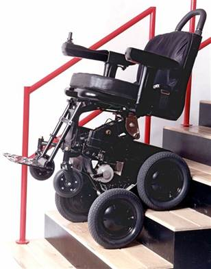
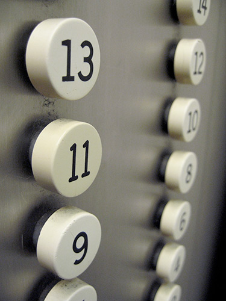
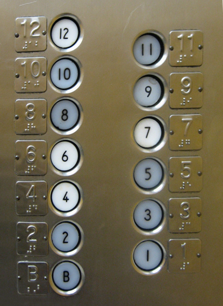

# Multi-Level Buildings

## Stairs

As with building entrances, steps and stairs can present a major obstacle for people using wheelchairs. Wheelchairs, strollers, carts, and other wheeled devices don't do well on stairs. In contrast to building entrances, which can be made universally-accessible relatively easily, stairs are an example of a technology that is not universally-accessible.

## Assistive Technology for Stairs

One approach to the problem would be to invent an assistive technology that can climb stairs. Dean Kamen's iBot wheelchair had the ability to climb stairs by balancing on two wheels at a time and then flipping a second set of wheels over to the next step. This design was revolutionary, but it did have limitations.

People with quadriplegia could not use it because users need to grip the handrail on the stairs to ensure stability. In any case, this wheelchair, sadly, has been discontinued, so it is no longer available for purchase, except on the used market.

Even though stair-climbing assistive technologies are a fascinating idea, so far, they have seen only limited applicability and limited acceptance within the marketplace. For the most part, then, with stairs, the goal is not direct accessibility.

We don't need to make stairs accessible to wheelchairs (or strollers, or carts). We need to make sure wheelchair users can get from one floor to the next.

That's where elevators come in.

## Elevators

Elevators solve the problem of getting people from one floor to the next.

Or do they?

How is a person with quadriplegia supposed to press the buttons to control the elevator? A person with quadriplegia can't move the hands, or doesn't have sufficient control over the hands to do that. People with quadriplegia generally can't use an elevator independently. As great as elevators are, they don't enable independent access to the building for people with quadriplegia.

Similarly, blind people can walk into an elevator, but will they be able to press the right buttons? Old elevators tend to have flat buttons without any distinguishing characteristics that a blind person can use to distinguish one button from the other. The blind person is also dependent in these circumstances.

Maybe blind people could push all of the buttons and that would at least guarantee that the right floor would be among the buttons, but how would blind people know when they arrived at the right floor? If all the elevator does is open the door, and maybe play a "ding" sound, there's no way for them to know what floor they're on. Some elevators announce the floor, but most don't.

Fortunately, many modern buildings now have raised numbers and/or tactile braille text on the buttons, allowing blind people to use the elevator independently.

So that solves the problem for people who are blind.

Or does it?

Unfortunately, some people don't have enough sensitivity in their fingertips to be able to read braille effectively, and not all blind people know braille. The braille is still a good idea, and it still helps many people, but it isn't quite as universal as we might hope it would be.

Plus, if more than one button is pushed, blind people still won't know what floor they're on for sure, so they won't know when to get off, unless the elevator announces the floors.

## Universal Design Principles and Examples

Table: UD Principles and Examples that Apply to Multi-Level Buildings

UD Principle            | Examples of Principle
------------------------|--------------------------------------------------------------------------
Principle 1,            | Elevators provided for access to multiple levels in buildings 
Equitable Use	          | that can be used by a wide variety of people
------------------------|--------------------------------------------------------------------------
Principle 4,            | - Buttons on elevators that are tactile or have braille on them
Perceptible Information	| - Visual and audio feedback that announces each floor level
