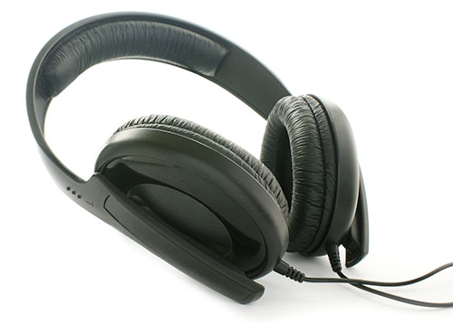

# Printed Materials

## Overview

There is a whole category of disability often referred to as "print disabilities." This can include people who are completely blind, people with extremely low vision, people with cognitive disabilities, or others for whom reading is particularly difficult or impossible.

Anything on a printed page is pretty much useless to people in this category. You may as well hand them a blank newspaper for all the good it is going to do.

There is so much print all around us, that it is easy to forget how much of the world is inaccessible to people with print disabilities. Print appears on:

- books
- magazines
- brochures
- business cards
- signs
- mail
- packaging
- clothing labels
- money
- television
- slide presentations
- consumer products of all kinds
- government and other official documents
- roads
- websites
- and many other places

## Books
Outside of a dog, a book is a man's best friend. Inside of a dog it's too dark to read.
- Groucho Marx

Books are pretty important. They are the basis for much of the information and learning available in this world. They are a record of our collective wisdom over the ages. Making books accessible to people with print disabilities ought to be a high priority.

Fortunately, many books are now available in electronic formats in e-readers, online on web sites, and in many other digital formats. The digitization of books opens new realms of possibility for independent learning and enjoyment for people with print disabilities.

When text is in a digital format, it has the potential to be read by screen readers, it can be manipulated by screen magnifiers, and its appearance (color, font, contrast, etc.) can be altered to meet the needs of people with low vision.

By moving to the digital space and avoiding printed materials altogether, you can bypass a lot of the problems associated with print disabilities.

Unfortunately, many e-readers, especially when they were first introduced, were inaccessible to people with print disabilities. The security settings on the e-readers didn't allow for screen reader access for blind readers or visual personalization for readers with low vision.

More recent versions of some of these e-readers have fixed some of these problems, but there is still plenty of room for improvement.

## Braille

People who are blind may be able to read braille (though not all can), so braille can be an acceptable alternative for some people. There are drawbacks to braille. Braille is expensive to produce. It requires very thick paper, which means that braille books end up being massive, both in terms of size and weight.

Can you imagine converting a long book like Les Miserables (approximately 1,488 pages in paperback) into a braille book? You could fill an entire wall with volumes of braille books for that one title.

## Business Cards

It is possible to make business cards more accessible to blind people who can read braille by adding braille embossing to the card. The card shown below has print on one side and braille on the other. Due to space limitations, the braille contains only the email and phone number. Even so, the most basic information is available to blind people who can read braille, compared to a completely flat card that is not at all useful to a blind person.

A person with low vision would still have difficulty reading this business card. To make business cards more accessible to people with low vision, the print would need to be much larger. In fact, you would probably want a separate version of the card without braille, because the braille can interfere with the readability of the text on the front.

Or, in this digital age, a better alternative to printed business cards may be to simply send the person a quick email or text message using your phone.

## Money

Money can be a particular problem for people who are blind or who have low vision, especially in the United States, where all of the bills are the same size and texture. A blind person can't tell them apart, and needs to rely on the honesty of other people when buying things with cash at retail locations.

People with low vision often have a hard time telling the bills apart too. Old paper currency in the U.S. was particularly bad for this. They all had nearly identical designs. When the designs are blurred, they are very difficult to distinguish from each other.

A person with low vision would need to read each bill with a magnifying glass or ask for help from other people. More recent designs for U.S. currency introduce visual changes that make each bill a little more distinctive, with added colors and other features.

Most of the justification for adding those new features was based in security concerns with counterfeiting, but it turns out that those features have the added benefit of helping people with low vision. The new designs still aren't much help to people who are blind though.

## Print and Screen Magnifiers

People with low vision often require print magnification or screen magnification to read printed materials. Something as simple as a magnifying glass can work for some people.

Other people need the more powerful capabilities of an electronic print magnifier with a computer monitor.

A screen magnifier works in a similar way, except that it magnifies the output of a regular computer on the screen.

## Audio

For most blind people, audio is usually the preferred method to access printed materials, especially if they are going to access the materials on their computer, because with a screen reader, users have many options as far as how to read it, including how fast to read it, whether to skip ahead to different sections, and so on.

To convert printed materials to audio format, someone would need to record a person reading the materials, or a text-to-speech process or OCR (Optical Character Recognition) software program can convert the printed materials to digital text, and that digital text can then be read by a screen reader.

## Universal Design Principles and Examples

Table: UD Principles and Examples that Apply to Printed Materials
UD Principle              | Examples of Principle
--------------------------|------------------------------------------------------------------------
Principle 3,              | - Printed text-based materials are supplemented with visuals that
Simple and Intuitive Use  |   reinforce information
                          | - Printed materials that use language that can be understood by a wide
                          |   range of users
--------------------------|------------------------------------------------------------------------
Principle 4,              | - Options that are provided for printed materials, such as braille, 
Perceptible Information   |   large print, and electronic formats
                          | - Content on printed materials that is clear and distinguishable
