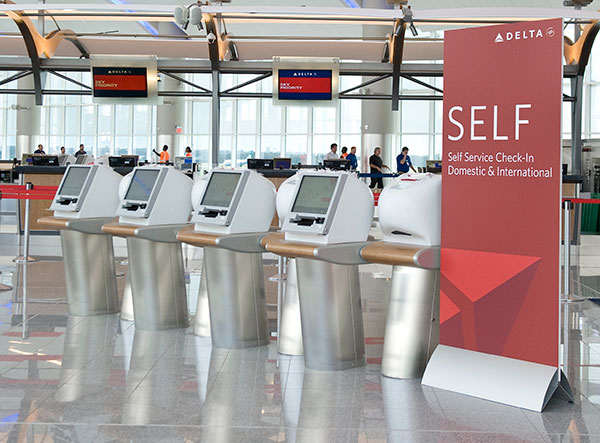
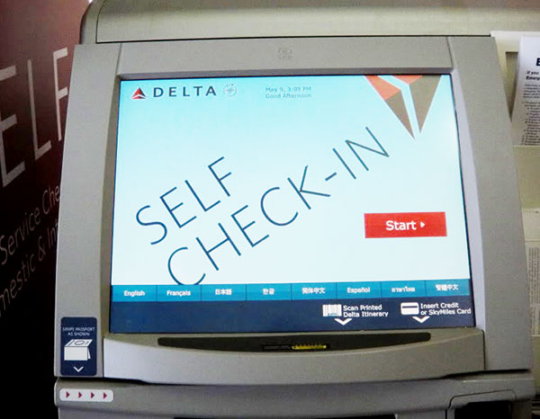
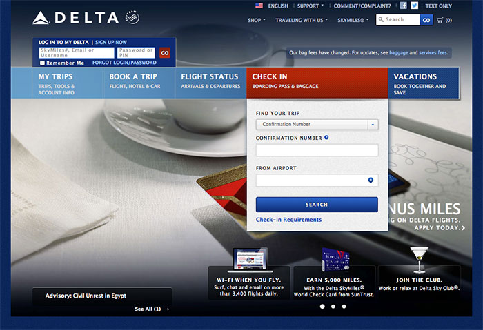
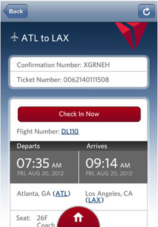
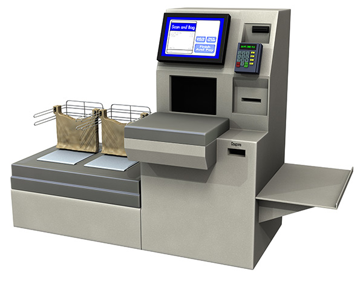
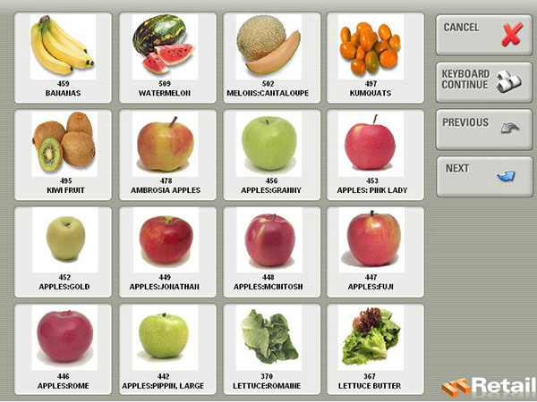

# Self Check-in/Check-out

Self check-in systems at airports help to speed up the process of getting from the airport entrance to the boarding gate. In a broad sense, they make the check-in process more "accessible" to the general population. In terms of disability accessibility though, they introduce new kinds of potential barriers.

## Physical Access

The kiosks are placed at a height that is convenient for most people, but which won't necessarily work for people in wheelchairs. As with drinking fountains, it can help to place kiosks at different heights to accommodate a wide range of users.

## Touchscreens

Touchscreens create some inherent challenges for people who can't see them, or for people who have low vision and can't see them well. It actually is possible to make touchscreens accessible to the blind, as demonstrated by the blind-friendly touchscreen in New York City taxis.

Designers have to make the effort to design with blindness in mind, though, because touchscreens designed for sighted people generally don't include the kinds of features that blind people need, such as audio instructions, very large clickable areas, or gesture-controlled activation.

People without the use of hands, or with no hands, will probably not be able to use a touchscreen kiosk at all.

## Text Size, Button Size, Color, and Contrast

Some parts of the screen may be difficult for a person with low vision to read. Looking at the photo of the kiosk screen above, the date and time are written in very small text at the very top of the screen. In addition to the problem of size, the color contrast of the text against the background is too weak for many people with low vision to be able to read. Providing a magnified version of the interface, or simply increasing the font size and contrast for everyone, would solve the problem.

People with tremors, no fingers, or difficulty with manual dexterity may not be able to click reliably on small buttons. The "Start" button on the screen above is probably large enough. The language buttons along the bottom are smaller. Any buttons smaller than those will likely cause problems for some users. Allowing for large clickable areas on all buttons will help.

## Audio Interface

Some kiosks speak to customers and have a built-in audio interface. That will help people with low vision, and could help people who are blind, as long as the interactive touch components accommodate blind access.

## Online Check-in

Many airlines now offer online check-in systems. Customers can log into the web site, confirm their flight details, and print their boarding pass using their own computer and printer at home. If the website is designed with accessibility in mind, this can allow people with disabilities to go through the process without seeking outside help.

## Mobile Check-in

In addition to regular online check-in, some airlines offer mobile check-in with applications installed on smart phones or tablets. The usual caveat applies: this solution is helpful for people with disabilities only if the software is designed with accessibility in mind.

## Grocery Store Self Check-out

Most of the observations about airport check-in kiosks apply to self check-out kiosks at grocery stores and other retail outlets. Physical access can be a problem. Many touchscreens are placed rather high and behind the counter, making them difficult or impossible to reach from a wheelchair or for short people.

The touchscreens need to have audio interfaces for people with low vision or blindness, and the touchscreen controls need to accommodate visual disabilities. The screen below would not work well for someone with low vision. Too many of the options appear similar. 

Many of the apples look almost identical, for example, especially to someone who cannot see the details well. In principle, the text below each picture could help, but in this specific example, the text is too small to be helpful to someone with low vision as another way to distinguish the choices. The buttons are also too close together. 

A blind person could not use this kind of interface either, because there are too many choices. The screen would need to be divided into larger quadrants, with audio instructions saying things like "touch the upper right corner for 'Cancel,' touch the bottom left for 'Previous,' touch the bottom right for 'Next,'" and so on.

## Online Grocery Shopping

As mentioned in the previous section, some grocery stores offer online grocery shopping, potentially making it easier for people with disabilities to shop for themselves, without needing to ask for help or depend on other people.

## Universal Design Principles and Examples

Table: UD Principles and Examples that Apply to Self Check-in/Check-out

UD Principle        | Examples of Principle
--------------------|------------------------------------------------------------------------------
Principle 2,        | - Kiosks that have both audio and visual touchscreen interfaces to 
Flexibility in Use	|   accommodate various users, and controls that accommodate people who are 
                    |   blind or visually impaired
                    | - Kiosks that are placed at various heights to accommodate diverse users
--------------------|------------------------------------------------------------------------------
Principle 5,        | - Larger clickable areas and fonts help prevent users who are visually
Tolerance for Error	|   impaired or have motor disabilities from making mistakes and recover
