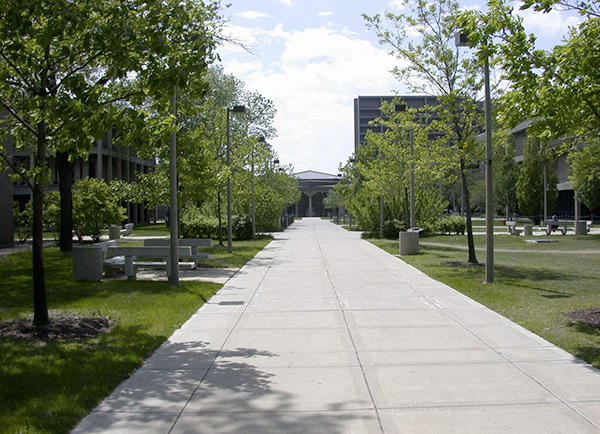
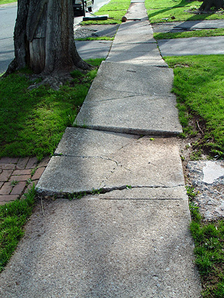
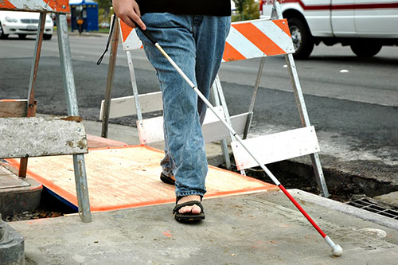
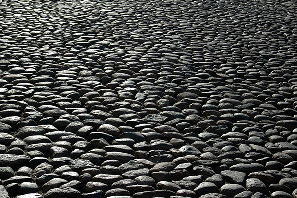
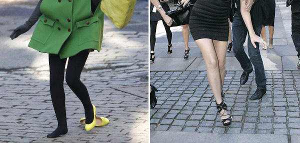
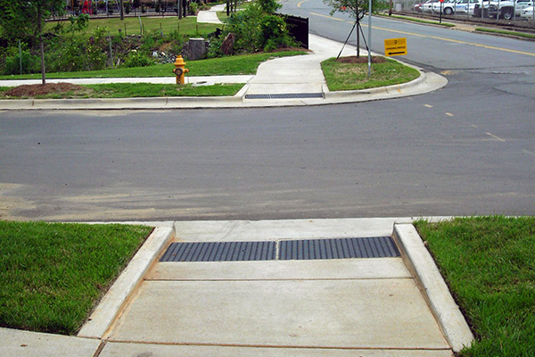
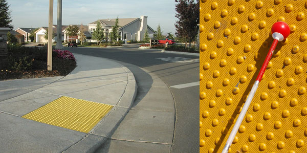
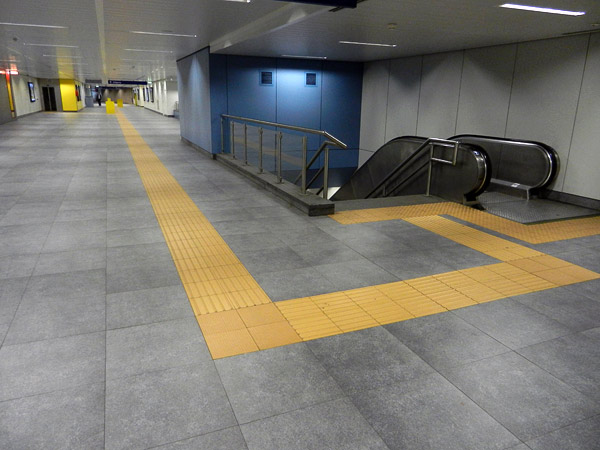
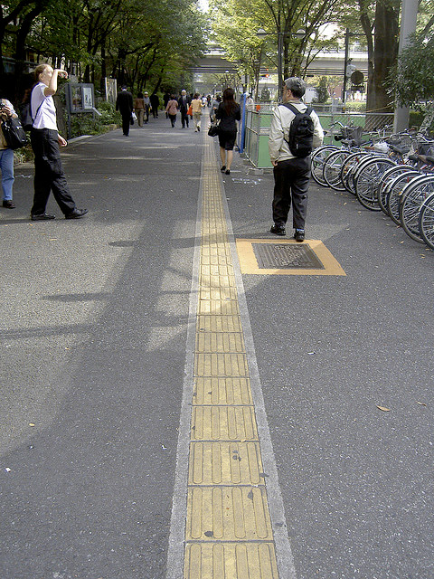
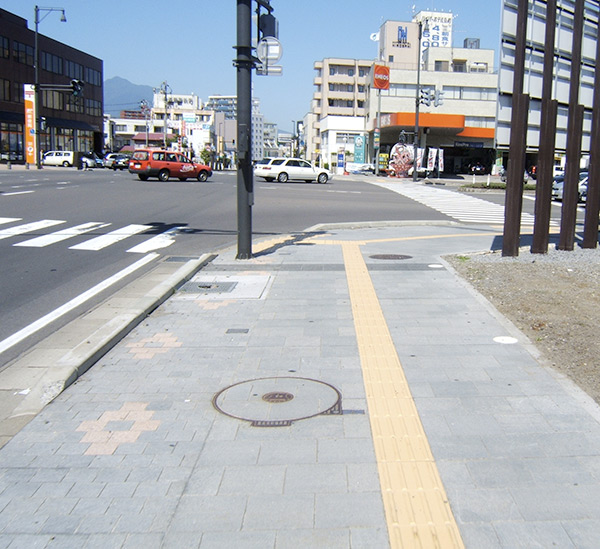

# Sidewalks

## Accessible Sidewalk Navigation
Sidewalks may seem like a bit of an odd place to start a discussion about universal design and web accessibility, but the comparison between sidewalks and digital technologies helps to set the scene for a broad discussion about what accessibility actually means.

People navigate sidewalks, and people navigate web sites. If the pathway on either has accessibility barriers, people will not be able to get to their destination.

## An accessible sidewalk is one that, at a minimum:

- is broad enough to allow people in wheelchairs to navigate and pass by others
- is flat enough to make wheelchair navigation feasible
- has no obstacles for wheelchair users or for blind users to bump into
- has clear, predictable boundaries making navigation by the blind feasible
- has curb cuts to allow wheelchair access to and from the sidewalk to other surfaces
- is relatively straight, to not cause confusion for blind users

We could add accessibility enhancements beyond these, but those will at least make accessibility possible. The photo below shows a reasonably accessible sidewalk on a college campus:

## Inaccessible Sidewalk Navigation

By way of contrast, the bumpy, broken sidewalk below presents some real accessibility challenges. People in wheelchairs may not be able to navigate over the bumps and broken edges. Blind pedestrians may trip on the bumps and cracks.

Construction along the sidewalk path can be another serious problem, making the sidewalk impassable to people with mobility or visual impairments. Construction zones can be very dangerous for blind people to navigate.

Cobblestone surfaces are nostalgically beautiful, but they are also difficult for people in wheelchairs, people who use walkers, canes, or who experience other mobility challenges.

## Universal Design of Sidewalks

People with disabilities aren't the only ones who will find cobblestone surfaces difficult. Women in high heels will struggle to walk on such an irregular surface.

People will struggle to push their strollers or carts over this surface too. (On the other hand, some kids will love the thrill of a bumpy ride!)

A sidewalk created with universal design in mind will benefit pretty much everyone, not just people with disabilities.

## Accessibility Enhancements for Sidewalks

### Curb cuts

Curb cuts are one of the most basic accessibility enhancements for sidewalks. A curb cut is a ramp graded down from the top surface of the sidewalk down to the surface level of the street, creating an unbroken transition to make it easier for wheeled devices—like wheelchairs, strollers, bicycles and carts—to navigate.

### Bumped and Ridged Tiles

Bumped tiles at the edge of the sidewalk or near obstacles can help to warn blind pedestrians and keep them safe. Blind people can feel the bumps with their feet or with their cane.

Ridges in the sidewalk can help guide blind people who use canes along the sidewalk or hallway path, and to important destinations, such as elevators, building entrances, etc.

## More Information

- Video: [Accessible Pedestrian Route Design](https://www.youtube.com/watch?v=uKYh4Ihp7WQ) from The Texas Department of Transportation

### Universal Design Principles and Examples

Table: UD Principles and Examples that Apply to Sidewalks

UD Principle                          | Examples of Principle
--------------------------------------|------------------------------------------------------------
Principle 1, Equitable Use	          | Sidewalks that are wheelchair accessible and have curb 
                                      | cuts that orient people who are blind, assist people 
                                      | with motor disabilities and people who walk with
                                      | objects such as carts and strollers
--------------------------------------|------------------------------------------------------------
Principle 4, Perceptible Information	| Detectable warnings built into curb cuts that warn people 
                                      | who are blind that they are approaching a street
--------------------------------------|------------------------------------------------------------
Principle 6, Low Physical Effort      | Sidewalks that are smooth and absent of bumps and cracks
--------------------------------------|------------------------------------------------------------
Principle 7,                          | Width of sidewalk allows for use of assistive 
Size and Space for Approach and Use	  | technologies (e.g., rollators, wheelchairs)

