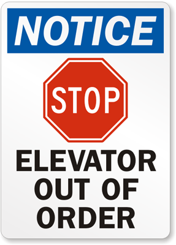
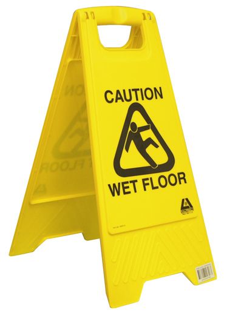
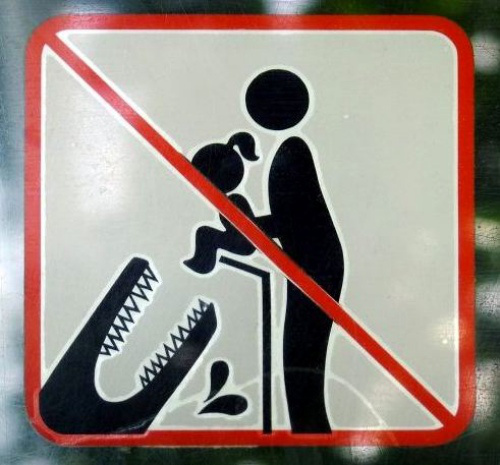
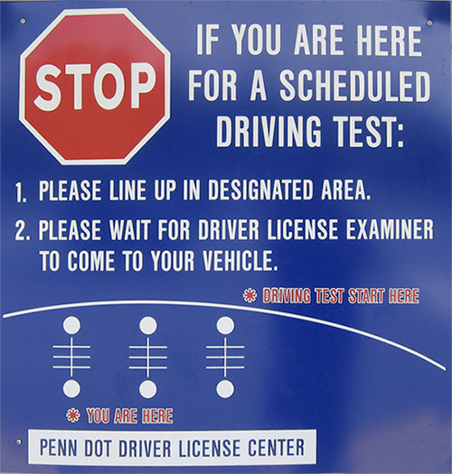
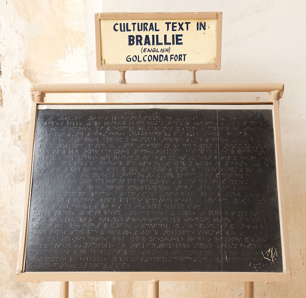
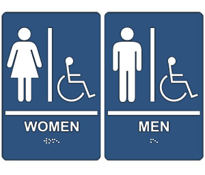
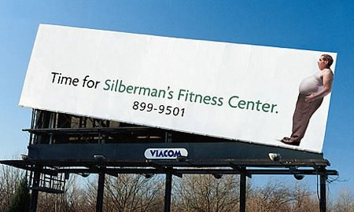
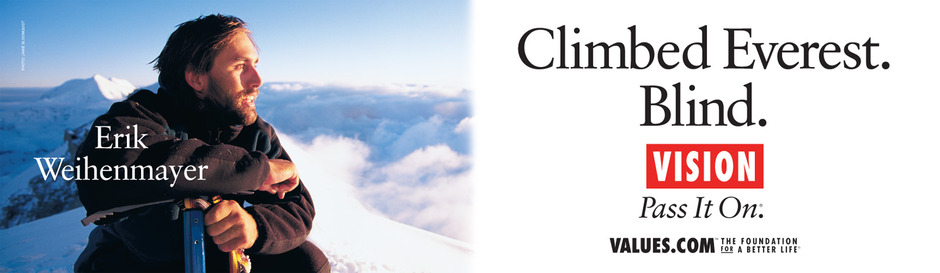

# Signs

## Warning Signs
Signs can tell us to stay out of dangerous areas.

Some people with cognitive disabilities who cannot read well will benefit from signs with visual depictions of the danger. The more visually-intuitive the sign, the easier it will be for the person with a cognitive disability to understand.

And whatever you do, don't feed your children to the crocodiles!

The strong visual nature of the sign above is designed to make it obvious that putting your child too close to these animals can be dangerous. You could argue that it really does look like an adult feeding a child to a crocodile, rather than an adult setting the child on a wall to look at the crocodile.

Perhaps it could be clearer in that way. Even so, the sharp teeth on the animal and the red line through the sign leave little doubt that this behavior, however it is interpreted, is bad.

## Informational and Instructional Signs

Signs can include simple, but important, information, such as whether a business is closed or open.

Informational signs may not include any text at all.

Or they may include quite a bit of text, explaining how to do things.

For blind people, the signs will be completely invisible to them, so it doesn't matter if the sign contains text or just images.

Blind people will need signs in different formats, such as audio or braille.

## Signs as Labels

Signs can label stores and offices, letting us know where things are and what their titles are.

Signs can also help us differentiate between two similar things, such as between a restroom for men and a restroom for women.

## Signs as Advertisements

Signs can distract us from other things around us and try to get us to buy things or to think about an idea that we weren't previously thinking about.

The question is whether this is a good idea or not. Advertisers create billboards and other ads to distract you on purpose, but being distracted may not be a good thing. Distracted driving can kill people. On a less serious level, distractions can make us less productive, swallowing up our time with tangents.

People with attention deficit disorder and some kinds of cognitive disabilities are especially prone to distractions, making it hard for them to focus on tasks and complete them.

## Universal Design Principles and Examples

Table: UD Principles and Examples that Apply to Signs
UD Principle              | Examples of Principle
--------------------------|------------------------------------------------------------------------
Principle 3,              | - Standardized signs that have depictions that are visually intuitive
Simple and Intuitive Use  |   and communicate important information in a simple manner
--------------------------|------------------------------------------------------------------------
Principle 4,              | - Visual signs that also present the same information in audio and
Perceptible Information	  |   braille formats
                          | - Signs that are enlarged with high contrasting colors

