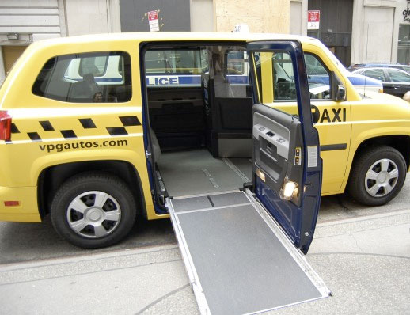
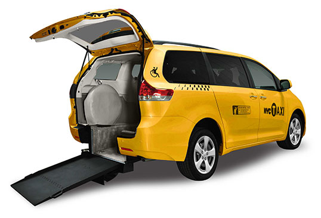

# Taxis

Most taxis are not accessible to wheelchairs, making them useless as a way for a person in a wheelchair to get around town. There are special taxis, though, designed for wheelchair access. These taxis typically allow wheelchair entrance through the side or through the back, by means of a ramp that extends from the bed of the taxi to the street or sidewalk.

## Fare Counters and... Touchscreens for the Blind?

Fare counters traditionally have been for visual users only. This puts blind users at a disadvantage, because they cannot verify that the driver is telling them an accurate fare based on the fare counter. Blind riders had to rely on the honesty of the taxi driver.

Some taxis now have small computers in the back seat with touchscreens that allow riders to check the fare. (The other main purpose of those touchscreens is to show advertisements, but that's not our focus here.)

As soon as riders enter the taxi, the touchscreen comes to life and begins to talk to the riders. One of the things that the touchscreen says is "For visually-impaired access, touch the screen multiple times." After touching the screen multiple times, an audio menu starts to announce things to the passenger, as shown in the video below:

- [Video](https://www.youtube.com/watch?v=hM0x0k2Bv3Y)

  
Video Transcript

  [TOUCHSCREEN AUTOMATED VOICE:] Main menu. You are riding in vehicle 3H99. Driver ID is 5324621. Fare: Six dollars. Tax: Zero dollars and fifty cents. Total due: Six dollars and fifty cents. Tap top left for audio options. Tap right for information. Bottom left to exit visually-impaired mode. Bottom center to hear the current fare and repeat.

With this system in place, people with blindness or low vision can access the fare information independently. They can also swipe their credit card on the computer in the back of the taxi and control the tip. Before, they had to rely on the driver for those functions, and they had to hope the driver was acting honestly and honoring their requests.

## Universal Design Principles and Examples

Table: UD Principles and Examples that Apply to Taxis

UD Principle             | Examples of Principle
-------------------------|-------------------------------------------------------------------------
Principle 2,             | - Taxis that have wheelchair access
Flexibility in Use       | - Credit card or cash payment options
-------------------------|-------------------------------------------------------------------------
Principle 4,             | - Touchscreens for people who are blind to use to access information
Perceptible Information	 |   about the taxi and fare
-------------------------|-------------------------------------------------------------------------
Principle 5,             | - Touchscreens that have larger clickable areas and fonts help prevent
Tolerance for Error	     |   people who are visually impaired or have motor disabilities from 
                         |   making mistakes, communicate mistakes, and help users recover from 
                         |   those mistakes

## See Also

- News story: ["A New Ride for the City Blind"](https://www.nypress.com/news/a-new-ride-for-the-city-blind-LBNP1020120418304189994) (about New York taxi touchscreens)