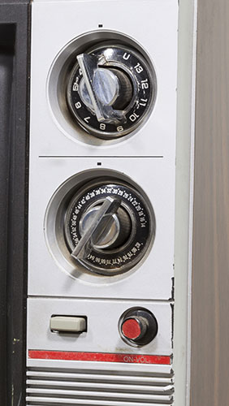
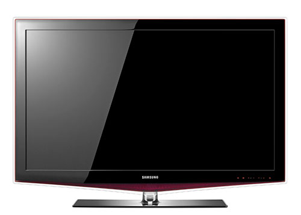
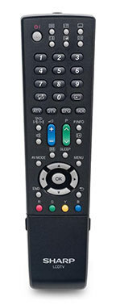
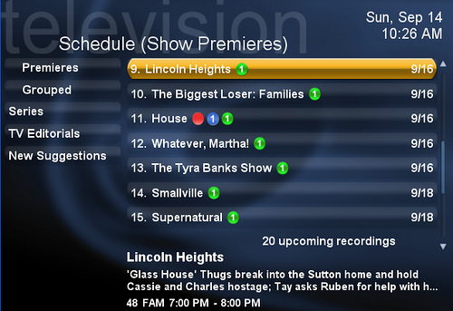

# Televisions

With televisions, we enter into the multimedia area of accessibility. We have audio and video, as well as menu systems for changing settings. We also have to worry about the hardware itself.

## Television Hardware

Can a blind person turn on the television and change channels, change the volume, and modify other important settings? What about a person with a motor disability, a cognitive disability, or an auditory disability?

Old televisions had physical dials on the outside. These could be difficult or impossible for a person with motor disabilities to use. On the other hand, a blind person could easily change the position of the dials and memorize which position corresponded to which channels.

Modern televisions tend to have much sleeker designs, with very few buttons on the television itself, and no dials. These newer designs don't require a person to grip them, so they will be easier on people with weaker hand muscles, or on those who have no hands. The person still needs to push the buttons, though, which make it hard for more severe motor disabilities.

In most cases, a blind person can still turn the television on or off on the TV itself, and change the volume. Most TVs also allow channel changes on the TV set, but on some systems you need to set the channel on the TV to one option and make all the real channel changes on the remote control.

Remote controls solve some accessibility problems. A person with motor disabilities, for example, could use a mouth stick to push the buttons on the remote, rather than go up to the television, which may be too high to be within reach, or which may not have space underneath it for a wheelchair to roll up to it. If the buttons on the remote are very close together though, they can be a challenge to access by a person using a mouth stick, or by a person with tremors in the hands.

Some remote controls can be quite complex, with lots of buttons that look and feel similar. With a little bit of experimentation, or the help of a friend, a blind person could probably learn where the important controls are. 

A person with low vision probably would not be able to read the numbers and text directly, except perhaps with a magnifying glass. A person with cognitive disabilities may find the number and array of buttons overwhelming. In fact, many people with average or above-average intelligence also find the buttons on remote controls to be overwhelming!

One big challenge for blind people and people with low vision is the on-screen menu system.

Unless the menu system includes a built-in screen reader with audio output, a blind person will not be able to use it. Scheduling recording times, viewing show schedules, and accessing other features will be impossible. A user with low vision may need the text enlarged more than the television allows.

The good news is that deaf people won't have trouble with any of the hardware on televisions.

## Deaf Access to Television Shows

Once we get past the hardware, the television shows have to be accessible. Deaf viewers will be able to see everything on television, but they won't be able to hear any of it.

Captions are the solution.

By default, captions are turned off on televisions. These are known as "closed captions," which means that they can be turned on or off according to viewer preferences. Viewers need to go into the TV menu system to turn them on, or perhaps there is a button on the remote to activate the captions directly.

Captions need to capture all dialog and narration. They also need to capture important sounds not spoken by people, such as "dramatic instrumental music" (shown in the screenshot below), applause, screams, or other sounds that set the scene, provide context, or give meaning to the video.

## Blind and Low Vision Access to Television Shows

People with visual disabilities have the opposite problem of deaf people. People with visual disabilities can hear television shows just fine (unless they are also deaf), but they cannot see them well, or at all.

Dialog, narration, music, and background sounds are all accessible to people with visual disabilities, but if there are important visual elements without accompanying sounds, that information won't be communicated to people with visual disabilities.

Take another look at the screenshot above. The captions say, "Dramatic instrumental music," which is what a deaf person needs to know, but the part that will be lost on people with visual disabilities is the fact that we're looking at Cary Grant with a very alarmed or surprised look on his face, with some crumpled white paper stuffed in his mouth.

Unless someone in the show says, "Why do you look so surprised, and why do you have paper stuffed in your mouth?" people with visual disabilities won't know why the dramatic instrumental music is playing.

The solution for people with visual disabilities is to provide "audio descriptions." Audio descriptions are an additional track of narration describing visual events for people with visual impairments. Audio descriptions can be either open, for everyone to hear, or closed, so that users turn them on if they want to, but they are off by default, like closed captions.

## Universal Design Principles and Examples

Table: UD Principles and Examples that Apply to Televisions

UD Principle              | Examples of Principle
--------------------------|------------------------------------------------------------------------
Principle 2,              | - Televisions that have distinguishable tactile controls and larger 
Flexibility in Use	      |   buttons to operate hardware
                          | - Televisions that allow the use of personal or assistive devices,
                          |   or voice control, to operate hardware
--------------------------|------------------------------------------------------------------------
Principle 3,              | - Remote controls with fewer buttons that make using the television
Simple and Intuitive Use  |	  and program menus easier
--------------------------|------------------------------------------------------------------------
Principle 4,              | - Televisions that have clearer, larger visuals and audio output for
Perceptible Information   |   on-screen menu options	
                          | - Televisions that allow users to enable captions and audio 
                          |   descriptions

