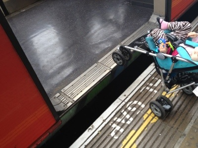

# Transportation Systems

Transportation systems can be quite complex, and the accessibility problems they present also can be complex. To start off with, we should emphasize that public transportation systems are vital for many people with disabilities.

Public transportation makes travel possible for people who would probably not be able to travel on their own. Public transportation is not an enemy of accessibility; it is one of the greatest allies. It's just that the system has to be designed with accessibility in mind, or else all of the problem-solving potential of public transportation systems is wasted.

Public transportation can include subway systems, trams, trollies, light rail trains, commuter trains, heavy rail trains, buses, monorails, and other similar systems. Each type of system has its own unique challenges, but some challenges are the same, or at least similar, across all of them.

## Buying a Ticket or Farecard

Farecard machines present a number of difficulties to users with disabilities. Blind people can't read them. Short people or people in wheelchairs may not be able to reach to the top of them. People with quadriplegia may not be able to interact with them.

The contrast between the text and the background color may not be high enough for people with low vision, or the text may be too small. People with cognitive disabilities may be confused by the machine.

All of these can be overcome with good design, but many public transportation systems don't have machines with enough accessibility features to benefit everyone. Users with disabilities will likely have to depend on the help of family, friends, station attendants, or strangers who happen to be willing to help out.

## Buy Online Instead

Now we're getting to something that affects web accessibility directly. Rather than buy a ticket or farecard through a machine, we can make it possible to buy online through a web site. We could set it up to allow users to print their own farecards, or we could send reusable plastic farecards to them in the mail.

When the balance on the card runs down, we could allow them to add more money to it through the web site, or we could allow users to set up auto-deductions from their bank account so that the balance never goes below a pre-determined threshold.

There are a lot of options. By making this available online, we have the opportunity to bypass some of the inherent accessibility difficulties of physical machines.

The catch is that the web site must be accessible, or it will not be of any benefit to users with disabilities.

## Turnstiles and Gates

Once passengers purchase their farecards of subway systems, they need to enter past the turnstiles or gates. Some turnstiles, like the ones on the New York City subway, shown below, are very narrow.

Passengers with luggage or strollers may not be able to use the main turnstiles at all. In fact, even overweight customers will find the turnstiles so narrow that they are an uncomfortable fit.

The Washington DC Metro system has narrow gates as well, but every exit has at least one wide gate to allow for wheelchairs and other large objects (or people!).

Turnstiles like the one shown below help to keep people out, but they can also cause injury if a person gets caught in the wrong part of it. Wheelchair users won't be able to use this kind of turnstile either.

## Train Platforms

Train platforms can be dangerous places. People can step off the platform and injure themselves, even if no train is coming. To help blind people avoid injury, bumped tiles like the ones used on sidewalk intersections can be used to alert people of the platform edge.

Train Arrival Announcements
Many train and subway systems have signs above the platform telling passengers when the trains will arrive. This is helpful to everyone except passengers who are blind or who have low vision. To be helpful to passengers with visual impairments, a speaker system would need to announce the same information.

Or, in a nod to more modern methods, mobile devices could receive real-time updates from a central server and blind people could listen to these updates on their phones, tablets, or other devices.

Train Door Visibility
People with low vision may have a hard time finding the doors on the train if the doors look too much like the rest of the train.

Passengers with low vision could wait until the doors open, and then perhaps follow other people to the open doors, but it would still be better to design the doors to be obviously different from the rest of the train. In the example below, bright red doors help to distinguish them from the glass and white frames to either side.

## Minding the Gap

The London Tube is famous for the phrase "mind the gap." That's because on many of the train platforms there really is a large gap between the platform and the train doors.

At some stations you need to step up. In others you need to step down. Some require stepping over a large gap that people could fall into and hurt themselves. You don't want to do that.

Wheelchairs and strollers have a difficult time navigating the wide or tall gaps at some of the stations. This problem is not unique to the London Underground. Many other older subway and train systems have essentially the same problem. They were designed before widespread awareness of the importance of disability access to public transportation.

## Route Maps and Guides

Blind people and people with low vision want to know where the stations are, even if they can't see them. Tactile maps can be one way to present the information, as shown in this photo of a tactile map of the Stuttgart, Germany train system. The system is presented on a metal surface with raised lines representing the train routes, and with braille labels and explanations.

## Online Access to Routes and Information

The same type of information can be presented online, on the main website of the transportation system. The online version wouldn't allow for a tactile interface, which would be one disadvantage, but it would still allow users to obtain lists of the stops and intersections on each of the routes, and other related information.

One of the advantages of an online version is that people could access it anytime, anywhere. They wouldn't have to travel to the train station, find the map, and spend time feeling it on location.

## Universal Design Principles and Examples

Table: UD Principles and Examples that Apply to Transportation Systems
UD Principle              | Examples of Principle
--------------------------|------------------------------------------------------------------------
Principle 4,              | - Both audible and visual arrival announcements
Perceptible Information	  | - Transportation systems that allow mobile devices to provide 
                          |   alerts regarding information and announcements
                          | - High contrast colors on doors that distinguish doors from the rest 
                          |   of the environment
                          | - Transportation systems that provide tactile route maps and guides
                          |   and enlarged maps and guides that are simple and easy to understand
                          | - Detectable warnings and lights along the edges of platforms
--------------------------|------------------------------------------------------------------------
Principle 7,              | - Turnstiles and gates that are large enough and wide enough for 
Size and Space for        |   wheelchairs and various people to use
Approach and Use	        |

## More Information

- A rather comprehensive list of ideas and techniques for making public transportation more accessible: [https://citytransport.info/Access.htm](https://citytransport.info/Access.htm)
- U.S. Transportation.gov accessibility information site: [https://www.transportation.gov/accessibility](https://www.transportation.gov/accessibility)