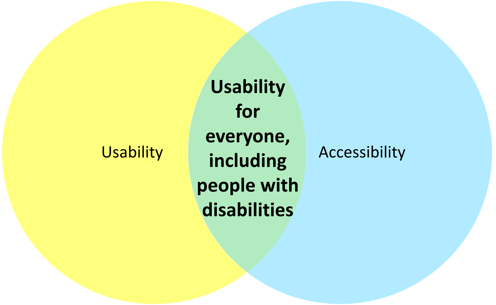

# Commonalities

The components used for evaluating usability can also be applied to accessibility. Accessibility focuses on how usable and satisfying a product or service is to people with disabilities, including but not limited to people who use assistive technologies. 

In terms of usability, accessibility increases the chances of more people being able to use a product or design regardless of their abilities.

More overlap occurs between usability and accessibility when accessibility practices increase usability for everyone and usability increases accessibility. Using high contrasting colors for web pages not only helps people who have low vision or colorblindness, but it also helps those using their devices in bright sunlight.

Ensuring that a web page is keyboard accessible assists those who are blind, those who may have a motor impairment, or users without disabilities who prefer to use keyboard strokes for browsing and navigating. Usability practices that promote using simple language and intuitive designs may assist those with cognitive disabilities to use a product or service more productively.
