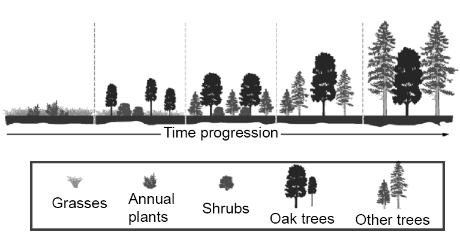

# Overview
The image to be described in this section is shown below:



## The alt text

### Option 1: Short alt text

This alt text would need to be supplemented by a longer description.

```html
alt="A diagram showing 5 stages in the progression of forest regrowth."
```

### Option 2: More detailed alt text

Option 2: More detailed alt text
Depending on the intent of the author, this longer alt text may be all that is required.

alt="A diagram showing 5 stages in the progression of forest regrowth,
from grasses and annual plants, to shrubs, to oak trees,
to other trees, and to a mature forest"

## The long description

### Example 

#### Note: This kind of literal description would be appropriate in situations when the user is being asked to interpret the diagram, as is the case in a learning assessment. A less detailed description could be appropriate in other circumstances.

The diagram shows a cross section of a landscape, with the progression of growth shown left to right. There are few plants on the left, with progressively more plants and trees until arriving at the final stage on the right, which has the most plant and tree growth. A vertical dashed line in the drawing separates each of the stages visually. A legend below shows the types of plants and trees from the illustration with text labels (grasses, annual plants, shrubs, oak trees, and other trees). The 5 stages show the following plants and trees:

- In stage 1, there are grasses and 3 annual plants.
- In stage 2, there are grasses, 2 shrubs, and 3 small oak trees.
- In stage 3 there are 2 shrubs, 2 small-to-medium-size oak trees, and 3 small trees of other kinds.
- In stage 4, there is one medium size oak tree and three trees of other kinds: two medium size, and one small.
- In stage 5, there is one large oak tree and two large trees of other kinds.

The exact number of plants and trees is not meaningful. The illustration is designed to represent their relative number in comparison to each other.
