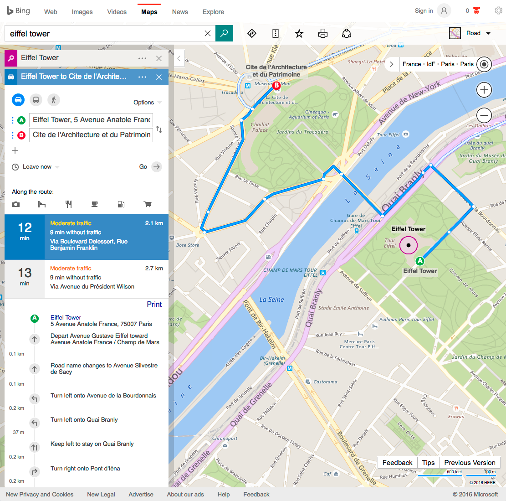
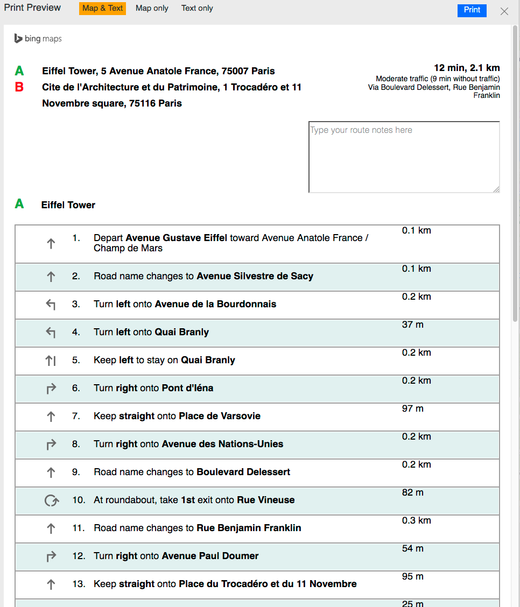

# Map directions

## Overview

Maps are inherently a visual concept. They are two-dimensional spatial representations of physical spaces, often with embedded symbols, and specific meaning attached to types of lines (e.g., representing streets, buildings, etc.). There is an entire visual vocabulary represented in maps that is difficult to convey to people who are blind. There is also an assumption that the spatial relationships between objects are perceivable by the audience.

There is an additional problem: Maps can be used for many different purposes. A person can use a map to get a sense of the layout of a city, or to learn the name of a building, or to find out how close locations are to each other, or to find the nearest bus stop, or to find a coffee shop, or to get directions from one place to another. There is no way to predict how a person will use a map.

Creating meaningful, well-written alternative text for all of the possible uses of a map is essentially impossible. Fortunately, the alternative text for some map uses can be automated by data and algorithms, such as the creation of driving directions.

You might ask: Why would people who are blind even want driving directions? They can't see to drive! The answer is that, while it is true they can’t drive independently, they can be navigators to their drivers, or they can describe the directions to other people so that they can drive themselves. We shouldn't jump to faulty conclusions about people who are blind, just because the information is so visually-oriented.

## Visual Directions

In this section, the example is a map that shows how to drive from the Eiffel Tower in Paris to the Cite de l'Architecture et du Patrimoine, which overlooks the Eiffel tower on the other side of the river.

The visual aspects of the directions (where things are spatially and visually in relation to each other) can be described, in theory, but it would probably require intelligent writing by a human being who was aware of how the directions would be used, and which types of visual information needed to be described for the users who are blind. On a general-purpose map application like Bing, there is no way to predict what a user will search for, so it is impractical to pre-populate every possible search with intelligent descriptions of the visual information.

Although we may not be able to provide alternative text for all of the possible uses of a map, we do not want to forget that the low vision community and color-blind users will benefit from good color contrast choices and adjustable color selections.

## Text Directions

In Bing, when a user types a request for these directions, the visual representation of the pathway is shown on the map itself. The driving directions are written in a sidebar to the left. A printer version of these directions is also available. The directions in Bing are available in a text-based format. A screenshot of this printer-friendly layout is shown below:

A simplified version of the text is listed below:

- Depart Avenue Gustave Eiffel toward Avenue Anatole France / Champ de Mars (0.1 km)
- Road name changes to Avenue Silvestre de Sacy 0.1 km)
- Turn left onto Avenue de la Bourdonnais (0.2 km)
- Turn left onto Quai Branly (37 m)
- Keep left to stay on Quai Branly (0.2 km)
- Turn right onto Pont d'Iéna (0.2 km)
- Keep straight onto Place de Varsovie (97 m)
- Turn right onto Avenue des Nations-Unies (0.2 km)
- Road name changes to Boulevard Delessert (0.2 km)
- At roundabout, take 1st exit onto Rue Vineuse (82 m)
- Road name changes to Rue Benjamin Franklin (0.3 km)
- Turn right onto Avenue Paul Doumer (54 m)
- Keep straight onto Place du Trocadéro et du 11 Novembre (95 m)
- Keep straight onto Avenue du Président Wilson (25 m)
- Arrive at Avenue du Président Wilson on the right. The last intersection is Place du Trocadéro et du 11 Novembre. - If you reach Avenue Albert de Mun, you've gone too far
- Assuming that the map application interface is fully accessible, text directions like those in the example above - are an effective way to make map directions accessible to screen reader users.

The basic concept of taking a visual experience (maps) and reworking it in a different format (a list) can apply to other types of visual information too.
