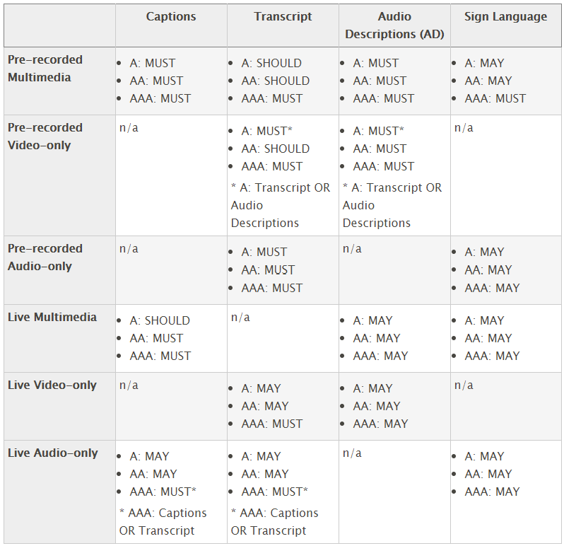

# Multimedia accessibility decision matrix

The next four sections of this course describe various methods for providing alternatives for time-based media. To help you accurately and quickly assess which media alternatives are appropriate for the type of media and level of regulatory compliance applicable to your work, we have provided the matrix below.

## Note:

In the matrix below, A, AA, and AAA refer to the Web Content Accessibility Guidelines (WCAG) compliance levels.

## The matrix

- See: https://codepen.io/cerovac/full/MWKVVYj

## Explanation

Time-based media can be divided in to three categories:

- Audio-only: e.g., podcast, recording of a press conference, rebroadcast radio presentation
- Video-only: e.g., video tour of a property, how-to video with no narration, silent movie
- Multimedia (synchronized audio and video): e.g., movie, television program, commercial, how-to video with narration

There are four methods for providing alternatives for time-based media:

- Captions: synchronized visual text alternative for both speech and non-speech audio information needed to understand the media content
- Transcripts: a document including text descriptions of visual and auditory information needed to understand the media content
- Audio descriptions: narration added to the soundtrack to describe important visual details that cannot be understood from the main soundtrack alone
- Sign language: a visual translation of a spoken language using combinations of movements of the hands and arms, facial expressions, or body positions to convey meaning

Clearly, not every type of alternative is applicable to each type of media. For example, video-only content does not require captions and an audio-description is clearly not needed for audio-only content. In addition, time-based media can be pre-recorded or live.

And, to complicate matters further, when you take regulatory compliance into account (as discussed in the previous section), some techniques are required and some are recommended.

The table above will help you map your media type and required compliance level to the appropriate alternative technique(s).

- “MUST” indicates a technique required by the corresponding WCAG Level, Section 508, or CVAA requirements (if applicable).
- “SHOULD” indicates a technique that is not required by a given WCAG Level, Section 508, or CVAA but is highly desirable to benefit the widest range of consumers, including people with multiple disabilities such as deaf-blindness.
- “MAY” indicates a technique that really goes "above and beyond" and may be out of reach for many organizations.