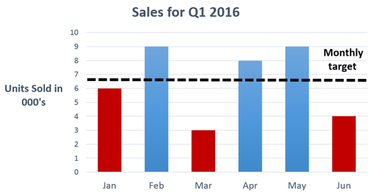
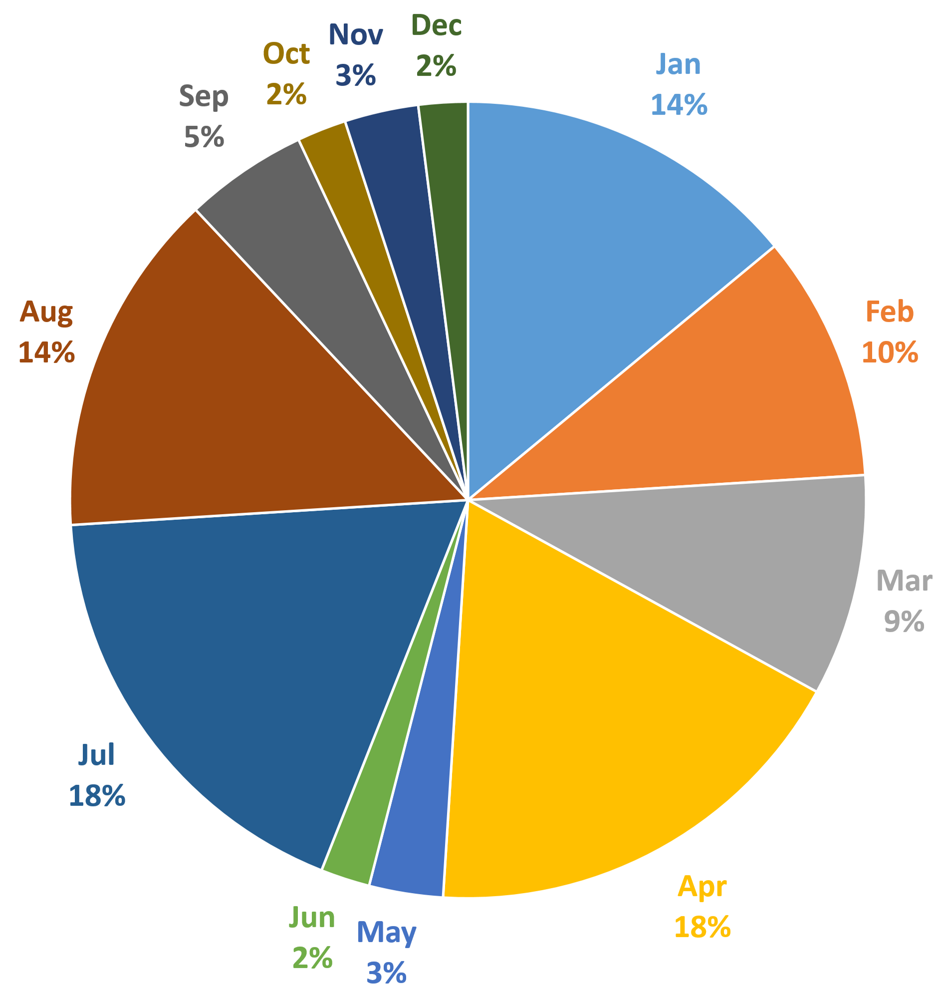

# Color that conveys meaning

## Any information conveyed by color MUST be accompanied by a programmatically determinable text alternative.

When color is used as the only means to convey information, people who are colorblind, have low vision or are blind will be unable to take advantage of or make sense of the information. 

For example, a person who cannot see will not know which to choose when instructed to "advance to next screen using the red arrow", and a person with low vision or color blindness will not be able to use a color-coded map of bus routes if color is the only way the routes are differentiated.

Text is the foundation upon which all other accessible content is built. Everything must exist in a text format — either as normal text or as alt text — or else screen readers won't be able to read it. If you color-code anything on a web page, you'll need to convey the meaning behind the colors in a text format.

### Example

```html
<table class="data" style="background:white;">
  <caption>
    Courses
  </caption>
  <tbody><tr>
    <th scope="col" style="width:200px">Course
      Title</th>
    <th scope="col" style="width:85px">Level</th>
  </tr>
  <tr>
    <td>String Theory</td>
    <td style="background:#b83b3b;color:white;text-align:center">Advanced</td>
  </tr>
  <tr>
    <td>Quantum Mechanics</td>
    <td style="background:#b83b3b;color:white;text-align:center">Advanced</td>
  </tr>
  <tr>
    <td>Basic Sewing and Stitching</td>
    <td style="background:#ffff00;text-align:center">Intermediate</td>
  </tr>
  <tr>
    <td>How to Tie your Shoe</td>
    <td style="background:#008000;color:white;text-align:center">Beginner</td>
  </tr>
</tbody></table>
```

## The text alternative for information conveyed by color MUST accurately convey the same information without color.

### Good example

The alternative text conveys all pertinent details of the chart, including an equivalent description for the information conveyed by color only.

The alternative text for the bar chart conveys all pertinent details of the chart, including an equivalent description for the information conveyed by color.


```html
 
```

## Any information conveyed by color MUST be accompanied by a visible alternative (text, image, etc.) that does not depend on color for meaning.

Since colors may look similar to those who are colorblind or who have low contrast vision and other people who may adjust the screen colors to meet their needs, it is critical that color is not used as the only way to communicate or distinguish information.

### Example

To make sure that sighted users and users with low vision can understand a color-based pie chart, it is important to associate the visual labels with their corresponding visual data. Labels should be:

- Unambiguous
- Near the data they represent

If the labels are too far from the data points, everyone will have a hard time associating the labels with the data.

In particular, users with low vision will have a hard time because the label and data may not be visible on the screen at the same time, due to the way screen enlargers show only a small section of the web page at a time. Screen enlarger users will need to move back and forth in their browser to figure out which label belongs where.



