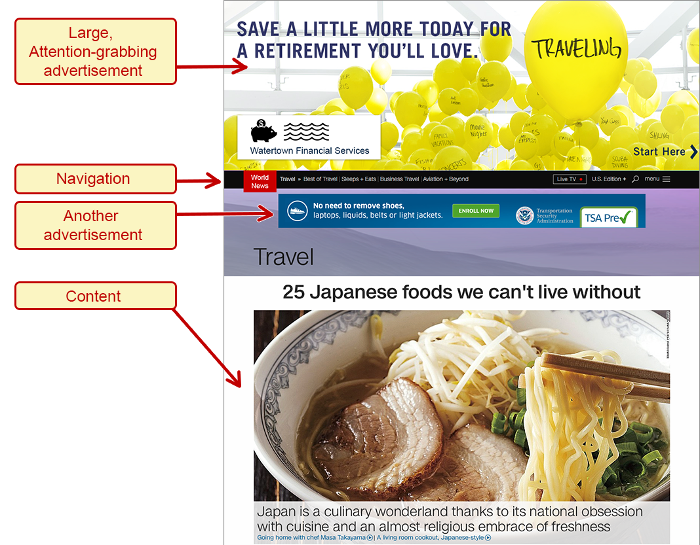

# Layout Design to Enhance Visual Discoverability

## The layout SHOULD have only one main visual focus.

### Bad example: too many things competing for the main focus

In the example below, there are several things competing for the user's visual attention. There is an enormous ad at the top of the page (It is a photo of 30 or so yellow balloons, with the text "Save a little more today for a retirement you'll love"). 

Below the ad is the main navigation menu. Below that is another ad; it's a banner ad which is smaller than the first, but which still takes up most of the width of the design. 

Below that is the section heading in large font: "Travel." Below that is a heading ("25 Japanese foods we can't live without"), followed by an enormous photo of a Japanese dinner bowl. The text of the article begins below that image.

Is the main purpose of this page to draw people away from the page with the big advertisement at the top? Or do the designers really want users to focus on the big graphic below the heading as the main focus of the page? 

The visual design suggests that you're supposed to first notice the advertisement at the top. That would be especially true on lower resolution monitors that would cut off the large image at the beginning of the article. Users might see only the ad, or at least mostly the ad.

In this design, there is conflict between some of the business goals (get users to click on advertisements to bring in revenue) and content goals (explain things about Japanese food).

## The design SHOULD draw attention to the intended visual focus.

Despite all of the previous warnings about color and contrast, both color and contrast can be used to draw the user's attention to the visual focus.

### Good example: modal dialog with dark background overlay

A common example is the use of a semi-transparent dark overlay on top of the background when a modal dialog is in focus. The dialog appears in the center, with full contrast, and the background appears obscured and darker. The user's visual attention is drawn to the high contrast element rather than to the darkened, low contrast element.

[good example, modal dialog with dark background overlay](dialog-darkened.png)