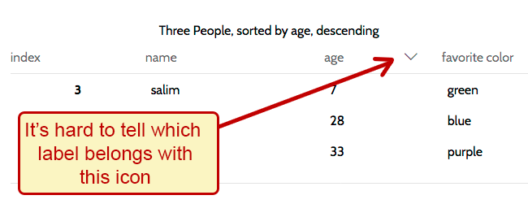
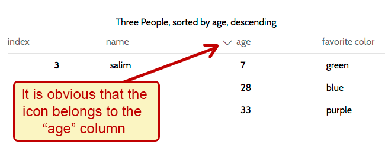

# Visual Proximity of labels

## Labels SHOULD be visually adjacent to their controls.

### Bad example

In the example below, the icon that is supposed to indicate that the table is sorted by a particular table header is too far from the table header label to know for sure that the icon is in fact related to the table header at all. To make it worse, it looks like the icon could belong either to the label on the left or the label on the right. It isn't clear by the visual positioning.

### Good example

In the example below, the icon that indicates that the table is sorted by a particular table header is immediately adjacent to the table header label. It is clear by the visual positioning which label the icon belongs to.

