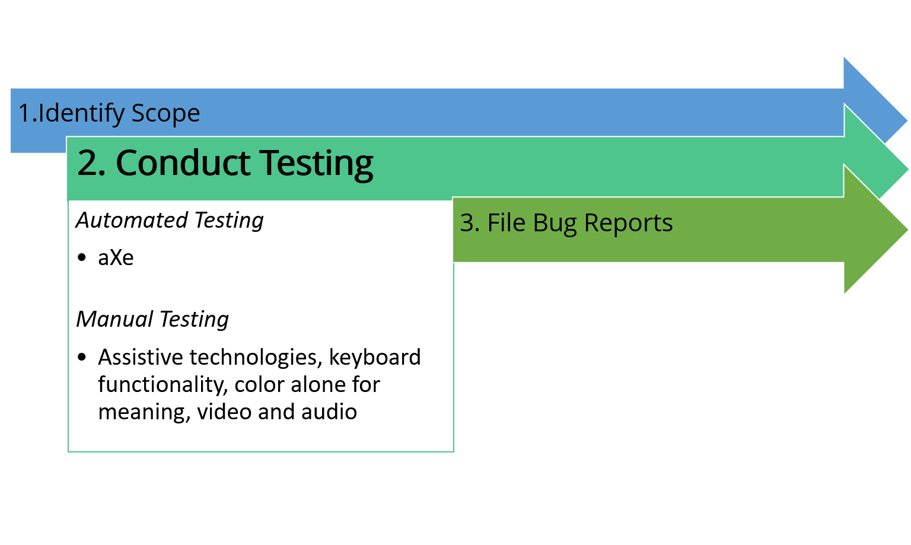

# Run an Automated Check

To get a good understanding of the general underlying problems that are present in the page or application, it is often best to start by running an automated scan on the page(s) to identify the problems that can easily and quickly be spotted using software programs.

These scans will not only help you identify the most basic issues that need to be fixed, they will also allow you to be more efficient by looking for elements that can be easily automated, such as the presence of heading tags in the content, alt attributes on images, and color contrasts.

Experts agree that about a third of accessibility problems can be found through automated testing. This means that while it is certainly worthwhile to conduct automated testing, one should never consider automated testing to be sufficient to find all accessibility problems in a page or application.

For instance, it is very easy for an automated tool to verify that there are heading tags in the content, or alt attributes provided for every image, but no tool will be able to determine if these headings truly represent the outline of the page's content, or if the value of these alt attributes truly reflects the nature of the images that are presented.

It is always up to a skilled evaluator to grab the data found by these tools and check if it actually meets the requirements for accessibility.

An effective and efficient testing methodology will provide complete coverage by utilizing both automated testing and manual testing:

- Automated testing tools should be utilized to test primarily that which automated tests can check effectively and for flagging items which require manual inquiry.
- Manual testing approaches should be used to provide coverage in testing those items which are inappropriate for automatic testing and should also be used to validate and verify the automated tests.
