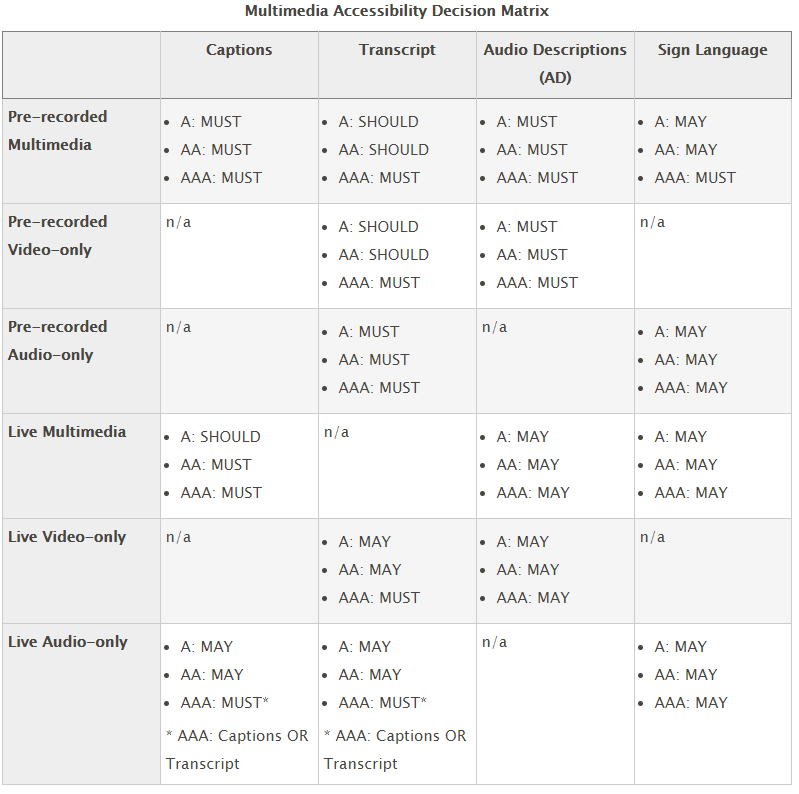

# Test Audio/Video Accessibility

## Overview

Video, audio, and multimedia presentations must be accessible to users who have sensory disabilities (blindness, low vision, deafness, hard of hearing, deafblindness). There are different methods to ensure users with sensory disabilities have access to the information provided in these types of presentations. Common methods include:

- Captions: Text synchronized with the media for those who cannot hear the audible information.
- Transcripts: A full text document that includes spoken words, meaningful sound effects, and important visual information. People who cannot see or hear the content benefit from a transcript.
- Audio descriptions: An audio track added to the media where a narrator describes the important visual content that is not conveyed in the media's original audio track (such as unspoken actions and events) for the benefit of people who cannot see what's happening.

The requirements for video, audio, and multimedia content are going to depend on which accessibility compliance level or standard the content looks to satisfy. Below is a multimedia accessibility decision matrix that will help you identify what is required of different types of content based on compliance level. A, AA, and AAA refer to the Web Content Accessibility Guidelines (WCAG) compliance levels.

## Multimedia Accessibility Decision Matrix

To learn more, take the course Multimedia, Animations, and Motion.

## Testing Methodology for Video Only

For presentations that contain only video (visual) content:

- First, check to see if an audio description track or text description of visual content is necessary. If important visual information is not conveyed anywhere, audio description or text description is needed.
- If an audio or text description is provided, check that it accurately describes important visual content in the video (You may need to watch the entire video to ensure audio description or text description is accurate).
- If a text description is provided, make sure it is near the video it describes and can be easily found by all users.

## Testing Methodology for Video and Audio

For presentations that contain both video and audio content, captions must be provided. But transcripts and audio description may also be required, depending on which accessibility requirements or standards the content must satisfy.

### Captions

- Look to see if captions are available, either through open captions (captions that are always on, cannot be turned off) or closed captions (look for a closed captions button or some way to turn on captions).
- If captions are available, check for the following:
  - Captions are in sync with the spoken audio content.
  - Captions are accurate. If the content is scripted, captions should be verbatim (including "um's" and stuttering). If content is unscripted, captions should be as close to verbatim as possible (but "um's" and stuttering may be omitted).
  - If multiple speakers are present onscreen, then speakers are identified in the captions.
  - Any important sound effects (e.g., music that sets the mood) are captured and described in the captions.
- Make sure automatic captions aren't used because they are often inaccurate.

### Transcripts

- Check to see that a transcript is available.
- If a transcript is available, it should be near the multimedia presentation and easy to find (either on the page itself or provided through a link).
- Check the transcript for accuracy. The transcript should include the following:
  - All spoken words
  - Descriptions of important non-verbal sounds (noises, music) that contribute to the experience
  - Identification of speakers
  - Descriptions of important visual content — transcripts are intended for people who cannot hear or see the content

### Audio Description

- If an audio description track is necessary, check that it accurately describes important visual content in the video (You may need to watch the entire video to ensure the track is accurate).

## Testing Methodology for Audio Only

For presentations that contain only audio content (podcasts):

- Check to see that a transcript is available.
- If a transcript is available, it should be near the audio presentation and easy to find (either on the page itself or provided through a link).
- Check the transcript for accuracy. The transcript should include the following:
  - All spoken words
  - Descriptions of important non-verbal sounds (noises, music) that contribute to the experience
  - Identification of speakers

## Testing Methodology for Media Players

Media players can be tricky when it comes to accessibility, though progress has been made through the use of the HTML 5 video element and other players designed with accessibility in mind. The main concerns with media players, though, are keyboard accessibility and screen reader accessibility. In the past, media players have been notorious for causing keyboard traps and media player controls have not been properly exposed to screen readers. Though there has been progress, it is still important to test media players and ensure they can be operated by as many users as possible.

## Testing for Keyboard Accessibility

To evaluate media players for accessibility, check that the following are true:

- All controls can be accessed using the Tab key.
- The tab order for the controls is logical. It should reflect the visual order of the controls.
- All controls have visual focus indicators. When keyboard focus is set on a control, there should be a visual border around the control so users know where the focus is.
- All controls can be activated using the keyboard. The Enter key and Space bar should activate button controls; and the volume slider and progress slider should be controlled using the down arrow, up arrow, right arrow, and left arrow keys.
- Focus is managed throughout all user interactions. For instance, if a control activates a modal dialog (e.g., caption preferences), focus is moved to the dialog. When the dialog is closed, focus moves back to the control that activated the modal dialog.
- If there are any custom controls in the media player, instructions for how to operate them by keyboard are provided.

## Testing for Screen Reader Accessibility

Media player support for screen readers may depend on the screen reader itself. So, it would be best to test a media player with at least two different kinds of screen readers. In general, though, look for the following when testing a media player with a screen reader:

- The name of each control is conveyed to the screen reader. The screen reader should render names of controls like "Play," "Pause," and "Volume" so that users know what the control is.
- The role of each control is conveyed to the screen reader. Slightly different from the name, the role identifies the element the control uses, such as a button or a slider. Together with the name, the screen reader should render something like "Play button" or "Volume slider".
- The value of certain controls is conveyed to the screen reader. In the case of using a slider for volume, the control should identify the value to users so that users understand changes. For example, if a user decreases the volume from 100% to 80%, the screen reader should announce the values "100%, 90%, 80%".
