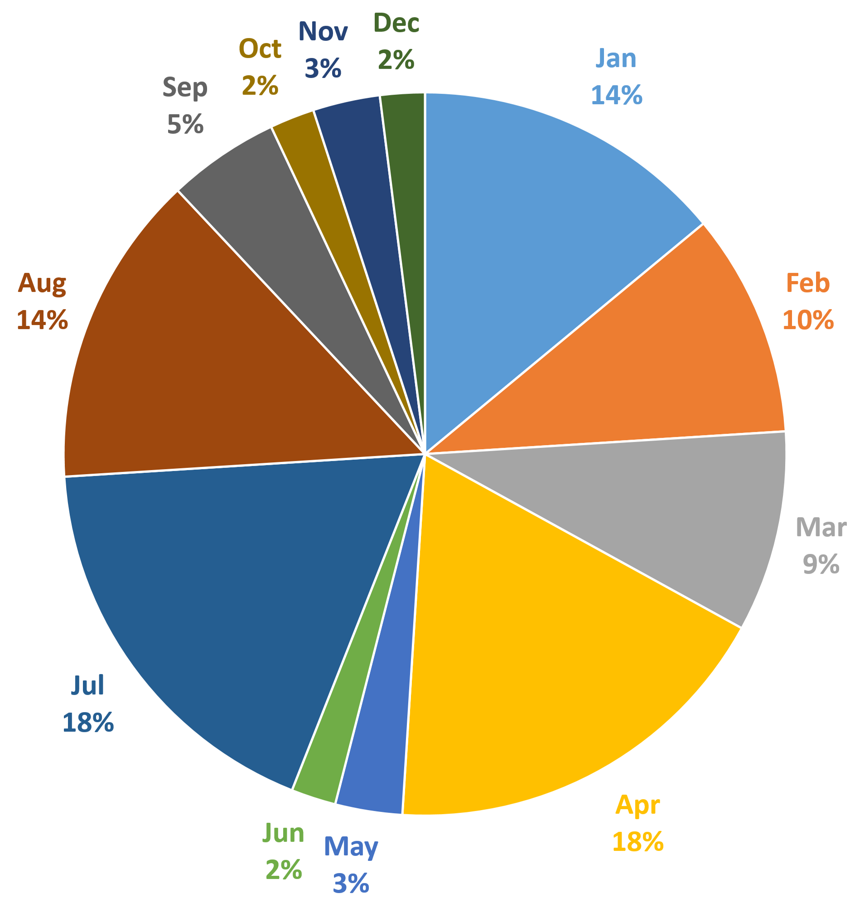

# Test for Meaning Conveyed with Color

## Overview

Colors can enhance the look of web content, making it more attractive and engaging. But when colors are used to convey meaning, people with visual disabilities may not be able to perceive the colors, so they may not understand the meaning.

For example, if a web page distinguishes between good things by using green text and bad things by using red text, people who are blind, colorblind, and even some who have low vision will have no idea which things are good and which are bad.

It's perfectly fine to use those colors for the benefit of sighted users, but only if the information is also presented in some other text format. For example, typing the word "good" or "bad" before each item would solve the problem for users who have color deficiencies or who cannot see at all.

## Testing Methodology

### Desktop Web and Mobile Web

When testing for color usage to convey meaning:

- First, identify any instances on the web page where color is being used to convey meaning.
- If there are instances, check that an equivalent text-based method is used as well to convey meaning.
- Additionally, evaluate the content and information presented on the web page, and check if there are any references to colors in the text-based content (e.g., instructions that tell users to select a green button).

## Bad example

Color alone conveys the meaning

## Good example

The chart additionally provides labels to convey the meaning

