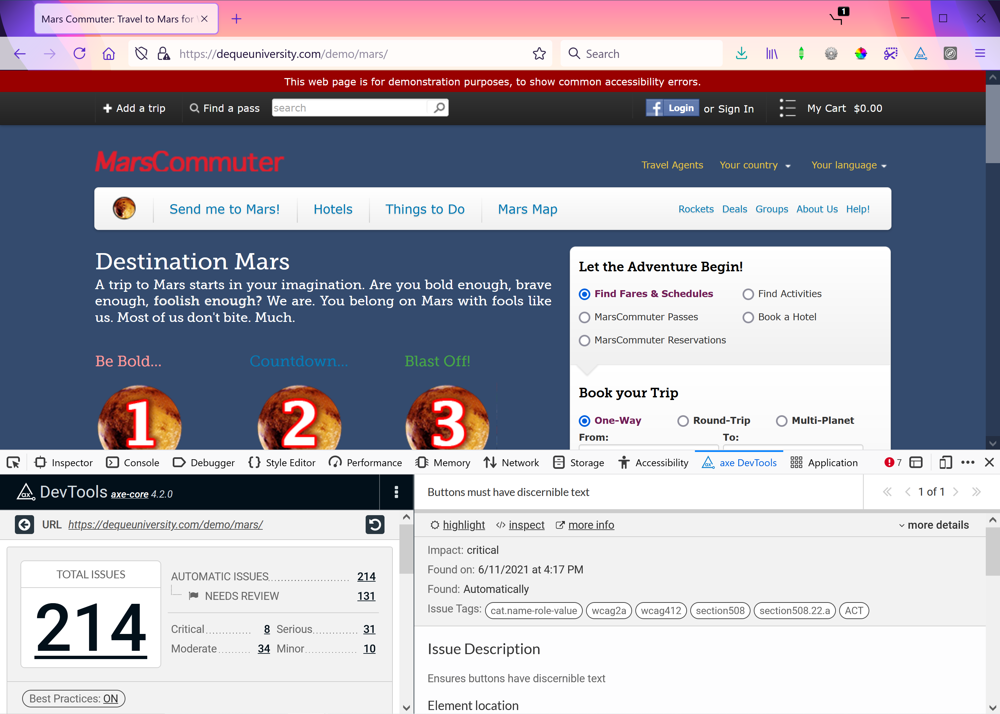

# axe DevTools

## Overview

The axe DevTools browser extension is based on a lightweight open-source JavaScript library that allows testers and developers to assess web content within the browser.

This powerful tool uses accessibility rules that provide consistent results so that testers and developers can easily identify issues and apply accessibility fixes. The results also yield no false positives. It is one of the most robust free tools available today to run automated accessibility testing.

### Steps to Using axe DevTools

Using the axe DevTools browser extension is pretty simple. Below are some quick steps to get started with the accessibility testing tool:

- First, download the axe DevTools extension for Firefox opens in a new window or Chrome opens in a new window.
- Next, navigate to the web page you would like to test.
- To access the extension, launch the developer tools menu within the browser. You can right-click on the web page and select - Inspect from the menu. The keystroke Ctrl + Shift + I also opens developer tools in both browsers on Windows, and the keystroke Command + Alt + I opens developer tools in both browsers on macOS.
- In the developer tools menu, locate the tab for the axe DevTools extension and open the tool.
- Select the Scan All of My Page button in the tool to run an accessibility analysis of the web page. Once the analysis is done, results will appear within the tool.

## Understanding an axe DevTools Report

Once the analysis is complete, two panels of content appear in the tool's dashboard. The left-hand panel contains a list of the accessibility issues found on the web page and the number of times each issue occurred on the web page. When an issue is selected, detailed information regarding the instance of the issue on the web page is provided in the right-hand panel of the dashboard. In the right-hand panel, you will find:

- A description of the issue along with a More Info link. The link will take you to a page that provides extensive information about the issue and remediation recommendations for the issue.
- In the top-left corner, you will be able to see the impact of the issue (Critical, Serious, etc.) as well as the accessibility guidelines the issue fails.
- There are also two buttons in the panel located near the impact and the More Info link: Highlight and Inspect. The Inspect button takes you to the code that is causing the issue in the Inspector. If the issue can be seen on the web page, the Highlight button will show you where the issue occurs on the web page.
- The code snippet that caused the issue.
- A list of guidelines that can be used to fix the issue.

## Summary

As mentioned before, the axe DevTools browser extension tool is an easy tool that testers can use to quickly identify accessibility issues. The results and detailed information provided within the tool can help testers create actionable bug reports that developers can use to address the issues.

Developers can also use the tool themselves to easily find issues and quickly address them. It must be reiterated, though, that automated testing is just one piece of effective accessibility testing.

Though it is extremely helpful in locating issues, it is critical that testers and developers do not rely solely on automated testing to find all accessibility issues in web pages.
