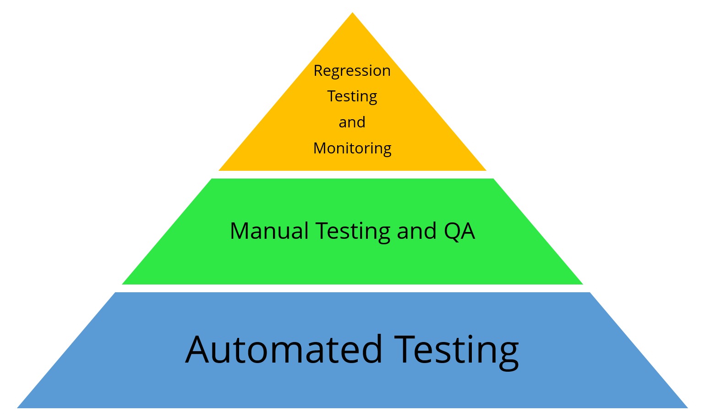

# Types of Automated Testing

## Automated Unit Testing for Accessibility

As developers write code and the larger that code becomes, the more difficult and time-consuming manual testing of code can be. Automated unit testing can save developers time (and, to be frank, save them from headaches) when it is implemented during the build process.

Unit tests verify the behavior of the code without relying on any external dependencies like a database or the file system; and the smaller the test, the better it is for developers to understand just how well their code performs.

These tests run in the least amount of time, since they are entirely in-memory, and they are not susceptible to changes in the environment. The idea behind automated unit testing is that the sooner developers can identify issues, the sooner they can remediate those issues and not risk their code breaking something further down the line.

Automated unit testing can be used to identify accessibility errors within the code early in the development cycle, which has tons of advantages. While manual accessibility testing will always be needed, implementing unit testing for accessibility can greatly reduce the load and the workflow of the manual testing process.

It is often said that even though only a third of accessibility issues can be found through automated testing, it pays to address that "third," especially if a majority of the accessibility issues on a web page fall into that percentage. If these issues can be found right away through automation, it will give testers more time to focus on issues that can only be discovered through manual testing.

Also, with the results from automated unit accessibility testing, developers will have more confidence in altering and fixing existing code and deploying quick fixes without the worry of the code causing side effects or breaking something.

Lastly, creating accessible code may become habitual for developers who utilize unit testing to identify accessibility issues. Developers will learn from the results they receive and remember to implement accessibility as they create new code.

Automated Integration Testing for Accessibility
Once everything is found to be working properly through unit testing, integration testing should be conducted to evaluate units coming together as a whole. Through integration testing, developers can continue to discover accessibility issues, while continuing to work on development. Integration tests should be kept separately from unit tests so that they both can be performed at different stages of the development cycle. These tests can be run rather quickly (but slower than unit tests) and repeated, while still allowing developers to uncover issues early enough before they become real-world problems.

An accessibility testing pyramid; automated testing is the foundation of the pyramid, followed by manual testing and QA, and regression testing and monitoring closing out the top of the pyramid

## Automated Regression Testing and Monitoring

After issues discovered in automated testing and manual testing have been fixed, regression testing and monitoring should be conducted. In automated regression testing, the goal is to uncover new errors, or regressions, in existing functionality after changes have been made to a system, such as functional enhancements, patches, or configuration changes.

Experience has shown that as software and websites are fixed, emergence of new and/or reemergence of old faults is quite common, so a regression test is necessary to detect such negative consequences of change.

Common methods of regression testing include rerunning previously run tests and checking whether program behavior has changed and whether previously fixed faults have re-emerged. Regression testing can be used to test a system effectively by systematically selecting the appropriate minimum set of tests needed to adequately cover a particular change.

When it comes to accessibility, both the goal and the approach are the same. In addition to checking for new bugs, a regression audit for accessibility would be aimed at ensuring successful remediation of bugs that were found in the prior tests.

In such a scenario, all that is necessary is to test the system using the exact same tests as were performed during the prior test event. In doing so, repairs can be verified against the identical criteria that found the initial errors.
