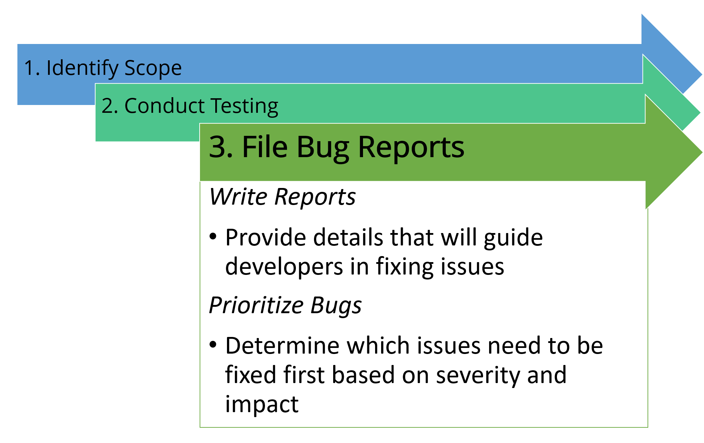
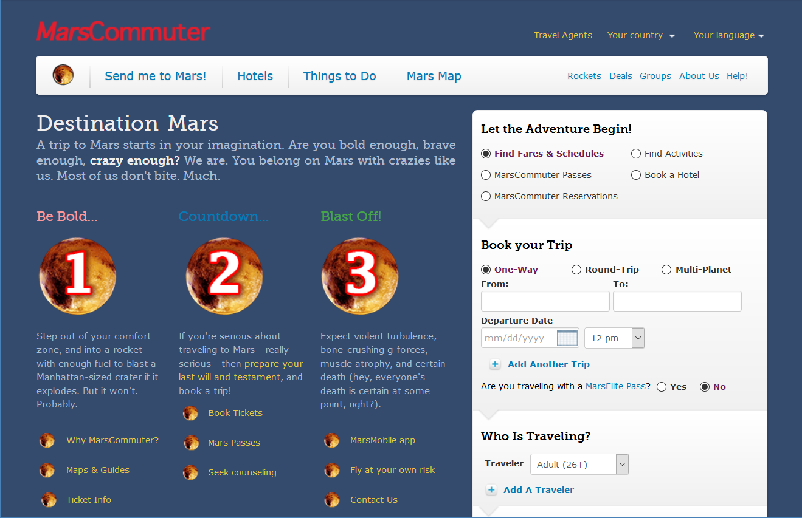
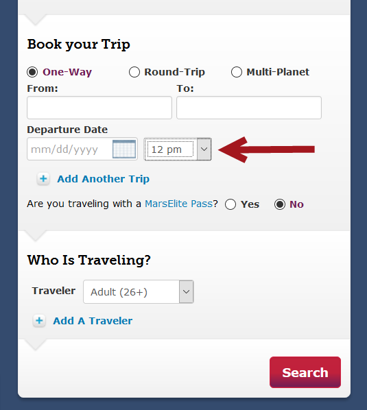

# Writing Effective Accessibility Bug Tickets

## Components of a Good Bug Report

In order for issues to be remediated, reports that are filed need to be well written. This is especially critical for accessibility issues. Why? Because if you are filing a bug on a feature that is outside your team, you cannot be sure how familiar the person assigned to that bug is with web accessibility, and you want to increase the chances that the person assigned to fix your bug can reproduce the unwanted behavior quickly.

### Report Template

Once all of the data has been gathered from the automated testing phase, the manual testing phase, and the screen reader testing phase, you will need to bring it all together into a single format that will be easy to read and use. Below is a basic template that can be used to file issues.

#### Template for Accessibility Bug Report

##### Descriptive Title

Provide a descriptive title that identifies the accessibility issue

##### Issue Description

Provide a detailed description of the issue

##### Expected Results

Detail the expected behavior, what a user expects to happen upon interaction with content

##### Platform and AT

Identify the platform and any assistive technology used in discovering the issue

##### Impact/Severity

Identify the level of impact (e.g., Critical, Serious, Moderate, Minor); Often used to prioritize and triage fixes

- Critical: The issue results in blocked content for individuals with disabilities. Until a solution is implemented content will be completely inaccessible, making the organization highly vulnerable to legal action. Remediation should be a top priority.
- Serious: The issue results in serious barriers for individuals with disabilities. Until a solution is implemented some content will be inaccessible, making the organization vulnerable to legal action. Users relying on Assistive Technology will experience significant frustration when attempting to access content. Remediation should be a priority.
- Moderate: This issue results in some barriers for individuals with disabilities but would not prevent them from accessing fundamental elements or content. This might make the organization vulnerable to legal action. This failure must be resolved before a page can be considered fully compliant.
- Minor: This is considered an issue that yields less impact for users than a moderate issue. For a page to be considered fully compliant this issue must be resolved but can be dealt with last.

##### Steps to Reproduce

Include specifics needed to reproduce the issue, including step-by-step instructions and credentials that should be used to reproduce the issue

##### Visual or Video

Provide a screenshot with visual indicators, video recording of the accessibility issue, or even a code snippet of where the issue occurs

##### Remediation

Whenever possible, try to include recommendations for fixing the issue

### Sample Bug Report

The examples below present an ineffective bug report and how that report is improved to assist in fixing the issues reported. Each example uses the demo site, MarsCommuter opens in a new window, which was designed to demonstrate common accessibility errors.

#### Bad Example

Title: Visual Focus Indicator

Description: The visual focus indicator disappears when tabbing through the web page.

Expected Results: The visual focus indicator should always be visible.

Steps to Reproduce: Go to MarsCommuter and tab through the web page.

Visual:

---

Now, the bug report above may seem like it presents the right amount of information. However, the chances of the issue being fixed are slim to none. One, the visual focus indicator does appear in certain places on the web page.

For those who do not have the background in accessibility, the focus indicator disappearing at times may not seem like a big deal; plus, they may not know who actually benefits from seeing the focus indicator.

The bug report needs to be more specific as to where the focus indicator disappears on the web page, the impact it has when the focus indicator can't be seen, how severe losing focus indicator is, and actionable recommendations to fix the issue. In the good example below, the bug report has been improved so that remediation for the issue can be expedited.

#### Good Example

The report from the bad example above has now been revised to provide meaningful information to get the issue fixed.

---

Title: Visual focus indicator disappears in the Booking widget

Description: When a user tabs through the Booking widget on MarsCommuter home page, the visual focus indicator is lost after tabbing through the Departure Dates form fields.

Expected Results: When a sighted keyboard user tabs through the widget, the user should be able to see where the keyboard focus is within the widget at all times.

Severity: Critical (Prevents sighted keyboard users from interacting with web page)

Steps to Reproduce:

- Go to the MarsCommuter opens in a new window home page.
- Place keyboard focus in the From field in the Booking widget.
- Tab through the rest of the fields.
- Visual focus disappears after the form field where users select the time.

Visual: Screenshot of where the visual focus indicator is last seen in the Booking widget on MarsCommuter

Remediation: Check that the CSS outline property is not disabled through outline: none; or outline: 0; after users tab from the Departure Dates fields. Visual focus indicator must follow the keyboard focus throughout the widget and the web page.
