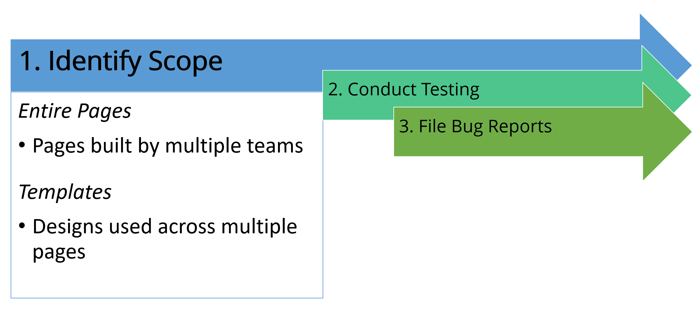

# Entire Pages and Templates (Designs)

## Overview

Before testing even begins, the first thing that needs to be done is to identify the scope of the test. Basically, you need to determine what will be evaluated so you know when testing is done.

When it comes down to it, the following should be of prime importance when choosing what to test (in this order):

- Anything that occurs across the entire site, such as templates.
- Anything used to navigate, such as navigational menus.
- Anything used to accept payment or to commit the user (or organization) to a legal contract, such as Forms.
- Anything used during primary interaction with the site.
- Anything typically found to cause accessibility problems: Images, Forms, Tables, Frames, Interface Elements relying on client-side scripting, and Media.
- Anything typically used by persons with disabilities, such as site maps.
- Anything necessary for contacting the organization, such as contact forms and staff directories.
- Anything that gets a lot of traffic, such as the Home page or any of the pages that receive the top 80% of traffic.

All of the aforementioned items should be weighed and prioritized based upon how often they occur on the site and how critical they are to the successful use of the system.

For instance, it may be necessary to de-prioritize tables on a site that doesn't contain a lot of data tables in high traffic areas. Conversely, for a site that holds a lot of reports and does contain a lot of data tables, these features would be given higher priority.

Once the overall scope has been defined, then you will be ready to look under the hood to see what accessibility challenges lie in the code underneath.

## Selecting Entire Pages for Evaluation

When it comes to selecting entire pages for evaluation, the pages should have the most diversified and representative data in terms of content, semantics, and structure.

In other words, you will want to pick pages that will contain paragraphs (of course), but also headings, data tables, form controls, images, graphs, lists, citations, etc. Basically, you will want to evaluate pages that allow you to analyze how each of the components were handled during the development process.

An entire website is rarely built by the same individuals these days. Rather, entire teams of developers all pitch in and contribute to the entire production.

As a result, people with very different skill levels end up creating and building the underlying code. Therefore, it's always good to try and grab pages that do come from different teams and compare these same components, from one page to another, or one section to another. Doing so can easily result in selecting many dozens or even hundreds of pages in much larger environments.

## Selecting Templates for Evaluation

In addition to selecting pages with varying content, you will also want to select pages from every single template that is being used in the project. Ideally, you should pick at least one or two pages from all templates used, in addition to the home page, which is an obvious choice and should always be the very first page to analyze.

Selecting pages from each template will possibly result in pages with very similar structures being evaluated, but it is important to do it because sometimes, the simple fact of creating a new template based on another one will result in accessibility problems, especially when it comes to the sequential order of the content.

Worst case scenario, pages that are too much alike will end up being audited much faster than others, so the impact will not be that significant.

It's always better to be safe than sorry, though, especially when that template ends up being replicated and reused a few hundred times afterwards. Accessibility barriers should be caught before they become widespread.
