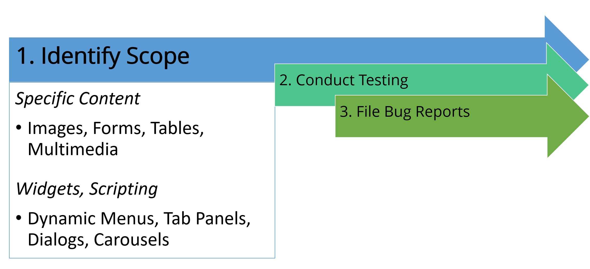

# Page Content and Widgets

## Selecting Specific Page Content for Evaluation

### Images

Accessibility problems relating to images constitute the #1 area of accessibility problems on the web. For the most part, the accessibility errors relating to images revolve around two failures: first, whether the alt attribute exists on the `` element at all; and second, whether the text within the alt attribute is of sufficient quality to serve as a suitable replacement for the image.

Because this latter case is highly subjective, manual testing is required for all images found in test units.

For many sites, test units should be selected specifically because they offer a chance to check image alternative text quality. If image use is significant, such as in a web store, gallery, or web application, select units that offer a handful of images to test.

It will often be readily apparent whether the development or content staff understand how to create quality alternative text after only a few units. Select more units depending upon how many different teams contribute code or content to the site, as doing so will show where disparities may lie in team members' understanding of alternative text.

### Tables

Tables are another area where inaccessible production can cause significant impact on users. Testers should select a handful of representative samples for tables.

Generally, very simple tables will not cause significant problems, therefore only one or two samples of simple tables should be included. However, complex tables, such as those which use cells that span multiple columns or rows, tend to contribute to significant challenges and should be tested critically for proper accessible markup.

Often in large sites, tables that hold data are generated using server-side code that pulls the table's data from a database. If multiple tables are found that display very similar data, only one example of such a table should be used. If it is suspected that the tables are created manually (in other words, NOT using information from a database), a small handful should be selected.

In practice, most developers create tables the same way every time, so patterns of errors will reveal themselves very quickly.

### Forms

Forms on the web are the primary feature used for a user to interact with web interfaces. Any time a user posts a status on Twitter or Facebook, a form is completed. Any time bills are paid with online banking, a form is filled out.

Any time e-mail is sent with Gmail or Yahoo, again, a form is completed. Yet, among the areas where accessibility is a concern, forms rank highly in the trouble they cause for users with disabilities.

From a testing perspective, it is vital that an audit include comprehensive testing of forms, especially in cases where those forms are part of the core functionality of the system being tested. As is the case with tables, forms are often an area where code reuse is high.

For instance, in PHP, JSP, and other object-oriented server-side languages, classes are often written that handle both the presentation and processing of forms. In other cases, client-side code such as jQuery can be used to handle presentation and processing of forms.

In both approaches, be it client-side or server-side, it is often the case that the same code is used for all (or at least most) of the forms on the site. If this is the case on the site being tested, it is advisable to avoid testing every single form on the site but rather concentrate on unique examples that allow the tester the ability to get good data efficiently.

### Frames

Frames tend to have a limited number of well-documented accessibility challenges, the testing of which can often be handled via automated testing. While there are some tests that should be done manually, testing frames is often rather fast in most cases. In addition, remediating most issues with frames is also rather fast and can have a high positive impact for end users. For this reason, frames should be included in a test effort.

### Multimedia

There are also a number of high impact accessibility challenges relating to the presentation of multimedia content. A wide array of users with disabilities may be impacted by not only the content within the multimedia but also the interface elements that present the multimedia content, such as video and audio players. Therefore, multimedia needs to be included in the test effort.

## Selecting Custom Widgets and Client-Side Scripting for Evaluation

Modern enterprise websites often contain a lot of client-side scripting and custom widgets, often through the use of JavaScript frameworks such as jQuery, MooTools, Dojo, etc. Client-side scripting provides the ability to create rich interactive experiences online.

Unfortunately, there also tends to be a number of ways widgets and client-side scripting can create accessibility problems that have a high negative impact for users with disabilities. Therefore, it is very important to test features that include client-side scripting.

When selecting client-side scripting, it is advisable to select unique representative samples.

For instance, if the site features a number of simulated dialogs or lightboxes, it is recommended that at least one of them be tested. The same goes for dynamic menus, accordion menus, table sorting, and any other user interface elements that are presented with and/or depend on client-side scripting.

Typically, only one or two examples of each type of scripted UI element are needed, provided they come from the same code base, as these items will probably be using the same underlying code.
